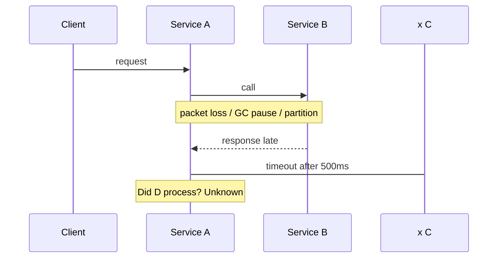

# Network failures

> **Learning Path:** Distributed Systems
> **Section:** 2.1.6 — Core concepts

**Network failures**

### 1. The problem

You have two services on different hosts. You call Service B from Service A and assume the call returns. In a distributed system that assumption is false.

The problem is not "sometimes the network is down". The problem is that building a system that assumes reliable, ordered, low-latency communication will fail in production. Latency spikes, packets drop, switches reboot, DNS fails, a node GC pauses for 5 seconds. These are normal.

The constraint: you cannot control the network, you can only control how your system reacts to it.

### 2. Mental model

Network is unreliable by default.

Think of it as a lossy, slow pipe that can disappear at any time. Messages can be lost, delayed, duplicated, reordered, and the remote side can be up while you think it is down.

This is the core of the 8 Fallacies of Distributed Computing: the network is not reliable, latency is not zero, bandwidth is not infinite, the network is secure, topology doesn't change, there is one administrator, transport cost is zero, the network is homogeneous.

Once you internalize that, network failure stops being an edge case and becomes the baseline you design for.

### 3. How it works

At the transport layer TCP will retry and retransmit, but it cannot save you from application-level problems. A TCP connection can be alive while the application is unresponsive. A timeout on your side fires while the remote side already processed the request and is waiting for an ack.

Two failure patterns matter:

* **Partial failure:** the call succeeds on the remote side but you never see the response. You don't know if it was processed.
* **Partition:** you can reach some replicas but not others. The system appears split.

The practical signal is timeout, not exception. Timeouts are the primary way you detect a network failure.

### 4. Architectural reasoning

When you accept network failures as normal, design choices change.

* **Bound the wait.** Every remote call needs a timeout. Without it one slow dependency stalls the whole request.
* **Make operations idempotent.** If you retry because you timed out, you must not create duplicate side effects. Use idempotency keys for writes.
* **Fail fast and isolate.** Use circuit breakers to stop retrying a clearly failing dependency, and bulkheads to prevent one failing call from exhausting threads/ connections.
* **Decide consistency policy.** On a partition you can choose availability with eventual consistency, or consistency with unavailability. That is CAP in practice.

Alternatives are: synchronous retry with backoff, asynchronous retry via outbox/queue, or immediate failure with compensation. The choice depends on whether the operation is read or write, and whether latency or correctness dominates.

### 5. Trade-offs and failure modes

* **Retries vs. amplification.** Blind retries create retry storms and can overload a recovering service. Add jitter and exponential backoff, and cap retries.
* **Timeout too short vs. too long.** Short timeouts improve responsiveness but increase false failures. Long timeouts preserve correctness but increase tail latency.
* **Idempotency cost.** Idempotent design adds storage for deduplication keys and changes API contracts. It's cheap compared to duplicate charges.
* **Visibility.** Network failures are silent. You need request tracing with timing, timeout reason, and retry count to reason about them.

Common failure modes: thundering herd on recovery, split-brain writes when partitions heal, and cascading failures when timeouts are not propagated.

### 6. Example

Order service creates an order and needs to reserve inventory.

Order service -> Inventory service via HTTP. Network latency spikes to 3s during peak.

Decision: 500ms timeout, 2 retries with jitter, idempotency key = orderId.

If all retries fail, return 202 Accepted and enqueue the reservation request to a durable outbox for async retry. Customer sees "processing", not an error. Inventory reservation is retried with backoff until success, and deduplicated by orderId.

If you had chosen blocking retries for 10s, the order API would have timed out, threads would pile up, and the payment service would also stall.

### 7. Reasoning challenge

Your payment service calls fraud check synchronously. Fraud check is 99.9% available but has p99 latency of 800ms. Your SLA for payment is 600ms.

Do you increase timeout, make fraud check async, or fail the payment when fraud check is slow? What happens to consistency and user experience in each case?

### 8. Key takeaway

* Network failures are normal, not exceptional. Design for them first.
* Timeout is the detection mechanism. Without it you cannot reason about failure.
* Idempotency + retries is the minimum viable pattern for writes over an unreliable network.
* Choose availability vs consistency explicitly on partitions; don't let the network choose for you.
* Observability of latency, timeouts, and retries is required to operate distributed systems safely.
