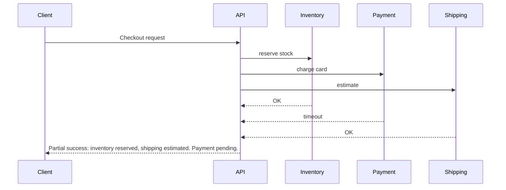

# Partial failures

> **Learning Path:** Distributed Systems
> **Section:** 2.1.7 — Core concepts

### The problem

In a monolith a failure is binary: it works or it crashes. In a distributed system a request touches multiple independent failure domains — services, networks, datacenters, third-party APIs. They fail independently and at different times.

You get a call that reaches the API gateway, the API talks to Inventory, Pricing, and Recommendations. Inventory responds in 40ms, Pricing times out after 2s, Recommendations returns stale data. The request is not fully successful and not fully failed. It is partially successful.

If you design for all-or-nothing, you throw the whole request away on the first error. That creates cascading failures, poor availability, and bad user experience.

### Mental model

Think of the system as a mesh, not a chain. Partial failure means *some paths work, some don’t, and the state of the system is inconsistent for a window of time*.

The goal is not to prevent partial failures — they are inevitable — it is to contain them and make progress with what is available.

### How it works

Partial failure handling is about detection, isolation, and graceful degradation.

* **Detection:** Timeouts, health checks, error codes, and latency SLOs tell you a component is degraded, not just down.
* **Isolation:** Bulkheads and circuit breakers stop a slow/failing dependency from consuming all threads, connections, or retries.
* **Degradation:** Return a best-effort response using cached data, defaults, or skip non-critical paths.
* **Compensation:** For writes, use idempotency, retries with backoff, and compensating transactions so partial commits do not corrupt state.

The API does not wait forever and does not fail the whole checkout because Payment is slow.

### Architectural reasoning

Partial failure handling helps when:
* A request depends on >1 service with different criticality
* Downstream SLAs are worse than yours
* Availability is more valuable than perfect freshness

Alternatives are:
* **Fail fast / all-or-nothing:** Simpler, but availability drops with the weakest dependency.
* **Synchronous retries:** Can amplify load and cause thundering herd.

Choose partial failure design when you can define a *degraded but useful* response. Example: show product page with recommendations disabled vs show nothing.

### Trade-offs and failure modes

* **Complexity vs resilience.** You need timeouts, idempotency keys, fallback paths, and observability. That is real engineering cost.
* **Consistency vs availability.** Accepting partial results means temporary inconsistency. You must decide what is safe to serve stale or missing.
* **Silent data loss.** A fallback that hides errors can mask systemic problems. You need explicit degradation signals and alerting on partial paths.
* **Retry storms.** Without idempotency and jitter, a transient partial failure becomes a full outage.

### Example

E-commerce checkout.

Critical path: Inventory reservation + Payment.
Non-critical: Email receipt, analytics, recommendation personalization.

Design:
* Inventory and Payment have short timeouts with 2 retries + jitter.
* If Payment times out, return `payment_pending` and enqueue a background reconciler. Do not release inventory immediately; hold with TTL.
* If Recommendations is down, serve cached top sellers.
* Bulkhead payment calls to a separate thread pool so a slow PSP cannot starve inventory calls.

User gets a usable outcome, and the system stays available while the partial failure is healed.

### Reasoning challenge

Payment service returns 200 Success, but the API times out before reading the response body. You retry the charge. What must be true to make this safe?

Think about idempotency, duplicate charges, and how the client sees the result.

### Key takeaway

* Partial failures are normal in distributed systems. Design for them, don’t assume them away.
* Isolate failures with timeouts, bulkheads, and circuit breakers so one slow dependency doesn’t kill the whole request.
* Define degraded responses explicitly; availability often beats perfect consistency.
* Make operations safe for retries: idempotency, timeouts, and compensating actions are architectural requirements, not nice-to-haves.
