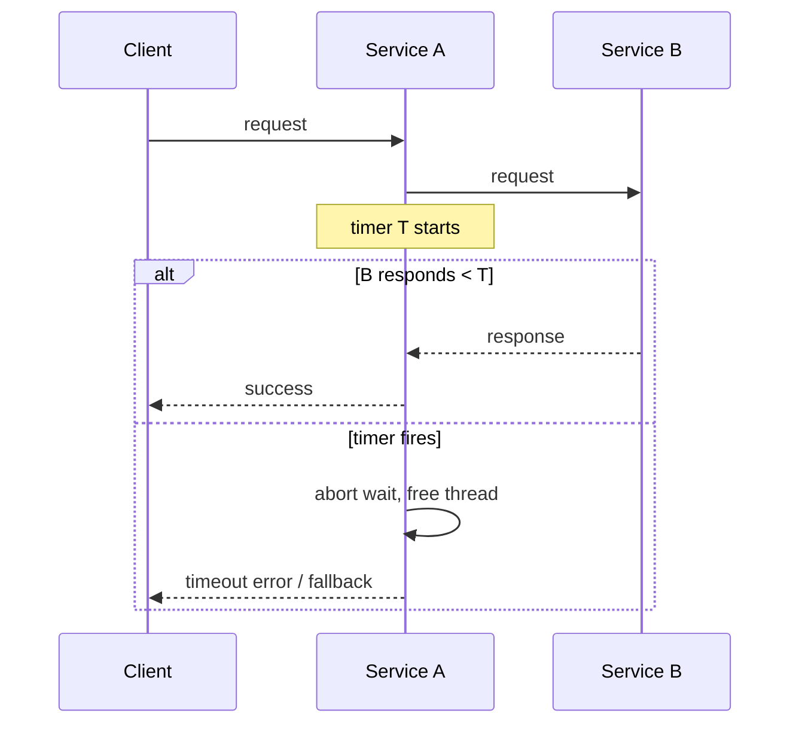

# Timeouts

> **Learning Path:** Distributed Systems
> **Section:** 2.1.8 — Core concepts

### The problem

In a distributed system a request is a chain of remote calls. If service A calls B and B never responds, A waits forever. That waiting consumes a thread, a connection, memory for the request context, and eventually the caller's capacity.

Network partitions, GC pauses, deadlock, slow downstream, or a bug can make a call arbitrarily slow. Without a bound, one slow dependency can exhaust the caller's thread pool and take down the whole service. This is the root cause of cascading failures.

You need a way to stop waiting and reclaim resources, even if the work is still in progress somewhere else.

### Mental model

A timeout is a lease on patience. You are saying: *I will wait at most T for a result, then I give up and do something else.*

It does not make the downstream faster. It makes the caller controllable.

Think of it as a budget for waiting, not a guarantee of success.

### How it works

Essentially three places to set the budget:

* **Client-side request timeout.** The caller starts a timer when it sends the request. If the timer fires before a response, the caller aborts the wait and handles the failure locally. The downstream may still be processing.
* **Server-side processing timeout.** The service sets a deadline for how long it will work on a request. Used to avoid runaway queries and to protect shared resources.
* **Idle/connection timeout.** How long a connection can stay open with no data. Prevents half-open sockets from accumulating.

All three are independent. The effective timeout seen by the user is the minimum of the chain.

The caller must decide what to do on timeout: fail fast, return a degraded result, retry, or shed load.

### Architectural reasoning

Timeouts help when you need **bounded resource usage and failure isolation**.

Use them to:
* Protect a caller from an unbounded downstream. Thread pools and connection pools stay usable.
* Define a service level contract. `p99 latency < 500ms` is only meaningful if you enforce a timeout.
* Enable fallback and graceful degradation. If inventory service times out, return cached stock or ask user to retry later.

Do not use a timeout as a substitute for fixing slowness. If you constantly timeout, you are just hiding a capacity problem.

Alternatives:
* Wait forever -> guarantees correctness but risks collapse.
* Retry without timeout -> amplifies load during an outage.
* No timeout + backpressure -> can work, but requires careful flow control and often adds latency.

Choose timeouts when the cost of waiting exceeds the value of the result, or when you must preserve the caller's availability.

### Trade-offs and failure modes

* **Too short vs too long.** Short timeouts cause false failures and churn. Long timeouts let problems accumulate. The right value comes from SLO + observed latency distribution, not guesswork.
* **Timeout mismatch.** If client times out at 500ms and server processes for 5s, you create orphan work and wasted resources. Align timeouts across the call chain, typically decreasing toward the edge.
* **Thundering herd on retry.** A timeout triggers retries, which increases load exactly when the system is struggling. Combine timeouts with jittered backoff and circuit breaking.
* **Partial failure ambiguity.** A timeout does not tell you if the downstream succeeded. Idempotency and outbox patterns are required if you retry non-idempotent operations.

### Example

Checkout service calls Inventory, Payment, and Shipping.

SLO for checkout is 1.2s. Inventory p99 is 600ms, Payment p99 is 800ms.

You set client timeouts: Inventory 700ms, Payment 900ms, and an overall request timeout 1.2s. If Payment times out, you return 503 with a retry-after and do not charge the user twice. The checkout service keeps its thread pool healthy and can still serve other users.

If you had waited indefinitely, a slow Payment outage would have exhausted checkout threads and taken down the whole checkout flow.

### Reasoning challenge

Service X has p99 latency 2s under normal load. Your API gateway has a 500ms timeout to protect user experience. Requests are idempotent. Do you increase the gateway timeout, add a fallback, or change Service X? What metrics would you check before deciding?

### Key takeaway

* Timeouts bound waiting and protect callers from downstream stalls; they do not fix slowness.
* Set timeouts from SLOs and latency distributions, and align them across the call chain.
* Always define the failure action: fail fast, fallback, or retry with backoff.
* Timeouts interact with retries and circuit breakers. Design them together to avoid cascading failures.
