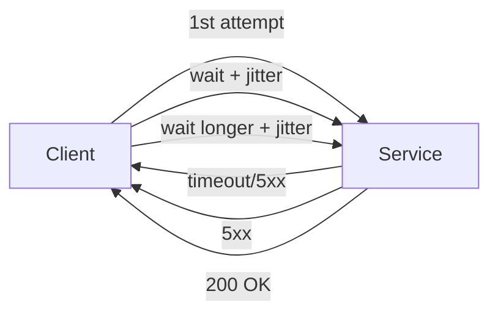

# Retries

> **Learning Path:** Distributed Systems
> **Section:** 2.1.9 — Core concepts

**Retries**

### 1. The problem

Distributed systems fail intermittently. A request times out, a node is rolling, a network blip drops a packet, a downstream service is briefly overloaded. The failure is transient: if you try again in a few hundred milliseconds, it succeeds.

Without retries, every transient failure becomes a user-visible error. With naive retries, transient failures become systemic outages.

The problem is not "how to loop". It's deciding when retrying is safe, and how to retry without making things worse.

### 2. Mental model

A retry is a bet that the failure was temporary and the operation is safe to repeat.

That bet requires two properties:
* **Transient failure** - the cause will likely be gone soon
* **Idempotency or idempotent handling** - repeating the operation does not create harmful side effects

If either is missing, retry is dangerous.

### 3. How it works

The essential mechanism is not a loop, it's controlled repetition with backoff.

Core controls:
* **Max attempts** - cap the cost and latency
* **Backoff** - increase wait time between attempts, e.g. exponential
* **Jitter** - randomize delay to avoid thundering herd
* **Retryable errors only** - retry on timeouts, 5xx, connection errors. Do not retry 4xx client errors
* **Idempotency key** - for non-idempotent writes, send a key so the service can deduplicate

Implementation is client-side for synchronous calls, and message-level for async queues.

### 4. Architectural reasoning

**When it helps:** Read-heavy paths, GETs, idempotent POSTs with keys, and operations where transient errors dominate. It hides brief blips from users and reduces manual intervention.

**When it hurts:** Non-idempotent writes without deduplication, payment charges, inventory decrements, state transitions. A retry can double-charge a customer.

**Alternatives:**
* Fail fast + user retry - pushes cost to user, good for user-facing non-critical actions
* Circuit breaker - stop retrying when downstream is clearly down to avoid overload
* Fallback / degradation - return cached data or partial result instead of retrying
* Shed load - reject new requests early

Decision rule: retry only if the operation is safe to repeat and the failure is likely transient.

### 5. Trade-offs and failure modes

* **Latency vs reliability.** Each retry adds tail latency. Too many retries turns a 200ms request into seconds.
* **Thundering herd.** Simultaneous retries after an outage can overwhelm the recovering service. Jitter and exponential backoff mitigate this.
* **Retry amplification.** A 1% error rate with 3 retries can become 3x load on a struggling service. This creates cascading failure.
* **Poison messages.** Some failures are permanent. Retrying forever creates infinite loops and log noise. Need max attempts + dead letter queue.
* **Cost.** Retries consume compute, network, and queue capacity. In pay-per-request systems that is real money.

The classic failure: a service times out after 1s, client retries immediately 3 times. The downstream is actually overloaded, so retries make it worse and cause a full outage.

### 6. Example

Payment authorization service calling a bank API.

* Request is idempotent via `Idempotency-Key` header. Bank stores key for 24h and returns same result on repeat.
* Client retries only on timeouts and 5xx.
* Backoff: 200ms, 600ms, 1.8s with +/-20% jitter.
* Max 3 attempts.
* After final failure, return 503 to caller and enqueue for async reconciliation.

If the bank API is down for 30 seconds, clients back off and spread load. If the bank returns 400 Bad Request, client does not retry - it's a permanent error.

Without idempotency key, a retry after timeout could charge the card twice.

### 7. Reasoning challenge

You have a microservice that emits an event to Kafka after updating a DB. The producer gets a timeout from Kafka. The DB transaction already committed.

Do you retry the produce? What if the produce actually succeeded but the ack was lost?

What changes if you produce before committing the DB?

### 8. Key takeaway

* Retries exist to absorb transient faults, not to fix permanent ones.
* Safety requires idempotency or explicit deduplication. No idempotency = no blind retry.
* Use exponential backoff with jitter and a hard max attempts to avoid amplification.
* Distinguish retryable errors from non-retryable errors. 5xx/timeout = retry, 4xx = don't.
* Retries interact with the whole system. They improve user experience at the cost of load, latency, and complexity.
