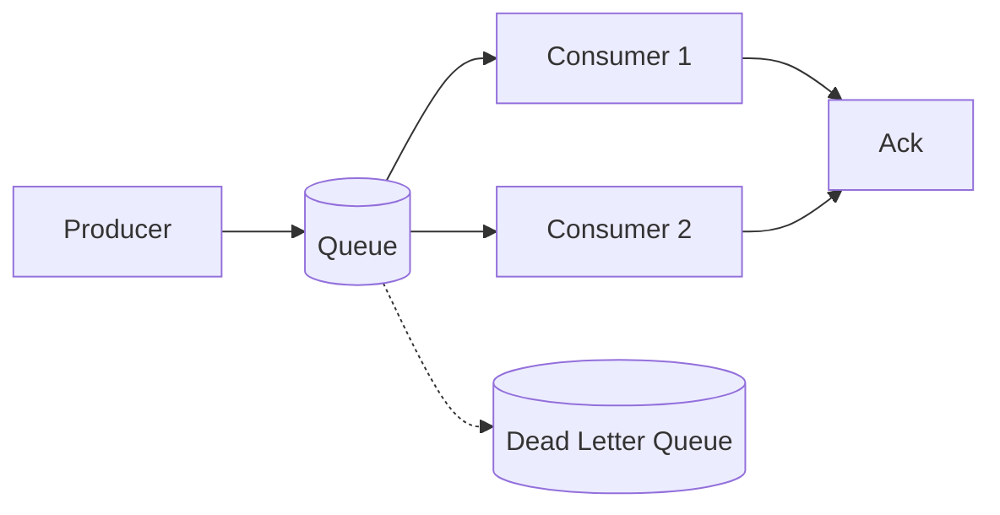

# Queues

> **Learning Path:** Distributed Systems
> **Section:** 2.2.1 — Messaging

### The Problem

Synchronous calls couple producers and consumers in time, space, and rate.

Service A calls Service B directly. If B is slow, A waits. If B is down, A fails. If A gets a traffic burst, B gets the burst. Failure propagates instantly.

You need decoupling: producers should not care if consumers exist, how fast they run, or if they are temporarily unavailable. You also need buffering: handle spikes without dropping work.

### Mental Model

A queue is a durable mailbox with a single in-order FIFO lane.

Producer drops messages in. Consumer takes them out. The queue holds them in between, levels load, and survives restarts.

Think conveyor belt with a buffer zone. Items arrive at different speeds, the belt smooths it.

### How It Works

Essential mechanism only:

Producer enqueues → Queue persists → Consumer dequeues → Process → Acknowledge

The queue guarantees two things architecturally: **durability** until acknowledged, and **ordering within a partition**.

Delivery semantics are a choice, not a feature:
* **At-least-once:** message may be redelivered. Needs idempotent consumers.
* **At-most-once:** may be lost on failure. Lower latency.
* **Exactly-once:** hard, usually achieved via idempotency + deduplication, not by the queue alone.

Pull vs push matters operationally. Pull gives consumer back-pressure control. Push reduces latency but can overwhelm slow consumers.

### Architectural Reasoning

Use a queue when you need temporal decoupling and rate smoothing.

It helps when:
* Producer and consumer have different availability windows
* Work is bursty and you want to absorb spikes
* You want retry and isolation of failures
* You need to scale consumers independently of producers

Alternatives:
* **Direct RPC:** low latency, strong coupling, no buffering.
* **Shared DB polling:** simple, high latency, DB becomes hotspot.
* **Pub/Sub topic:** one-to-many fanout, no ordering guarantee across consumers, no load leveling.

Choose queue for work items, choose topic for events you want many services to react to.

### Trade-offs and Failure Modes

* **Latency vs durability.** Persisting to disk adds latency. In-memory queues are fast but lose messages on crash.
* **Ordering vs parallelism.** Strict FIFO limits concurrency. Partition by key to parallelize while preserving order per key.
* **Backlog growth.** Slow consumer = growing queue = memory/disk cost and increased latency. Need monitoring, scaling, and back-pressure.
* **Poison messages.** A message that always fails will be retried forever. Use dead-letter queue with max retries.
* **Head-of-line blocking.** One slow item blocks later items in strict FIFO. Mitigate with priority queues or separate queues.

Failure mode to remember: at-least-once delivery + non-idempotent consumer = duplicate side effects. Design consumers for idempotency first.

### Example

E-commerce order placement.

`Order Service` produces `OrderCreated` to `order-processing-queue`. 
`Payment Service`, `Inventory Service`, `Email Service` consume from separate queues or the same queue with different consumer groups.

If Payment Service is down for 5 minutes, orders accumulate in the queue. When it returns, it drains backlog without losing orders. Order Service returns success immediately. No user-facing latency couples to downstream reliability.

If payment fails transiently, the message is retried with backoff. After N failures it goes to DLQ for manual review.

### Reasoning Challenge

You need to process user sign-up events to:
1. Send a welcome email within 5 seconds
2. Enrich profile in a data warehouse nightly
3. Trigger real-time fraud check synchronously for high-risk countries

Would you put all three on the same queue? What semantics and topology would you choose?

### Key Takeaway

* Queues decouple time, rate, and failure between producer and consumer.
* Durability and delivery semantics are architectural choices, not defaults.
* Design for at-least-once delivery and idempotent consumers.
* Monitor backlog, retry policy, and dead-letter queue as first-class operational signals.
* Use queues for work, topics for broadcast.
