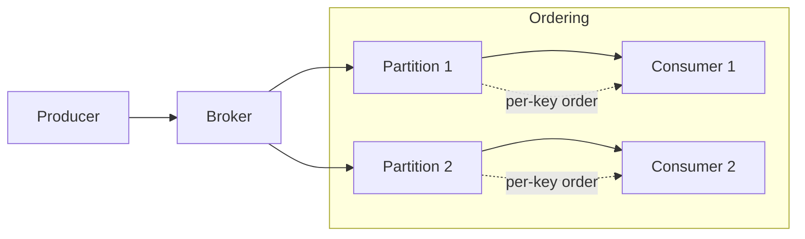

# Ordering

> **Learning Path:** Distributed Systems
> **Section:** 2.2.11 — Messaging

### 1. The problem

In a single process, events happen in a sequence. In a distributed system they don't.

Producers publish, brokers route, consumers process. Network jitter, retries, parallel partitions, and consumer scaling all mean the same logical stream can arrive out of order.

The problem isn't latency. It's correctness.

If service A emits `CreateOrder`, `AddItem`, `Checkout` and service B processes them as `Checkout`, `CreateOrder`, `AddItem`, the order total is wrong, inventory is corrupted, and money moves incorrectly.

You need ordering only where the business logic depends on sequence. The question is how much ordering you can afford.

### 2. Mental model

Think of ordering as a contract about *relative* delivery, not absolute time.

* **No ordering:** messages can arrive any time.
* **Per-key ordering:** messages with the same key are delivered in publish order.
* **Total ordering:** all messages system-wide are delivered in a single global order.

Total ordering is a single point of serialization. Per-key ordering is ordering scoped to a partition.

Partitions give you parallelism. Ordering restricts it.

### 3. How it works

Ordering is enforced by removing concurrency at a boundary.

A broker assigns messages to a partition using a hash of the key. All messages for that key go to one partition. Consumers read a partition sequentially and advance an offset.

The broker guarantees:
* **Append-only log per partition.** Writes are monotonic.
* **Offset tracking.** Consumer commits only after processing.
* **No reordering within partition.** If message 3 is read, 1 and 2 were already readable.

For total order, you need a single logical log or a consensus layer that serializes all writes, e.g., a leader per topic. That gives you global sequence numbers at the cost of throughput.

Causal ordering goes further: if A happened-before B, all consumers see A before B. It requires vector clocks or happens-before tracking and is rarely used in messaging.

### 4. Architectural reasoning

When does ordering help?

* State machines where next state depends on previous state: account balance, order lifecycle, inventory decrement.
* Event sourcing and CQRS where replay must be deterministic.
* Audit and compliance where sequence matters legally.

Alternatives:

* **Make operations commutative and idempotent.** If `AddItem` can be applied in any order and safely retried, you don't need ordering. This is the preferred escape hatch.
* **Application-level reordering buffer.** Consumer holds messages for a window and emits in order. Pushes complexity to the edge and adds latency.
* **Per-key ordering via partitioning.** The common compromise.

You choose per-key ordering when you need sequence per entity but can scale across entities. You choose total ordering only when the domain is inherently global, e.g., a single ledger.

### 5. Trade-offs and failure modes

Ordering is in direct tension with scalability and availability.

* **Throughput vs ordering.** Per-key ordering caps parallelism to one consumer per partition. Total ordering caps it to one.
* **Availability vs ordering.** During partition rebalancing, a consumer may pause to avoid delivering out of order. That creates head-of-line blocking.
* **Latency.** Reordering buffers and retries increase tail latency.
* **Failure modes to remember:**
  * **Rebalance breaks ordering** if a consumer picks up a partition mid-stream without respecting offset.
  * **Retry with new message ID** creates duplicates that look like new events.
  * **Clock skew** makes wall-clock timestamps unreliable for ordering. Use sequence numbers, not timestamps.
  * **Key hotspots** destroy parallelism. One very active order ID serializes all work.

Exactly-once processing is often confused with ordering. Exactly-once is about duplicates. Ordering is about sequence. You can have exactly-once but still out of order.

### 6. Example

E-commerce order service.

Events: `OrderCreated`, `ItemAdded`, `ItemRemoved`, `OrderPaid`, `OrderShipped`.

Business rule: you cannot pay before create, cannot ship before pay.

Design: Kafka topic `orders` partitioned by `orderId`. Producers always include `orderId` as key. Consumers process one partition sequentially.

Result: all events for order 1234 are ordered, but orders 1234 and 5678 are processed in parallel. If you need a global report of revenue by minute, you lose total order and must aggregate with watermarking.

If you later need to remove ordering for throughput, you must make handlers idempotent and commutative, e.g., store the full snapshot with each event and apply last-writer-wins.

### 7. Reasoning challenge

You have a payments service that emits `Debit` and `Credit` events per user account. Peak load requires 32 partitions. Compliance requires a globally consistent audit log.

Do you enforce total ordering across all accounts, per-account ordering, or no ordering with commutative operations? What breaks if you pick wrong, and what is the cost of your choice?

### 8. Key takeaway

* Ordering is a constraint you pay for with parallelism and availability.
* Per-key ordering is the practical default: scale by entity, order within entity.
* Total ordering is expensive and usually a design smell; prefer making operations commutative where possible.
* Never rely on wall-clock time for order. Rely on partition sequence numbers and offsets.
* Ordering failures show up as subtle state corruption, not crashes.
