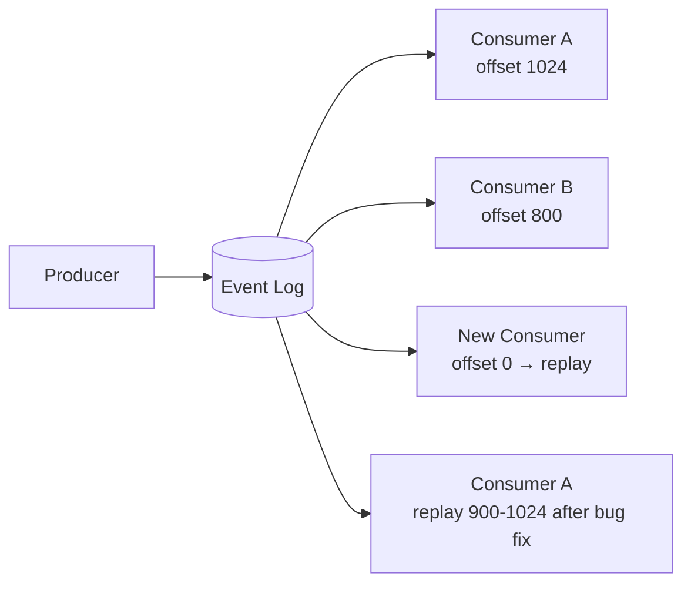

# Replay

> **Learning Path:** Distributed Systems
> **Section:** 2.2.12 — Messaging

**Replay** is not a feature. It is the consequence of treating messages as an immutable log, not as a transient notification.

### 1. The problem

In distributed messaging you have producers and consumers with different lifecycles and speeds.

* A producer emits an event now. Consumer A is ready now, Consumer B will be built next quarter.
* Consumer C processes 10k/s, Consumer D processes 100/s.
* A bug in Consumer A corrupts derived state. How do you fix it?
* You need to change the schema, add a field, or rebuild a read model.

If messages are fire-and-forget queues, the event is lost after consumption. You cannot re-derive state, onboard a late consumer, or recover from a bug without asking producers to re-emit.

Constraints that force replay:
* **Decoupling in time:** producers and consumers must not be synchronized.
* **Independent scaling:** consumers can lag without blocking producers.
* **Correctness over time:** state must be reconstructible from history.

### 2. Mental model

Think of a tape recorder, not a walkie-talkie.

A walkie-talkie delivers a message once and forgets it. A tape recorder writes events to a durable append-only log. Consumers have a playhead - an offset. They can start at the beginning, resume from where they left off, or rewind to replay.

Replay = ability to move the playhead backwards and re-read past events.

### 3. How it works

The essential mechanism is a persistent, ordered, immutable log with consumer-managed offsets.

* **Append only:** producers write, consumers only read.
* **Offset tracking:** each consumer group tracks its own position. No global pointer.
* **Retention:** log is kept for a defined window, not forever. Replay is bounded by retention.
* **Idempotency:** reprocessing the same event must be safe. Consumers must be designed for at-least-once.

This is the core of Kafka, Event Hubs, Pulsar, Kinesis with retention, and event sourcing stores.

### 4. Architectural reasoning

When replay helps:
* **Late joining consumers:** a new service needs the full history to build its view. It replays from offset 0.
* **Bug recovery:** a logic error in a consumer can be fixed and the affected window replayed to rebuild downstream state.
* **Schema evolution:** you need to migrate a read model to a new schema. Replay through a transformer.
* **Debugging and auditing:** reproduce an incident by replaying the exact event stream into a sandbox.

When it hurts:
* You pay for durable storage and ordering guarantees.
* You must handle out-of-order delivery, duplicates, and schema changes over a long window.
* Consumers must be idempotent and deterministic.

Alternatives:
* **Queue with redelivery:** one retry, no history. Good for command processing, bad for re-derivation.
* **Snapshot + incremental:** store periodic snapshots and replay only deltas. Reduces replay cost.
* **Change Data Capture re-emit:** ask source DB to re-publish. Couples you to source availability.

Decision rule: use replay when state is derived from events and must be reconstructible. Don't use it when messages are one-off commands with no need for history.

### 5. Trade-offs and failure modes

* **Storage vs time window:** longer retention = longer replay window but higher cost. Retention is a business decision.
* **Schema evolution:** replaying old events against new code fails if events are not backward compatible. Version events and keep readers tolerant.
* **Consumer lag and backpressure:** replaying a large window can starve live traffic. Use separate consumer groups or rate-limit replay.
* **Ordering:** replay preserves order per partition/key, not globally. Design consumers to tolerate partial ordering.
* **Poison messages:** a bad event will poison every replay. You need dead-lettering and skip logic.

### 6. Example

E-commerce order pipeline.

`orders` topic receives `OrderCreated`, `OrderPaid`, `OrderShipped` events. Three consumers:

* Inventory reserve, built at launch
* Fraud detector v1, built at launch
* Fraud detector v2, built 6 months later

Fraud detector v2 needs 6 months of history to train a model. It subscribes to `orders` and replays from the earliest retained offset, building its own view. Inventory reserve lags during a deploy, then catches up from its saved offset.

When a bug in Fraud v1 caused false positives for 2 days, the team fixes the logic, resets that consumer group's offset to the start of the incident window, and replays. Downstream alerts are rebuilt correctly without asking producers to re-emit.

### 7. Reasoning challenge

You have a payment event stream with 30-day retention. A new compliance service must process all events from the last 90 days. What do you do, and what architectural constraint forces your decision?

Think about retention window, source of truth, and idempotency.

### 8. Key takeaway

* Replay exists to decouple *when* an event is produced from *when* it is consumed, and to make state reconstructible.
* It requires an immutable log, consumer-managed offsets, and idempotent consumers.
* The real cost is not storage, it is schema evolution, duplicate handling, and bounded retention.
* Choose replay when you need time-travel for consumers; avoid it for one-off commands where history adds no value.
