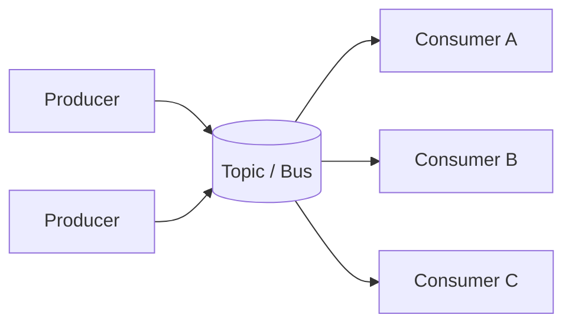

# Pub/sub

> **Learning Path:** Distributed Systems
> **Section:** 2.2.2 — Messaging

**Pub/Sub**

### 1. The problem

You have multiple producers generating events and multiple consumers that need those events, but they cannot be tightly coupled.

Constraints appear:
* Producers and consumers scale independently and deploy on different cadences
* One event must reach many consumers, each with different processing speed and SLA
* Consumers may need to be added later without changing producers
* System must survive transient failures on either side

Point-to-point RPC couples them. A shared database couples them to schema and polling load. You need a decoupling layer that handles fan-out, buffering, and delivery.

### 2. Mental model

Publish/Subscribe is a broadcast channel with anonymous participants.

Producers publish to a *topic* without knowing who receives it. Consumers subscribe to a *topic* without knowing who sent it. The broker is the post office: it holds messages until a subscriber is ready.

This gives temporal decoupling - producer and consumer need not be alive at the same time - and spatial decoupling.

### 3. How it works

Essential mechanism only:

Producer publishes an immutable event to a topic. Broker persists and routes it to all active subscriptions. Each consumer maintains its own cursor/offset. Delivery semantics are broker-defined: at-least-once, at-most-once, or exactly-once.

No direct request/response. No contract between producer and consumer except the event schema for that topic.

### 4. Architectural reasoning

Choose pub/sub when you need fan-out and loose coupling.

It helps when:
* One event triggers many independent reactions: order placed -> inventory, billing, email, analytics, fraud
* Consumers have different latency budgets and can be scaled separately
* You need replay for new consumers or recovery

Alternatives:
* **Point-to-point queue**: one message, one consumer. Good for work distribution, bad for fan-out.
* **RPC / synchronous call**: low latency, tight coupling, caller must handle downstream failures.
* **Polling shared store**: simple, high latency, read amplification, schema coupling.

Pub/sub is not a replacement for a transactional request. Use it for side effects, not for command-response.

### 5. Trade-offs and failure modes

* **Ordering vs parallelism.** Per-partition ordering is possible, global ordering is expensive. Architect for idempotent consumers.
* **Delivery guarantees.** At-least-once means duplicates. Exactly-once requires transactional outbox + idempotency keys. Pick the guarantee you can operate.
* **Fan-out amplification.** One event to N consumers = N processing cost and N failure surfaces. A poison message can block a consumer group.
* **Consumer lag and backpressure.** Slow consumer causes backlog in broker. You get unbounded storage cost or message loss. Need dead-letter queues, scaling policies, and retention limits.
* **Schema evolution.** Adding fields is easy, removing/renaming breaks consumers. Version topics or use schema registry with backward compatibility.

Failure modes to design for: broker outage, network partitions causing duplicate delivery, consumer crash losing in-flight messages, and unbounded queue growth.

### 6. Example

Order service publishes `OrderPlaced` to topic `orders`.

Inventory service subscribes, reserves stock. Billing subscribes, creates invoice. Email service subscribes, sends confirmation. Analytics subscribes, writes to warehouse.

Order service never knows these exist. Inventory can be down for maintenance, messages buffer. Email can be redeployed with a new version and replays last 7 days from broker to rebuild state.

No synchronous call chain, no cascading timeouts.

### 7. Reasoning challenge

You need to notify 3 internal services about user sign-up and also trigger an external 3rd-party webhook with strict 2 second SLA. One service is batch, runs hourly. The webhook is unreliable and must be retried with exponential backoff.

Would you put all 4 consumers on the same pub/sub topic? What would you change?

### 8. Key takeaway

* Pub/sub exists to decouple producers from consumers in time and space, enabling fan-out.
* It trades coupling for complexity in ordering, duplicates, and operational visibility.
* Use it for event propagation and side effects, not for synchronous business transactions.
* Design consumers to be idempotent, independently scalable, and tolerant of lag.
