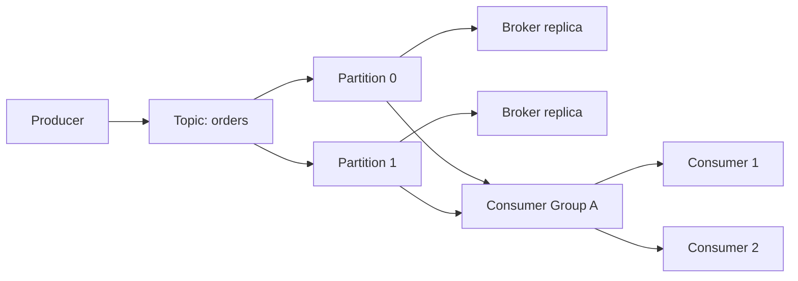

# Kafka

> **Learning Path:** Distributed Systems
> **Section:** 2.2.3 — Messaging

**The problem**

What breaks when services talk directly to each other?

A producer needs to send an event to many consumers, consumers process at different speeds, producers should not block if a consumer is down, and you sometimes need to reprocess old events. Point-to-point RPC couples availability. A classic queue gives decoupling but only one consumer per message. A database poll gives replay but creates read load and tight coupling to schema.

Constraints that emerge at scale:
* Throughput must be decoupled from processing speed
* Consumers need independent scaling
* Events must survive process restarts
* Ordering matters within a business entity, but not globally

**Mental model**

Kafka is not a queue. It is a distributed, durable commit log partitioned by key.

Think of it as an append-only tape recorder per topic. Producers append records. Consumers read from the tape at their own pace and remember where they left off with an offset. The tape never rewinds for new readers.

That gives you three properties: decoupling in time, decoupling in space, and replayability.

**How it works**

A Topic is a logical stream split into Partitions. Each partition is an ordered, immutable log replicated across brokers.

Producers write to a partition, chosen by key hash for ordering. Consumers join a Consumer Group and cooperatively own partitions. Offsets are committed separately from data, so consumers can seek back.

The essential mechanism is: append to log, replicate, consume with offset tracking. No per-message ACKs between producer and consumer.

**Architectural reasoning**

When it helps:
* Many-to-many fan-out: one event to multiple downstream systems
* Backpressure absorption: fast producers, slow consumers
* Event replay for new services or recovery
* Ordering guarantees per key, not per topic

Alternatives:
* Message queue like RabbitMQ / SQS: point-to-point, good for work distribution, poor for replay and fan-out
* Pub/Sub like SNS / PubSub: fan-out, no replay by default
* Change Data Capture from DB: source of truth, but couples to DB schema

Choose Kafka when you need a durable event backbone where consumers are independent and you want to treat events as a first-class product. Choose a queue when you need work distribution with at-least-once processing and no replay.

Decision rule: if you ask "can we rebuild a downstream view from history?" you want a log.

**Trade-offs and failure modes**

* Ordering is per partition only. Global ordering requires one partition, which caps throughput.
* Consumer lag is a normal metric, not a failure. It means processing capacity < ingestion. You scale consumers or increase partition count.
* Partition count is hard to change later. Too few = throughput ceiling. Too many = broker metadata and rebalance overhead.
* Replication protects against broker loss, but leader election causes latency spikes. Under-replicated partitions are a silent risk.
* Offsets are consumer-managed. Commit too early = data loss on crash. Commit too late = duplicates. At-least-once is the default.
* Operational complexity is real. You need ZooKeeper/KRaft, partition leadership, retention policy, and schema governance.

**Example**

E-commerce order pipeline. `orders` topic, partition by `order_id`.

Order service appends `OrderCreated`. Inventory, billing, shipping, analytics all consume the same topic in separate consumer groups. Analytics group replays the last 30 days to build a new dashboard without touching the order service.

If billing is down, its consumer lag grows but orders keep flowing. When billing recovers it catches up from its last committed offset.

**Reasoning challenge**

You have a payments service that must process each payment exactly once and maintain strict global ordering for audit. You also have a notifications service that can tolerate duplicates and wants high throughput.

Would you put both on the same Kafka topic? How would you partition, and what would you change if audit requirements were relaxed?

**Key takeaway**

* Kafka solves decoupling in time and space via a durable partitioned log, not via per-message routing
* Ordering guarantees are per partition; parallelism requires sacrificing global order
* Consumers are independent readers with their own offsets; replay is a feature, not an accident
* Operability costs are high: partition planning, replication, consumer lag, and schema evolution are architectural decisions, not tuning
