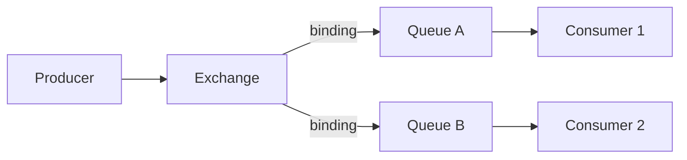

# RabbitMQ

> **Learning Path:** Distributed Systems
> **Section:** 2.2.4 — Messaging

**The problem**

Synchronous HTTP calls couple services in time and failure domain. Producer must wait for consumer, consumer must be up, and a spike in demand creates backpressure that propagates back to the caller. You end up with retries, timeouts, cascading failures, and a system that is hard to evolve.

Constraints that force a change: services need to scale independently, some are slower than others, failures must be isolated, and you want to add new consumers without changing producers.

Messaging decouples *when* and *who* processes work. A producer hands work off and moves on. A consumer pulls work when it can. A broker sits in the middle to hold the work.

**Mental model**

Think post office, not phone call.

Producer drops a letter in a mailbox. The post office routes it to a named box based on rules. Consumer empties its box at its own pace. The sender does not know who reads it or when.

RabbitMQ is a message broker implementing AMQP. The core pieces are Exchange → Queue → Consumer. An Exchange routes messages based on binding rules. A Queue is the durable buffer. A Consumer acknowledges processing.

One producer can feed many consumers, and one consumer can read from many queues.

**How it works**

Producer publishes a message to an exchange with a routing key. The exchange applies bindings and delivers copies to matching queues. Messages persist in a queue until a consumer receives and acks them. If a consumer crashes before ack, the message is requeued.

Key controls an architect uses:
* **Durability**: durable queues and persistent messages survive broker restart, at a latency cost.
* **Acknowledgements**: at-least-once delivery. Manual ack avoids silent loss but creates duplicates on retry.
* **Prefetch**: limits unacked messages per consumer to avoid one slow worker starving the queue.
* **Routing**: direct, topic, fanout, headers. Choose how broadly to fan out.

**Architectural reasoning**

When it helps:
* Temporal decoupling: producer and consumer do not need to be up simultaneously.
* Load leveling: queue absorbs bursts, consumers drain at steady rate.
* Fan-out: one event, many independent reactions, e.g., order.created → inventory, billing, analytics, email.
* Backpressure with bounded queues: you can shed load explicitly rather than cascade.

When it hurts:
* You need low latency and strict ordering across partitions. A queue gives ordering per queue only.
* You need replay and long retention of an immutable log. A queue is a buffer, not a log.

Alternatives:
* Kafka for ordered, replayable event streams with high throughput.
* SQS / Pub/Sub for managed, at-least-once with less operational burden.
* Direct RPC / gRPC for low latency request-response where coupling is acceptable.

Choose RabbitMQ when you need rich routing, fine-grained delivery guarantees, and a broker you control, and when message volume fits a queueing model rather than a streaming log.

**Trade-offs and failure modes**

* Broker is a single point of failure and a scaling bottleneck. Clustering helps but adds split-brain and partition handling complexity.
* At-least-once means idempotency is your responsibility. Duplicates happen on network errors and consumer crashes.
* Ordering is per queue, not global. Parallel consumers on the same queue break ordering. You need one consumer per logical stream or sequence numbers.
* Head-of-line blocking and poison messages: one bad message can stall a queue if not dead-lettered. Use DLQ with TTL and max retries.
* Memory pressure: unacked messages and large queues consume RAM. Disk spills hurt latency.
* Operational cost: monitoring queue depth, consumer lag, ack rate, and dead-letter rate is essential.

**Example**

E-commerce checkout.

Checkout service publishes `order.created` with orderId, userId, items. It does not call inventory, payment, or shipping.

* Inventory consumer reserves stock. If out of stock, it publishes `order.failed`.
* Payment consumer charges card.
* Shipping consumer schedules fulfillment.
* Analytics consumer writes to warehouse.

If payment is slow, its queue grows while others stay healthy. New consumers like fraud detection can be added by binding to the same exchange without touching checkout.

**Reasoning challenge**

You need to process `user.balance.updated` events. Per user, events must be processed in order to avoid race conditions. System must scale to 10k users and tolerate consumer restarts.

Would you use one queue with multiple consumers, one queue per user, or a single queue with partition key and ordered processing? What happens to throughput and operational complexity in each option?

**Key takeaway**

* Messaging buys decoupling in time and failure domain at the cost of latency and operational complexity.
* RabbitMQ is a router + buffer, not a durable log. Use it for work distribution and fan-out, not replay.
* Design for at-least-once: make consumers idempotent, use acks, prefetch, and dead-letter queues.
* Ordering requires one active consumer per logical stream. Parallelism and ordering are in tension.
