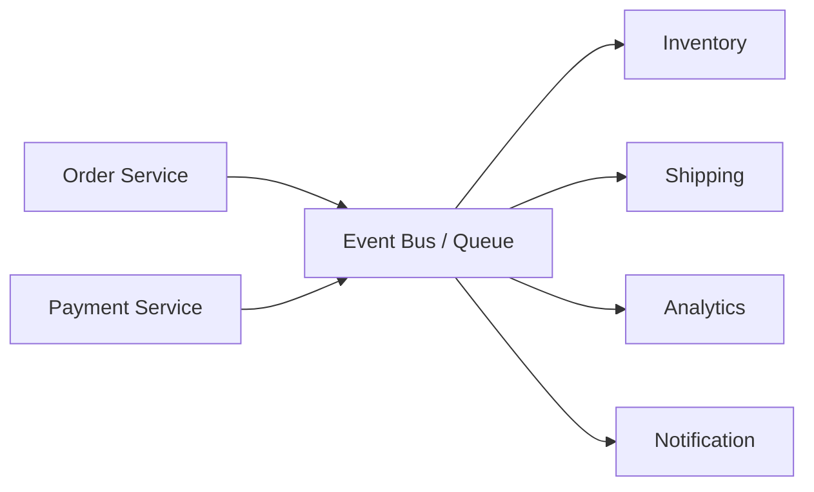

# Event-driven architecture

> **Learning Path:** Distributed Systems
> **Section:** 2.2.5 — Messaging

**The problem**

Synchronous request-response works until it doesn't. When Service A calls Service B directly, A is blocked on B's latency, B's availability, and B's capacity. Add Service C, D, and a mobile push, and you get a call graph that is tightly coupled, hard to scale independently, and fragile to failures.

The constraints that force a change:
* Producers and consumers have different throughput and availability requirements
* New consumers must be added without changing producers
* You need resilience to downstream outages
* You need an audit trail of what happened, not just current state

Event-driven architecture is the answer to decoupling *who does what* from *when it happens*.

### Mental model

Think of a post office, not a phone call.

Producers publish facts: "OrderPlaced", "PaymentSucceeded". They drop a letter in the box and continue. Consumers subscribe to the letters they care about and process them later. The broker guarantees delivery, not immediate handling.

The core mental model: **state changes are first-class events, and the system reacts to them asynchronously.**

Producers don't know consumers exist. Consumers don't know producers exist.

### How it works

The essential mechanism is publish/subscribe over a durable message transport.

1. **Emit**: A service publishes an immutable event with an ID, timestamp, aggregate id, and payload.
2. **Transport**: A broker queues or streams the event. Queues give point-to-point work distribution. Topics give fan-out to many subscribers.
3. **Consume**: Consumers read, acknowledge, and process. Processing is idempotent because at-least-once delivery is the norm.
4. **Ordering**: Ordering is per partition/key, not global. You trade global order for scale.

That's it. Everything else is operational detail.

### Architectural reasoning

Use it when you need loose coupling and independent scaling.

**When it helps**
* Multiple downstream systems need the same fact. One `OrderPlaced` fans out to inventory, billing, fraud, CRM.
* Consumers are slower or more volatile than producers. Queues absorb bursts.
* You want replayability. Rebuild read models or backfill new consumers from history.
* You want resilience. A consumer can be down for hours and catch up later.

**Alternatives**
* Synchronous RPC: simpler, strong consistency, immediate feedback. Choose it for core transactional flows that must succeed atomically.
* Request-response with orchestration: good for short-lived sagas with few steps. Becomes brittle at scale.
* Polling: simple but wasteful and high latency.

Decision rule: If the action can be *eventually* consistent and doesn't need a synchronous answer to the caller, make it an event.

### Trade-offs and failure modes

* **Eventual consistency.** Consumers see state later. Design UX and business rules around that. You cannot do immediate balance checks off an event stream without extra coordination.
* **Ordering and duplicates.** At-least-once means idempotency is mandatory. Out-of-order delivery per partition is possible. Use sequence numbers or versioned events.
* **Observability gets harder.** Traces span time, not just a stack. You need correlation IDs, dead-letter queues, and lag metrics.
* **Schema evolution.** Events are a public contract. Changing payloads breaks consumers. Use versioned schemas and backward-compatible changes.
* **Operational cost.** Brokers are stateful, partitioned, replicated systems. You pay for durability, retention, and replay.

The most common failure: treating events like commands. An event says what happened. A command says what to do. Mixing them creates hidden coupling and retry storms.

### Example

E-commerce order flow.

Order Service publishes `OrderPlaced {orderId, items}`. It does not call Inventory, Payment, or Shipping.

Inventory Service consumes `OrderPlaced`, reserves stock, publishes `StockReserved` or `StockRejected`.
Payment Service consumes `OrderPlaced`, charges card, publishes `PaymentSucceeded`.
Shipping Service consumes both `StockReserved` and `PaymentSucceeded`, then publishes `ShipmentCreated`.
Notification Service consumes `ShipmentCreated` and emails the user.

Order Service returns 200 ms after publishing. The whole pipeline completes in seconds, independently scalable, and can be replayed for a new loyalty-points consumer next quarter without touching Order Service.

### Reasoning challenge

You are building a funds transfer service. The transfer must be atomic and immediately visible for balance checks. You also need an immutable audit log and to trigger fraud scoring asynchronously.

Would you make the core debit/credit event-driven? How would you separate the synchronous correctness requirement from the asynchronous side effects?

### Key takeaway

* Event-driven decouples *what happened* from *who reacts*, enabling independent scaling and resilience.
* Choose it for fan-out, async processing, and replayability; avoid it where you need immediate, strongly consistent responses.
* Design for at-least-once delivery, idempotency, and schema evolution from day one.
* The hard problems are ordering, duplicates, and observability, not publishing messages.
