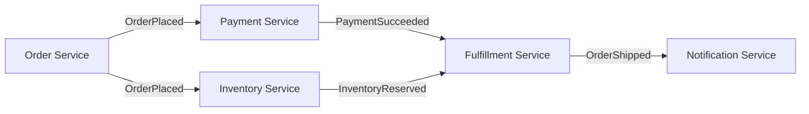

# Event choreography

> **Learning Path:** Distributed Systems
> **Section:** 2.2.6 — Messaging

**The problem**

When services are coupled by synchronous calls, a change in one service ripples through the caller chain. Add retries, timeouts, and a central coordinator and you get a different problem: the coordinator becomes a bottleneck, a single point of failure, and a coupling point.

You need services to react to state changes without knowing who else cares, and without a central process telling them what to do next. The constraint is: high autonomy, loose coupling, and independent deployability, while still delivering a coherent business outcome.

That is the need for choreography.

### Mental model

Orchestration is a conductor with an orchestra. Choreography is dancers who know the steps and react to each other's moves.

In event choreography there is no central controller. Each service owns its local behavior and publishes domain events when something meaningful happens. Other services subscribe to those events and decide what to do locally.

The system emerges from local reactions, not from a global script.

### How it works

1. Service A completes a local transaction and publishes an event to a durable message bus.
2. Service B and Service C independently subscribe to that event type.
3. Each subscriber validates the event, performs its own work, and if it changes state it publishes its own event.
4. Downstream services react to those new events.

No service calls another. There is no central workflow engine. The flow is a chain of cause → effect via events.

The bus provides at-least-once delivery, ordering per partition, and replayability. Idempotency is required on consumers.

### Architectural reasoning

Use choreography when:

* **Autonomy matters more than central visibility.** Teams can ship independently if they agree on event contracts.
* **The process is a natural chain of domain reactions.** e.g., place order → charge → reserve → ship → notify. Each step is owned by a different bounded context.
* **You want fan-out and fan-in.** One event can trigger many unrelated reactions without the producer knowing them.

Do not use choreography when:

* You need strict, globally enforced ordering across many steps.
* You need human-in-the-loop decisions or compensations that span services with complex branching.
* You need a single audit trail of the entire business process.

Alternatives:
* **Orchestration:** A central workflow engine coordinates steps by invoking services. Good for complex, long-running sagas with explicit compensation. Bad for coupling and scalability.
* **Choreography + Saga:** Choreography for happy-path reactions, with explicit sagas for compensation when needed.

### Trade-offs and failure modes

* **Visibility is hard.** No single source of truth for "where is this order in the process". You need correlation IDs, event stores, and observability across services. Debugging becomes tracing a chain of events.
* **Eventual consistency is inherent.** Services see state changes with delay. You must design UIs and APIs to tolerate it.
* **Schema evolution is critical.** Events are contracts. Breaking a field breaks all consumers. Use versioned schemas and backward compatibility.
* **Cascading failures.** A bug in one consumer can poison downstream events. Poison messages and dead-letter queues must be managed.
* **Testing is integration-heavy.** You cannot unit test the whole flow; you need contract tests and event simulation.
* **No central rollback.** Compensation must be modelled as explicit events, e.g., `PaymentFailed` triggers `InventoryRelease`. If you forget a compensating reaction, state diverges.

### Example

E-commerce order fulfillment.

Order Service publishes `OrderPlaced {orderId, items}`. Payment Service consumes it, charges the card, publishes `PaymentSucceeded` or `PaymentFailed`. Inventory Service consumes `OrderPlaced`, reserves stock, publishes `InventoryReserved`. Fulfillment Service waits for both `PaymentSucceeded` and `InventoryReserved` before publishing `OrderShipped`. Notification Service listens to `OrderShipped`.

No service knows the full flow. Each team can change its internal logic as long as it emits the agreed events. New services, e.g., Loyalty Service, can subscribe to `OrderShipped` without touching existing code.

### Reasoning challenge

You are designing a money transfer service. Requirements: debit sender, credit receiver, send notifications, update fraud risk score, and comply with audit. Transfers must be atomic from a business perspective and you must be able to prove exactly which steps ran and in what order for regulators.

Would you choose pure event choreography, orchestration, or a hybrid? What is the key risk you would mitigate first?

### Key takeaway

* Choreography = decentralized reaction to domain events, no central controller.
* It optimizes for loose coupling, autonomy, and scalability at the cost of visibility and central control.
* It works best for natural, mostly linear domain flows where eventual consistency is acceptable.
* You must invest in event contracts, idempotency, observability, and explicit compensating events.
* Choose orchestration when you need global process control, strong ordering, and auditable step-by-step execution.
