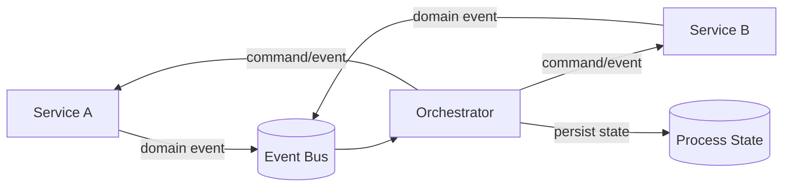

# Event orchestration

> **Learning Path:** Distributed Systems
> **Section:** 2.2.7 — Messaging

## 1. The problem

A business process rarely lives in one service. Order → Payment → Inventory → Shipping → Fulfillment notification spans 5+ autonomous services.

You cannot hold a distributed transaction open for minutes/hours. You cannot make services call each other synchronously - that creates temporal coupling, cascading failures, and a fragile call graph.

You need a way to coordinate a long-running, multi-step workflow across service boundaries while keeping services decoupled, independently deployable, and eventually consistent.

## 2. Mental model

Event orchestration is a conductor for distributed work.

Services emit domain events: `order.created`, `payment.succeeded`, `inventory.reserved`. They never call each other directly.

A single orchestrator subscribes to those events, maintains the process state, and emits the next commands/events to drive the workflow forward. Services stay dumb about the overall process; the orchestrator owns the process logic and ordering.

Choreography = every service reacts to events and decides what to do next. Orchestration = one coordinator decides what happens next.

## 3. How it works

The essential loop:

1. Correlation. Each business instance gets a correlation id, e.g. `orderId`. The orchestrator tracks one state machine per id.
2. Listen. Orchestrator consumes events from the bus, filters by correlation id.
3. Transition. On event, orchestrator updates its local state and emits the next step as a command or event.
4. Durability. Orchestrator persists state so it survives crashes and can replay.

Implementation is usually a state machine engine. The engine is not the services; the services just publish facts and react to commands.

## 4. Architectural reasoning

When it helps:
* Long running, multi-step business processes with human steps, retries, timeouts
* Need for centralized visibility, audit trail, and compensations
* Process logic changes frequently and you want it in one place

What it solves vs alternatives:
* **Synchronous orchestration / Saga coordinator with RPC**: removes coupling but introduces blocking and failure propagation.
* **Choreography**: fully decoupled, no single point of control. Great for simple fan-out, but process logic is distributed, hard to trace, and changing the flow requires touching many services.

You choose orchestration when you need explicit control flow, centralized observability, and defined compensation. You choose choreography when the interactions are truly local and the overall flow is simple enough to emerge.

## 5. Trade-offs and failure modes

* **Centralization vs coupling.** Orchestrator is a single source of truth for process. That gives visibility, but it becomes a critical path and scaling bottleneck if not designed for partition by correlation id.
* **State management.** Orchestrator must be durable. Lost state = lost process. Duplicate events must be idempotent. Out-of-order events require versioned state.
* **Latency and reliability.** Orchestrator adds a hop. If it is slow or unavailable, the whole workflow stalls. Use at-least-once delivery, retries with backoff, and dead-letter handling.
* **Blast radius.** A bug in orchestrator logic affects all instances. Process versioning and canary rollout of orchestrator rules become important.
* **Eventual consistency.** Services see commands asynchronously. You must design for pending states and timeouts, not immediate confirmation.

## 6. Example

Order fulfillment.

Order Service emits `order.created {orderId}`.
Orchestrator starts process `OrderFulfillment`, state = AWAITING_PAYMENT, emits `payment.requested`.

Payment Service consumes command, emits `payment.succeeded` or `payment.failed`.
On success, orchestrator transitions to AWAITING_INVENTORY and emits `inventory.reserve`.
Inventory emits `inventory.reserved`. Orchestrator emits `shipment.schedule`.

If payment fails after 3 retries, orchestrator executes compensation: emit `order.cancelled`, emit `customer.notified`.

All steps are observable in one place, replayable from the event log, and services never know about each other.

## 7. Reasoning challenge

You are building a real-time fraud detection pipeline. Events: `transaction.created`, `risk.scored`, `rules.evaluated`, `decision.approved`. Each step is sub-100ms, must process millions per day, and new rules are added weekly by different teams.

Would you use event orchestration, choreography, or a hybrid? What breaks if you centralize the flow?

## 8. Key takeaway

* Event orchestration exists to coordinate long-running cross-service processes without distributed transactions or synchronous coupling.
* The orchestrator owns process state and ordering; services emit facts and react to commands.
* Choose it for visibility, control, and compensation; avoid it for high-throughput, low-latency, loosely coupled reactive flows.
* The hard parts are durability, idempotency, ordering, and scaling the orchestrator without becoming a single point of failure.
