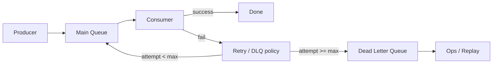

# Dead-letter queues

> **Learning Path:** Distributed Systems
> **Section:** 2.2.8 — Messaging

**Dead-letter queues**

### 1. The problem

Async messaging decouples producer and consumer. That decoupling creates a new failure mode: a message can be *unprocessable*, not just delayed.

A consumer fails to process a message. Maybe the payload is malformed, a required field is missing, a downstream service is down for hours, or a bug in the consumer code throws on a specific input.

If you retry forever you get a retry storm that blocks the queue for all other messages. If you drop the message you lose data silently. If you block the consumer you lose throughput.

You need a way to isolate bad messages so the healthy flow continues, while keeping the bad messages observable and recoverable.

### 2. Mental model

A dead-letter queue is a quarantine, not a trash bin.

The main queue is the production line. The DLQ is the quarantine room where messages that repeatedly fail processing are moved. They are still retained, just removed from the hot path.

Think of it as circuit breaking for individual messages.

### 3. How it works

The essential mechanism is: retry with a limit, then divert.

Consumer attempts processing. On failure the broker or consumer increments a delivery count. After N attempts, or on a specific error class, the message is routed to a DLQ instead of being re-queued.

The main queue stays healthy. The DLQ preserves the original message plus metadata: reason for failure, delivery count, first failure timestamp.

### 4. Architectural reasoning

DLQ solves a specific problem: poison messages.

When it helps:
* **Poison messages** are valid in schema but unprocessable by current code. E.g., an event with an unknown enum value.
* You need **operational continuity**. One bad message must not stall the whole stream.
* You need **forensics**. You want to inspect, fix, and replay failures without re-publishing from producers.

Alternatives and why DLQ is better:
* **Infinite retry with backoff:** protects against transient errors but creates head-of-line blocking and unbounded latency for the whole queue.
* **Drop on error:** guarantees progress but loses data and hides bugs.
* **Synchronous validation at publish:** reduces bad messages but cannot catch bugs introduced later in the consumer.

DLQ gives you a third option: make progress now, deal with the bad message later with human or automated remediation.

Decision rule: Use DLQ when failures are *partial* and *actionable*. If a message is likely to succeed on retry in seconds, use backoff. If it will never succeed without intervention, use DLQ.

### 5. Trade-offs and failure modes

* **Silent failure risk.** A DLQ that is not monitored is a black hole. You must alert on DLQ depth and age. An empty DLQ is good; a growing DLQ is an incident.
* **Operational burden.** Someone must triage DLQ messages: fix data, fix consumer, then replay. Without a replay process, DLQ becomes storage.
* **Replay semantics.** Replaying a DLQ message may be unsafe if the system is not idempotent. You need to design consumers for at-least-once processing and make replay explicit.
* **Error classification matters.** Not all failures should go to DLQ. Transient downstream errors should retry. Permanent validation errors should go straight to DLQ. Mis-classification either floods the DLQ or wastes retries.

### 6. Example

Payment event stream.

Order service publishes `PaymentRequested` to a queue. Payment processor consumes.

One message arrives with `currency: "BTC"` but the processor only supports `USD/EUR`. Consumer throws ValidationError. After 3 retries, message goes to DLQ.

Main queue continues processing thousands of valid payments. Ops gets an alert: DLQ depth = 1. They inspect the message, decide to add BTC support or route to manual review, fix the consumer, then replay the DLQ message.

Without DLQ, either payments stall behind the poison message, or the message is lost.

### 7. Reasoning challenge

Your order fulfillment service has a DLQ that grows by ~50 messages per hour. The messages all fail with `InventoryService timeout`. Your DLQ policy is max retries = 5 with immediate retry.

Is this a DLQ problem, a retry problem, or an architecture problem? What would you change first: the DLQ policy, the retry strategy, or the consumer design? Why?

### 8. Key takeaway

* DLQ exists to isolate poison messages so the main queue can make progress.
* It is a quarantine and observability tool, not error handling.
* Use it for permanent failures, not transient ones. Separate retry from dead-lettering.
* A DLQ without monitoring and a replay process is worse than no DLQ.
* Design consumers to be idempotent; DLQ replay is a core operational path.
