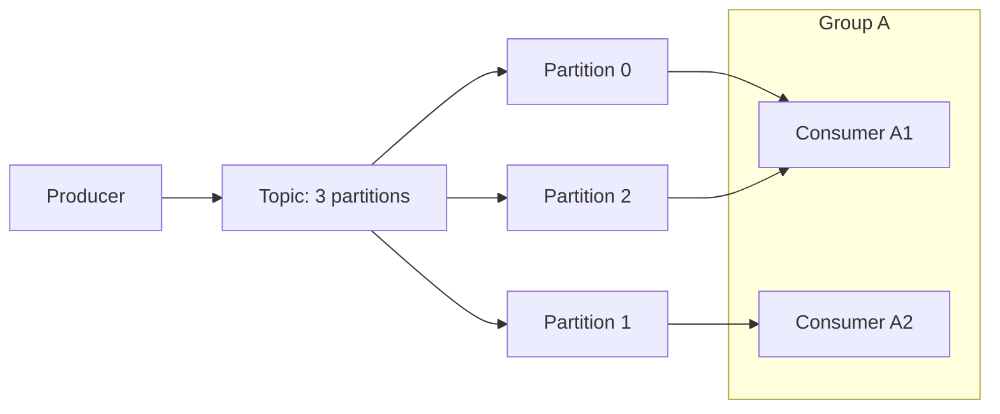

# Consumer groups

> **Learning Path:** Distributed Systems
> **Section:** 2.2.9 — Messaging

### The problem

You have a durable event stream. Producers write faster than a single consumer can read. You also need multiple independent services to react to the same events.

If you give each consumer its own queue you get duplication of data and no sharing of work. If you broadcast to everyone you waste work. You need a way to say: *this set of consumers should together process every message exactly once, in parallel*.

Constraints that force the design:
* Throughput must scale by adding consumers
* Fault tolerance must keep processing after a consumer dies
* Ordering must be preserved per key, not necessarily globally

### Mental model

A consumer group is a **work-sharing team** assigned to one logical stream.

Think of a newspaper route split into sections. The route is the topic, the sections are partitions. The delivery team is the consumer group. Adding a carrier lets you deliver faster. If a carrier quits, someone else takes their section. All papers still get delivered, each exactly once by the team.

### How it works

A stream is split into immutable partitions. A consumer group is a set of consumers that coordinate via a broker coordinator.

Assignment is exclusive per partition: one consumer in the group owns a partition at a time. The group tracks offsets per partition. If a consumer fails, the group rebalances and reassigns its partitions.

That gives you two guarantees:
* **Within a group:** each message is processed by exactly one consumer
* **Across groups:** each group gets a full copy of the stream

### Architectural reasoning

Use a consumer group when you need parallel, fault-tolerant processing of the same event stream with at-least-once semantics.

Alternatives:
* **Queue per consumer.** Simple, but no load balancing and you duplicate storage.
* **Broadcast to all consumers.** Good for fan-out like audit logging, bad for work distribution.
* **Single consumer with scale up.** Hits a throughput ceiling and is a single point of failure.

Consumer groups let you decouple producers from consumers and scale consumers independently. You can run multiple groups on the same topic for different purposes: one group for real-time processing, another for batch replay.

### Trade-offs and failure modes

* **Parallelism vs ordering.** Partitions give parallelism. Messages within a partition are ordered. If you need ordering per user/order-id, you must hash that key to the same partition. More partitions = more parallelism but more coordination overhead.
* **Rebalancing cost.** When a consumer joins/leaves, the group pauses, reassigns partitions, and resumes. Rebalancing storms during deploys cause latency spikes. Sticky assignment helps but doesn't eliminate it.
* **Consumer lag and offset management.** Committing offsets too early risks loss on failure. Committing late risks reprocessing. At-least-once is the default; exactly-once requires idempotent processing.
* **Uneven partitions.** A hot key can overload one consumer. You can’t rebalance within a partition, only move whole partitions.

Common failure: treating a consumer group as a service guarantee. A slow consumer holds back its partitions, causing lag for the whole group. Monitor lag per consumer, not just group average.

### Example

E-commerce `OrderCreated` events, 3 partitions keyed by `order_id`.

Group `inventory` has 2 consumers. One handles partitions 0 and 2, the other partition 1. Both process every order exactly once, in parallel. If a consumer crashes, its partitions move to the surviving member.

A separate group `email` also consumes the same topic, sending receipts. Groups are independent; adding email consumers does not affect inventory throughput.

### Reasoning challenge

You need to process payments with strict per-account ordering, but you also want high throughput. You currently have 6 partitions and 3 consumers in the group. A new compliance service must read the same stream but can tolerate 5-minute delay.

Do you add consumers to the existing group, create a new consumer group, or increase partitions? What breaks if you do each?

### Key takeaway

* A consumer group provides work-sharing with exactly-one-consumer-per-partition semantics.
* Partitions are the unit of parallelism and ordering; consumers are the unit of scale and fault tolerance.
* Choose groups for fan-out to different consumers, partitions for ordering and load.
* Rebalancing, lag, and offset commit strategy are the operational risks you must design for.
