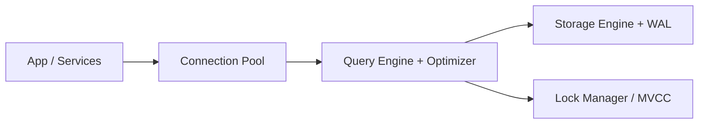

# Relational databases

> **Learning Path:** Data Architecture
> **Section:** 3.1.1 — Databases

### 1. The problem

Before relational databases, data lived in files, spreadsheets, and application code. That creates three architectural pain points:

* **Anomalies.** Update a customer address in one file, miss it in another. Data diverges.
* **Ad-hoc querying.** Find "all orders over $500 from customers in Germany last month" requires custom code and full scans.
* **Concurrency & trust.** Two writers can corrupt a file. How do you guarantee a transfer debit and credit both happen or neither happens?

You need a shared, structured store with enforced rules and predictable reads/writes under concurrency.

### 2. Mental model

A relational database is a **shared set of tables with enforced relationships, not a file store**.

Think of it as a ledger with a strict accounting clerk:

* Tables = named sets of rows
* Primary keys = unique identity
* Foreign keys + constraints = business rules enforced by the system, not the app
* SQL = a declarative query language independent of storage layout

The key insight is *declarative data integrity*. You describe what must be true, the engine guarantees it.

### 3. How it works

Essentially three layers:



* **Logical model:** Tables, indexes, constraints.
* **Execution:** The optimizer chooses access paths; transactions provide ACID via WAL and MVCC/locking.
* **Physical model:** B-trees for indexes, row/column storage, write-ahead log for durability.

You write `INSERT/UPDATE/SELECT`. The system decides how to enforce constraints, isolate concurrent sessions, and recover on crash.

### 4. Architectural reasoning

**When it helps**
* Strong transactional integrity is non-negotiable: payments, inventory, bookings.
* Complex relationships need joins and ad-hoc reporting without ETL.
* Multiple services need a single source of truth with consistent reads.

**Alternatives**
* Document / key-value stores: schema flexibility and high write throughput, weaker cross-record consistency.
* Data warehouse / OLAP: analytical scans, eventual freshness.
* NewSQL / distributed SQL: relational semantics with horizontal scale.

Choose relational when correctness and relationship integrity outweigh raw write scale and schema agility.

### 5. Trade-offs and failure modes

* **Consistency vs scale.** Single-node ACID is simple and fast. Sharding a relational DB breaks cross-shard transactions and joins. Scaling writes usually means read replicas, partitioning, or moving to eventual models.
* **Schema rigidity.** Adding columns is cheap; changing a core relationship in a live system is expensive. Migrations become architectural work.
* **Hot spots.** High contention on a primary key range or a popular row causes lock waits and throughput collapse.
* **Operational cost.** Vacuum/analyze, index bloat, long-running transactions blocking MVCC, and storage I/O dominate operability.
* **Query misuse.** N+1 selects, missing indexes, and unbounded joins turn a good system into a latency nightmare.

Failure modes to plan for: deadlock under concurrent writes, write amplification from indexes, and schema migration downtime.

### 6. Example

E-commerce order lifecycle:

`customers` → `orders` → `order_items` → `products`

Foreign keys enforce referential integrity. A payment transaction:

```
BEGIN;
UPDATE accounts SET balance = balance - 100 WHERE id = buyer;
UPDATE accounts SET balance = balance + 100 WHERE id = seller;
INSERT INTO ledger(...) VALUES (...);
COMMIT;
```

If the process crashes, WAL + atomic commit guarantees all three succeed or none. Reporting services can join these tables ad-hoc without duplicating data.

### 7. Reasoning challenge

You are designing a user profile service for a social app. Profiles have rapidly evolving fields, 10k writes/sec, 100k reads/sec, and eventual consistency is acceptable. A team proposes PostgreSQL with JSONB columns and read replicas.

What would you question about this choice? What workload characteristics would make you keep relational vs move to a document store, and what would you do to mitigate the relational downsides if you kept it?

### 8. Key takeaway

* Relational databases exist to enforce **declarative integrity and transactional correctness** across related data, not just to store it.
* They excel where **ACID, joins, and ad-hoc queries** matter more than schema agility and raw write scale.
* Architecturally, plan for **contention, schema evolution, and scaling limits**; the cost moves from app code to operations and data modeling.
* The decision is not SQL vs NoSQL, it is **consistency and relationship complexity vs flexibility and horizontal write throughput**.
