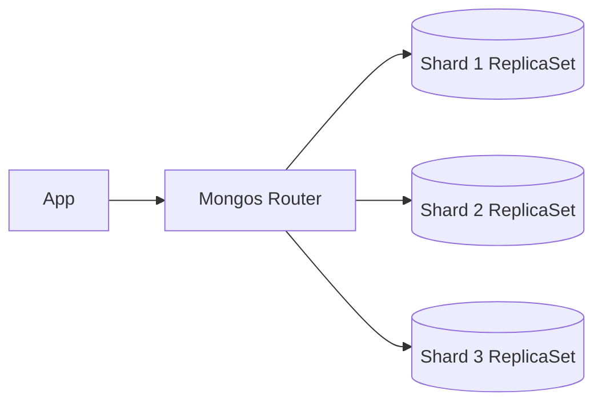

# MongoDB

> **Learning Path:** Data Architecture
> **Section:** 3.1.10 — Databases

**The problem**

You are scaling a product where data shape changes weekly and traffic grows horizontally. Relational schema migrations become a release bottleneck. Vertical scaling hits a ceiling. You need to store semi-structured JSON-like data with high write throughput and low-latency reads, without locking your domain model to a fixed table schema.

That is the constraint MongoDB was built to solve: flexible document storage with horizontal scale.

**Mental model**

Think of MongoDB as a distributed key-value store where the value is a rich document, not a row.

A collection = a table without a fixed schema.
A document = a JSON-like object with nested fields, arrays, and optional fields.

No joins. You design for co-location: put data you read together in the same document.

**How it works**

Data lives in replica sets for high availability: primary + secondaries replicate oplog. Reads can go to secondaries, writes go to primary.

For scale, data is sharded by a shard key. A mongos router routes queries to the correct shard.



Consistency is tunable per operation via write concern and read concern. By default it favors availability and partition tolerance over strong consistency.

Indexes are B-tree, including multi-key indexes for arrays. Aggregation pipeline provides in-process transformations without leaving the database.

**Architectural reasoning**

Choose MongoDB when:

* Schema evolves fast. Product catalogs, user profiles, IoT events where new fields appear without downtime.
* Data is naturally hierarchical and document-shaped. You want to avoid N+1 joins.
* Write throughput and horizontal scale matter more than multi-document ACID transactions.
* You need operational flexibility. Adding shards scales capacity without major rewrites.

Alternatives to consider:

* PostgreSQL with JSONB for strong consistency and relational integrity needs.
* Cassandra/DynamoDB for pure key-value with massive write scale and tunable consistency.
* MongoDB sits between relational flexibility and wide-column scale.

**Trade-offs and failure modes**

* Consistency vs availability. Default eventual consistency means replica lag can serve stale reads. Strong consistency requires primary reads and higher latency.
* Query power vs scalability. Ad-hoc queries and rich filters are easy, but unindexed queries and large aggregations kill performance.
* Sharding is a one-way decision. A bad shard key causes hot spots and jumbo chunks. Changing it requires re-sharding.
* Document size limit is 16 MB. Unbounded arrays grow documents and cause fragmentation and large working set.
* Operational complexity. Replica set elections, mongos routing, chunk balancing, and index management are real operational load.

Failure modes architects see: write concern w:1 with replica lag causing rollbacks, transactions that span shards are limited and slow, and secondary reads serving stale data for user sessions.

**Example**

User profile service for a SaaS platform.

Relational model would need users, preferences, subscriptions, activity arrays with joins and migrations.

MongoDB model:

```json
{
  _id: ObjectId,
  userId: "u_123",
  profile: { name, email, tier },
  preferences: { theme, notifications },
  subscriptions: [{ plan, startedAt }],
  lastActive: ISODate
}
```

Reads for a dashboard are one document fetch. Writes for preference updates are partial document updates. Shard key = userId hash for even distribution. Replica set gives HA across AZs.

**Reasoning challenge**

You need to store financial ledger entries for a payments product. Requirements: every debit must be balanced by a credit, reports must be exactly consistent, and you will query by date range, account, and merchant.

Would you choose MongoDB as the system of record? Why or why not?

**Key takeaway**

* MongoDB solves schema rigidity and horizontal scale for document-shaped workloads, not general purpose relational problems.
* Design documents around read patterns and co-locate what you query together.
* Shard key choice determines scalability; get it right early.
* Trade strong consistency and multi-document transactions for flexibility and horizontal write scale.
* Use it for read-heavy, schema-evolving domains like catalogs, profiles, content, events. Avoid it for financial ledger correctness and heavy relational joins.
