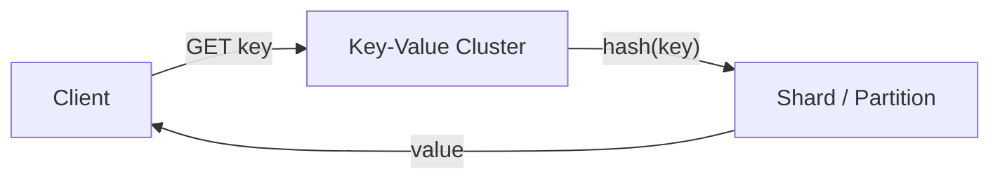

# Key-value stores

> **Learning Path:** Data Architecture
> **Section:** 3.1.11 — Databases

### The problem

You need to store and retrieve data by a known identifier at massive scale with low latency, and you don't need joins, filters, or ad-hoc queries.

Relational databases give you powerful querying but you pay for it: secondary indexes, locking, complex query planning, and scaling writes usually means vertical scaling or sharding logic in your app.

When the access pattern is *“I know the key, give me the value fast”*, the relational model is overkill. The constraints become:
- High read/write throughput
- Horizontal scale-out
- Millisecond latency at p99
- Simple operational model

That constraint creates a different data model.

### Mental model

A key-value store is a distributed hash table with a deliberately minimal API.

`PUT(key, value)`, `GET(key)`, `DELETE(key)`. Optionally `EXISTS` and TTL.

Think of it as a sharded dictionary. The key is the only access path. No schema, no secondary indexes, no joins. The value is opaque bytes — a JSON blob, protobuf, compressed object, whatever you want.

The mental model to keep: **one key maps to one value, and the system is optimized for that lookup.**

Partitioning is by hash of the key. That gives you even distribution and deterministic placement.

### How it works

Essentially three mechanisms:

* **Partitioning / sharding.** Keys are hashed to nodes. Adding nodes rebalances a subset of keys. This is why write throughput scales linearly with nodes.
* **In-memory first, persisted second.** Many KV stores keep hot data in RAM for latency, with async write-ahead log or SSD persistence. This is the core latency vs durability trade-off.
* **Simple consistency options.** You can choose strong per-key consistency or eventual consistency with replicas for read scale. Cross-key transactions are intentionally absent.

The simplicity is the point. The engine does one thing well: find the value for a key.

### Architectural reasoning

When it helps:
* Session state, auth tokens, feature flags — ephemeral data accessed by ID
* Caching layer in front of slower stores
* User profiles, product catalogs where read is by primary key
* Feature stores and embeddings lookup for AI systems where you need fast point lookups by user/item id
* Rate limiting counters, leaderboards with known keys

Alternatives:
* **Relational DB:** choose when you need ad-hoc queries, joins, multi-document transactions, strong consistency across entities.
* **Document store:** choose when you want richer querying on the value while keeping schema flexibility. You lose some raw speed.
* **Cache only:** Redis as cache is fine, but treat it as volatile. If you need durability, you need a persistent KV.

Decision rule: If your dominant access pattern is point lookup by a natural key and you can model the data to fit that, KV wins on latency, scale, and ops cost.

### Trade-offs and failure modes

* **No secondary indexes.** You cannot query by value fields. You must know the key up front. This forces you to denormalize and pre-compute keys, e.g., `user:123:profile`, `user:123:settings`.
* **Value size limits.** Large values hurt memory and network. Typical guidance: keep values < few MB. Larger blobs belong in object storage with KV holding a pointer.
* **Hot keys.** A single popular key can overload one shard. Mitigate with sharding by sub-key, caching, or write sharding.
* **Consistency boundaries.** Most KV stores give strong consistency per key, but no atomic multi-key transactions. You must design for eventual consistency or use application-level coordination.
* **Data modeling cost.** You move complexity from the database to the application. You need to design key namespaces, TTLs, and compaction strategies yourself.

Failure modes architects hit: using KV as a relational DB and building client-side joins; unbounded value growth causing OOM; assuming linearizability across keys.

### Example

Personalization service for an e-commerce app.

Reads: `GET user:8421:profile` → returns pre-built JSON with preferences, segments, last viewed items. 99.9% of requests are point lookups by user id at >50k RPS.

Writes come from an event pipeline that updates the profile asynchronously. Latency budget is <10ms p99.

KV cluster with hash partitioning and 3 replicas per key provides the throughput. The relational DB remains source of truth for orders and transactions, but the read path is served entirely from KV. TTL is used for session-scoped enrichment data.

### Reasoning challenge

You have a relational store with `users`, `orders`, `products`. Product managers want a real-time dashboard showing “top 100 products by revenue today” and “per-user spend last 30 days”.

Do you put these in a key-value store? Why or why not? What would you need to change about the access pattern or data model to make KV viable?

### Key takeaway

* KV stores exist to make point lookups by key fast and horizontally scalable, at the cost of query flexibility.
* Choose them when your access pattern is known keys, high throughput, low latency, and you can tolerate application-side data modeling.
* The main risks are hot keys, large values, and the temptation to query by value — which KV cannot do efficiently.
* Architectural success depends on key design, not feature lists.
