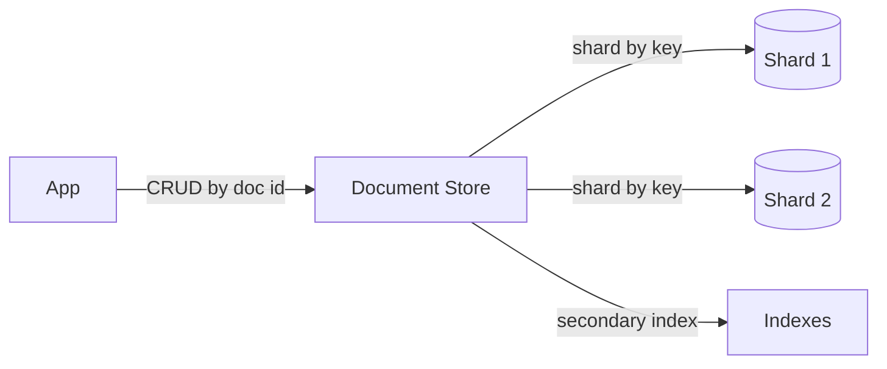

# Document stores

> **Learning Path:** Data Architecture
> **Section:** 3.1.12 — Databases

**Document stores**

### 1. The problem

You need to store data that is semi-structured, evolves fast, and is accessed by document.

Relational databases force you to define a schema up-front: tables, columns, types, foreign keys. That works when the shape of data is stable and relationships are rigid.

The pain appears when:
* Product attributes differ per category and new attributes are added weekly
* User profiles accumulate optional fields from different features
* You ingest JSON from third parties and don't want to normalize it first
* Development speed requires shipping a field today without a migration

The constraint is not storage, it's **schema evolution cost** and **mismatch between storage shape and access shape**. You want to read and write a whole object graph in one operation, not assemble it from 5 joins.

### 2. Mental model

A document store is a collection of self-contained documents.

Think of a filing cabinet where each folder is one entity and contains its entire state as a flexible JSON-like blob. The system indexes the folder by ID, not by columns.

No enforced schema across the collection. Each document can have different fields. The unit of storage and retrieval is the document.

### 3. How it works

Essentially: `key → document`.

Documents are stored in a binary JSON format, e.g. BSON. A primary key gives you O(1) lookup. Secondary indexes are built on fields inside documents, just like a relational DB, but queries are document-centric.

The essential mechanism is:
* Write a whole document, read a whole document
* Optional schema validation per collection, but not required
* Horizontal sharding by document key for scale



No joins. Relationships are either embedded in the document or referenced by ID and resolved in application code.

### 4. Architectural reasoning

**When it helps**
* Data shape is heterogeneous or evolves rapidly
* Access pattern is "fetch one entity and all its data" 
* You value developer velocity over strict consistency
* Write and read volume is high and you want to scale horizontally

**What it solves**
* Eliminates migration churn for schema changes
* Reduces read amplification: one document read replaces multiple joins
* Natural fit for JSON APIs and NoSQL services

**Alternatives**
* Relational + JSON column: keeps transactions, adds flexibility. Good if you need ACID across entities.
* Key-value store: even simpler, no query on fields. Good for pure cache.
* Column store: for analytical scans, not operational documents.

Choose document store when the dominant access is by entity, schema flexibility is a first-class requirement, and you can tolerate eventual consistency.

### 5. Trade-offs and failure modes

* **No free joins.** Embedding creates duplication; referencing requires application-level joins and risks inconsistency.
* **Consistency model.** Most offer tunable consistency; strong multi-document transactions exist but are more expensive than relational.
* **Query power.** Ad-hoc reporting and complex aggregations are harder. You end up exporting to a warehouse.
* **Operational complexity.** Sharding key choice matters. Hot keys and unbounded document growth hurt performance.
* **Failure mode:** unbounded document size leads to memory pressure on reads. Deeply nested arrays cause update amplification.

The architect's rule: document stores optimize for write/read of a single aggregate. If your workload is cross-entity analytics or strict transactional integrity, you pay a price.

### 6. Example

E-commerce product catalog.

A relational model needs `products`, `product_attributes`, `product_variants`, `images` tables and joins on every read. Each new attribute type requires a migration.

With a document store:
```json
{
  "_id": "prod_123",
  "sku": "SHOE-42",
  "category": "footwear",
  "specs": { "size": [42,43], "color": "red" },
  "variants": [ { "color":"red","price":120 }, ... ],
  "metadata": { "created_by": "..." }
}
```
Different categories have different `specs`. New field `sustainability_score` can be added without migration. Read path is one document fetch.

Writes are independent per product. Shard by `category` + `_id` for even distribution.

### 7. Reasoning challenge

You are designing a banking ledger for payments and a user preferences service.

Payment requires multi-record atomicity, auditability, and regulatory reporting. Preferences are JSON blobs per user, updated frequently, read on every request.

Do you use one database for both? Why or why not?

### 8. Key takeaway

* Document stores exist to match storage shape to access shape and remove schema migration cost.
* They trade relational integrity and ad-hoc joins for flexibility, developer speed, and horizontal scale.
* Use them when entities are self-contained aggregates with evolving schemas and read/write by document.
* Design for embedding vs referencing early; bad choices are expensive to fix later.
* Keep reporting/analytics separate; document stores are operational, not analytical.
