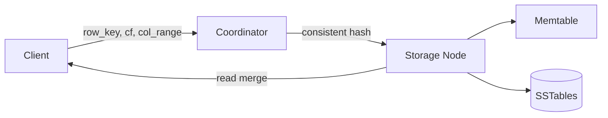

# Wide-column databases

> **Learning Path:** Data Architecture
> **Section:** 3.1.13 — Databases

## 1. The problem

Row-oriented relational databases work great until you hit three constraints together:

* **Write volume and scale.** Billions of rows per day, ingested from many writers worldwide.
* **Sparse, evolving data.** Each entity has a different set of attributes. New attributes appear constantly.
* **Access pattern is key-driven, not ad-hoc.** You almost always fetch by primary key, and you need a specific set of columns, not the whole row.

With a relational model you pay for these with schema migrations, wide rows, and write amplification. Adding a column means ALTER TABLE. Storing sparse data means lots of NULLs. Scans become expensive as rows grow. And horizontal scaling is hard because the row store is tightly coupled to the secondary index and transaction log.

Wide-column stores were created to remove schema and row width as a bottleneck for massive, append-heavy workloads.

## 2. Mental model

Think of a spreadsheet where each **row key is a partition**, and each row is a collection of column families.

A row = `{row_key: {cf1: {col1: val, col2: val}, cf2: {...}}}`

Columns are dynamic. You can add `cf1:device_temp` for one row today and never touch another row. Rows are sparse by design. Column families are stored together on disk.

The access pattern is: `GET row_key + optional column range`. No joins, no ad-hoc WHERE.

## 3. How it works

Storage is organized around the row key.

```
row key -> partition -> sorted columns -> SSTables
```

* Partitioning: Row key is hashed to determine node. All columns for a row live on one node, guaranteeing co-location for fast reads.
* Column families: Logical grouping of columns, often with different TTL/compaction policies. Within a family columns are sorted by name and versioned by timestamp.
* LSM-tree write path: Writes go to memtable, flush to immutable SSTables. Reads merge memtable + SSTables. This favors high write throughput and sequential I/O.
* Time series natural fit: Column name can encode timestamp, e.g. `sensor_readings#2025-08-17T10:00:00Z`. A read of one row returns a time range as a contiguous column slice.



No global secondary indexes are built automatically. You design the row key to encode your query.

## 4. Architectural reasoning

**When it helps**

* Append-only, high write QPS, global distribution. IoT telemetry, user events, clickstreams.
* Sparse and schema-evolving data. User profiles with optional fields, feature flags.
* Time series with per-entity history. You want to fetch last N minutes for one device fast.
* You can pre-model access patterns and accept denormalization.

**Alternatives**

* Row store / PostgreSQL: Strong consistency, ad-hoc queries, joins. Better when schema is stable and read patterns are unpredictable.
* Document store: Flexible schema, whole-document reads. Better when you need rich nested objects and secondary indexes.
* Key-value store: Simpler, single value per key. Wide-column adds ordered column families and range scans within a row.

Decision rule: If your workload is `GET by key + range of columns` at massive scale, and you are willing to design the data model around queries, wide-column wins.

## 5. Trade-offs and failure modes

* **No joins, limited transactions.** You denormalize and duplicate data. Cross-entity queries require application-side joins.
* **Eventual consistency by default.** Cassandra tunable consistency; Bigtable is strongly consistent within a row. Choose carefully for financial data.
* **Row key design is critical.** Hot partitions happen if keys are sequential or low-cardinality. You must design for partition distribution and read locality.
* **Operational complexity.** Compaction, repair, tombstones, and clock skew matter. Small mistakes in TTL or compaction cause unbounded disk growth.
* **Query expressiveness is limited.** You cannot ask arbitrary filters. If you need ad-hoc analytics, you must replicate to a warehouse.

## 6. Example

User activity for a mobile app.

Row key: `user_id`
Column family: `events`
Column name: `timestamp#event_type`
Value: JSON payload

Read `user_id` + last 24h events = one partition scan over a time-ordered column range. New event types require no schema change. Writes from edge regions go to local replicas with tunable consistency.

A relational alternative would need a table with one row per event, indexes on user_id and timestamp, and would struggle with billions of rows and cross-region writes.

## 7. Reasoning challenge

You need to store real-time bidding logs: `bid_id, user_id, campaign_id, timestamp, bid_price, features`. Queries are:

1. Get all bids for a campaign in last hour, ordered by time.
2. Get all bids by user for last 7 days.
3. Ad-hoc analysis on bid_price distribution.

Would you model this in a wide-column store? What would you denormalize, and what query would you be forced to push elsewhere?

## 8. Key takeaway

* Wide-column stores trade schema flexibility and horizontal write scale for ad-hoc query power and joins.
* Design is driven by access pattern: row key determines partition, column naming determines range scans.
* Best for append-heavy, key-driven, sparse, time-series workloads at planetary scale.
* Failure comes from bad key design and underestimating operational burden of LSM + eventual consistency.
