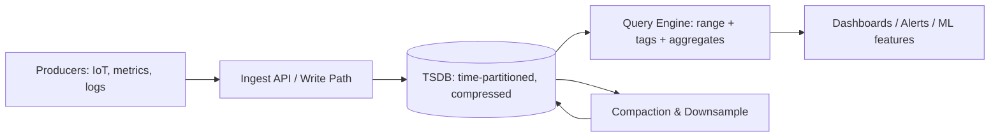

# Time-series databases

> **Learning Path:** Data Architecture
> **Section:** 3.1.14 — Databases

### 1. The problem

You need to store millions of timestamped measurements per minute and answer questions like: *what was CPU usage for host X in the last 5 minutes? What is the 99th percentile latency for service Y over the last 30 days?*

With a general purpose relational database this becomes painful fast:
* **Ingest rate** – append-only writes at tens to hundreds of thousands per second
* **Access pattern** – almost always *range scans by time + filter by metric/tag*, never random point lookups
* **Data lifecycle** – 95% of the value decays quickly; you want fine granularity for hours, then downsampled aggregates for months/years
* **Cardinality explosion** – one metric can have thousands of tag combinations: `cpu{host="a",region="us-east"}`

A row-oriented OLTP system pays for generality you don't use: secondary indexes on timestamp, random I/O, transactional overhead. You don't need ACID across the whole table, you need fast append and fast time-range scans.

### 2. Mental model

A time-series database makes **time the primary organizing dimension**.

Think of it as a write-optimized log partitioned by time, with a secondary index on tags/labels, and storage engineered for compression and fast range scans. Data is immutable once written; updates are rare, deletions are by dropping old time ranges.

```
metric_name + tags  →  ordered sequence of (timestamp, value)
```

That's the core. Everything else is optimization for that shape.

### 3. How it works

Essential mechanisms, not a feature list:

* **Time-partitioned storage.** Data is sharded by time interval, e.g., hourly or daily chunks. Queries for a recent window touch few partitions.
* **Columnar / compressed layout.** Values for a series are stored contiguously. Delta-of-delta encoding for timestamps + Gorilla-style float compression give 5-10x reduction.
* **Tag index, not full secondary index.** Tags are indexed for filtering; the time order provides the scan order.
* **Downsampling / retention policies.** Continuous aggregates roll 1s samples → 1m → 1h. Old raw data is dropped automatically.
* **Append-only writes.** No in-place updates. Compaction happens in background.



### 4. Architectural reasoning

When it helps:
* High write throughput, append-only, time-ordered data
* Queries are always time-range + metric/tag filters + aggregations
* You need long retention with tiered granularity
* You need low query latency for recent data

Alternatives and why you might not choose TSDB:
* **Relational / wide-column:** Postgres with Timescale extension works when you need full SQL joins with other relational data and moderate scale. Pure Postgres collapses under high cardinality ingest.
* **Object store + query engine:** S3 + Athena/Trino is cheap for cold storage and ad-hoc scans, but too slow for real-time dashboards and alerting.
* **Message bus only:** Kafka retains events but isn't a queryable analytical store.

Decision signal: if >80% of your queries start with `WHERE time > X AND time < Y` and writes dominate reads, a TSDB is the right primitive.

### 5. Trade-offs and failure modes

* **Ingest vs query flexibility.** TSDBs are fast at `time-range + aggregate`. Ad-hoc joins across unrelated metrics, arbitrary filtering, or transactional updates are weak.
* **Cardinality cost.** High cardinality = many unique tag combinations. Each series carries memory overhead for index and compression state. Unbounded tags = OOM.
* **Retention and cost.** Compression helps, but storing raw high-frequency data for years is expensive. You must design retention + downsampling up front.
* **Clock skew and late data.** Out-of-order writes are common. Systems handle it with watermarking, but queries on recent windows can be non-deterministic until data settles.
* **Operational coupling.** Schema is implicit via tags. A typo in a tag value creates a new series forever. Need governance for tag naming.

### 6. Example

Fleet telemetry for 50k vehicles, 200 signals per vehicle at 1 Hz.

Ingest ~10M points/min. Need:
* Real-time alert: engine temperature > 120°C in last 2 minutes
* Engineering analysis: average fuel consumption per model per region over last quarter
* Compliance: raw data kept 7 days, 1-min aggregates kept 90 days, 1-hour aggregates kept 2 years

Architecture: edge gateway → Kafka → TSDB with 7-day raw retention + continuous aggregates to downsampled tables. Dashboards query recent raw from TSDB hot tier; historical reports query cold aggregates. Relational DB keeps vehicle metadata; TSDB never joins to it, only filters by vehicle_id tag.

### 7. Reasoning challenge

You are building an AI observability platform that logs every LLM request: timestamp, model, prompt tokens, latency, cost, user_id, and a JSON blob of the prompt/response.

You expect 5k writes/sec now, 50k/sec in 12 months. Product wants real-time cost dashboards and also wants to run ad-hoc SQL investigations joining request logs to user profiles in Postgres.

Do you put everything in a TSDB, everything in Postgres, or a hybrid? What do you put where and why? What retention policy would you set?

### 8. Key takeaway

* Time-series databases exist because time-ordered append workloads have different access patterns than general OLTP.
* Optimize for **ingest speed, range scans, compression, and retention**; sacrifice ad-hoc joins and transactional updates.
* Cardinality and retention policy are architectural decisions, not tuning knobs.
* Use TSDB for the time-series signal, keep relational/object stores for entities and cold data; combine at query time when needed.
