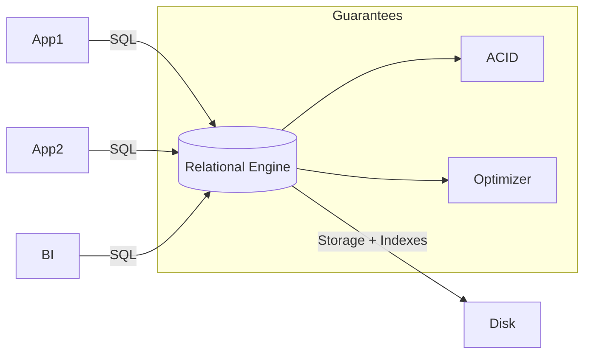

# SQL

> **Learning Path:** Data Architecture
> **Section:** 3.1.2 — Databases

**SQL**

### The problem

You have business data that is written by one system, read by many, and must be correct even under concurrent updates. 

Early approaches — flat files, custom in-memory structures, key-value stores — forced each application to define *how* to find and combine data. That led to duplication, inconsistent views, and brittle code whenever the shape of data changed.

The real constraint is not storage, it is **shared, trustworthy access to structured data with ad-hoc querying**.

### Mental model

SQL is not a storage engine. It is a declarative contract: you describe *what* data you want, not *how* to retrieve it.

The mental model is relational algebra over relations.
A relation = a table with unique rows and a schema. Operations are set-based: select, project, join, aggregate. The engine is responsible for turning that logical description into a physical plan.

Think of SQL as a stable API for data. Applications speak SQL, the database owns physical layout, concurrency, and durability.

### How it works

`SELECT ... FROM ... WHERE ... JOIN ...` is declarative.

The essential mechanism is:

1. **Parser & Binder** turns SQL into a relational expression bound to schema.
2. **Optimizer** chooses a physical plan using statistics, indexes, and cost model.
3. **Executor** runs the plan with ACID guarantees.

ACID is the architectural promise: Atomicity, Consistency, Isolation, Durability. It lets multiple writers and readers coexist without each app implementing locking and recovery.

Indexes are the bridge between logical sets and physical performance. A B-tree index makes point lookups O(log n) and supports range scans; a join is a merge or hash of sets.

### Architectural reasoning

Use SQL when you need:

* **Shared source of truth** across services. One schema, many consumers.
* **Ad-hoc, complex reads**. Filtering, joining, aggregating across entities is native.
* **Strong consistency for transactional data**. Orders, payments, inventory require serializable updates.

Alternatives exist for different constraints:

* **Key-value / document**: high write throughput, schema flexibility, low query complexity.
* **Columnar / OLAP**: analytical scans over immutable data.
* **Graph**: deep relationship traversal is primary access pattern.

SQL wins when correctness and flexible querying outweigh raw write scale and schema rigidity.

### Trade-offs and failure modes

* **Schema rigidity vs integrity.** Schema changes are expensive in production, but they enforce constraints, foreign keys, and types at the database level. The architect trades agility for correctness.

* **Joins cost.** Relational power comes from joins. Unindexed joins, large fan-outs, and N+1 queries kill latency. The database can optimize, but it cannot fix bad data access patterns.

* **Write amplification.** Normalization reduces duplication but increases writes and joins. Denormalization improves read latency at the cost of update complexity and storage.

* **Lock contention and scaling.** ACID isolation creates locks. Hot rows, long transactions, and missing indexes cause contention and deadlocks. Horizontal scale is harder than in stateless stores.

Failure modes architects see in production: missing covering indexes leading to full scans, transactions holding locks too long, schema migrations that block writes, and over-normalized models used for high-throughput read paths.

### Example

Enterprise order management.

Orders, customers, items, payments are separate relations with foreign keys. Services for checkout, fulfillment, billing, and reporting all read/write via SQL.

The checkout service issues one transactional `INSERT INTO orders ...; UPDATE inventory ...` with isolation ensuring stock is not oversold. Reporting runs analytical queries over the same tables. A single schema change, e.g., adding `tax_region`, propagates to all consumers because the contract is SQL.

When reporting load threatens OLTP latency, the architecture adds a read replica or a materialized view, not a new source of truth.

### Reasoning challenge

You are designing a real-time recommendation feed that must ingest 100k events/sec and serve personalized lists in <50ms.

Would you put the core event stream and the serving store in SQL? Why or why not? What would you keep in SQL and what would you move?

### Key takeaway

* SQL is a declarative interface to a relational model with ACID guarantees, not a storage format.
* Choose it for shared transactional truth and complex ad-hoc queries, not for schema-less high-velocity ingestion.
* The real cost is schema evolution, join performance, and lock contention, not syntax.
* Architect with the query workload in mind: indexes, transaction scope, and read/write separation determine success.
