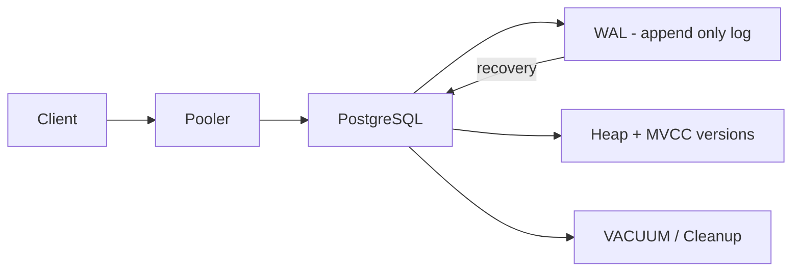

# PostgreSQL

> **Learning Path:** Data Architecture
> **Section:** 3.1.3 — Databases

### The problem

You have an application that needs durable, consistent state that multiple writers can update concurrently and many readers can query with ad-hoc filters, joins, and constraints.

File-based storage gives durability but no concurrency control. Key-value gives speed but no cross-row integrity. You need:

* Atomic multi-row updates that either all succeed or all fail
* Readers that never block writers and never see partial updates
* Declarative constraints and indexes for correctness, not just application code
* Long-lived schema evolution without rewriting the whole dataset

That is the problem relational databases were invented to solve, and PostgreSQL is the modern implementation that prioritizes correctness and extensibility over raw write throughput.

### Mental model

Think of PostgreSQL as a durable log of versions, not a place where rows are overwritten in place.

Writers append new versions of rows. Readers take a snapshot and see a consistent view of the database as of that snapshot. The system guarantees ACID, and lets you extend the type system, access methods, and procedural language inside the engine.

It is a single-node transactional engine with a very rich query optimizer, not a horizontally sharded scale-out store.

### How it works

The essential mechanism is MVCC + WAL.

* **WAL**: Every change is first appended to the Write-Ahead Log. That gives durability and crash recovery.
* **MVCC**: A write creates a new row version with a xmin/xmax visibility. Readers use a snapshot xmin to see only versions visible to them. No reader-writer lock contention.
* **B-tree indexes, vacuum**: Old versions are removed asynchronously by VACUUM. The planner uses statistics to choose join/order plans.

You get serializable isolation without stopping readers, at the cost of storage churn and background cleanup.

### Architectural reasoning

When it helps:
* Strong consistency requirements: financial ledgers, inventory, user accounts, anything where a multi-table update must be atomic.
* Complex queries: joins, window functions, filtering with rich predicates, where the query shape changes per request.
* Schema with constraints: foreign keys, unique constraints, check constraints enforced by the engine.
* Need for extensibility inside the DB: custom types, JSONB operators, full text search, GIS, or stored procedures close to data.

Alternatives:
* MySQL: simpler operational profile, fewer advanced features, different isolation defaults.
* SQLite: great for single-writer embedded use, not for concurrent multi-writer services.
* Document / key-value: higher write scale and lower latency, but you push consistency and joins to the application.

Choose PostgreSQL when correctness and query flexibility outweigh raw write scale, and when you want to keep business invariants in the data layer, not in app code.

### Trade-offs and failure modes

* **Write scalability is vertical.** One node can be fast, but sustained high write throughput hits I/O, WAL fsync, and vacuum. Sharding is manual.
* **Long transactions are toxic.** They pin old row versions, cause table bloat, and block VACUUM. They also hold snapshot, hurting cleanup.
* **Hot rows and lock contention.** Heavy updates to a single row or index page create serialization points. Advisory locks and row-level locks help, but contention still serializes.
* **Operational cost.** You need monitoring for bloat, autovacuum tuning, checkpoint tuning, and connection pooling. It is not fire-and-forget.

Failure mode example: a reporting job opens a 30-minute read transaction. Writes continue, MVCC versions accumulate, autovacuum cannot clean, table balloons, sequential scans slow, IOPS spike.

### Example

Enterprise order management with payments.

Orders, order_items, payments, inventory reservations must move atomically. A checkout transaction does:

1. Reserve inventory rows
2. Insert order + items
3. Create payment record
4. Emit event only on commit

PostgreSQL enforces foreign keys and unique order numbers, runs the three writes in one serializable transaction, and lets concurrent checkouts proceed without readers blocking. A read replica serves product catalog queries while the primary handles writes. Application code does not need distributed locks.

### Reasoning challenge

You are designing an AI feature store that ingests 500k events/sec from IoT sensors, and serves point lookups for online inference plus nightly batch training queries.

Do you put the raw event stream in PostgreSQL? Why or why not, and what would you keep in PostgreSQL?

### Key takeaway

* PostgreSQL exists to give you durable ACID transactions with rich relational queries and enforced invariants, trading write scale for correctness.
* MVCC lets readers and writers coexist, but creates vacuum/bloat pressure you must manage operationally.
* Use it when business rules and complex joins belong in the data layer; avoid it as a high-throughput append-only log.
* Long transactions and hot rows are the two most common architectural mistakes that turn PostgreSQL into a bottleneck.
