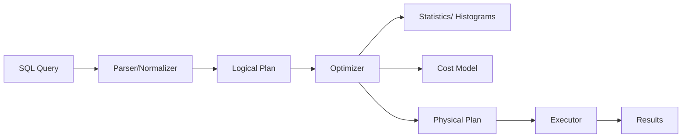

# Query optimization

> **Learning Path:** Data Architecture
> **Section:** 3.1.6 — Databases

**Query optimization**

### 1. The problem

A SQL statement is a *what*, not a *how*. `SELECT user_id, avg_rating FROM reviews WHERE product_id = 123` can be answered by a full table scan, an index seek, a pre-aggregated summary table, or a parallel scan across partitions. The cost difference is orders of magnitude.

At architect scale the problem is not correctness, it's cost under constraints:
* Data volume grows faster than single-node I/O/CPU
* Latency SLAs for online queries vs throughput for batch
* Shared resources: one bad plan can starve other tenants
* Cloud cost is directly proportional to compute and I/O

Without optimization, application developers must manually encode physical access patterns. That does not scale.

### 2. Mental model

The query optimizer is a cost-based planner. It takes a logical query and chooses the cheapest physical execution plan given current data statistics and system resources.

Think of it as a logistics planner: same destination, different routes. It needs a map — table sizes, index selectivity, distribution — and a cost model — I/O, CPU, network — to pick the route.

### 3. How it works

Essential steps:
* **Logical rewrite.** Join order, predicate pushdown, projection pruning. Rules are deterministic.
* **Physical choice.** Hash vs merge vs nested loop join, index scan vs seq scan, parallel vs serial.
* **Cost estimation.** Uses cardinality estimates from stats. Estimated rows × cost per row = plan cost.
* **Plan caching.** Stable plans are reused. Good for OLTP, dangerous for skewed data.

The optimizer does not know your business. It knows statistics.

### 4. Architectural reasoning

When it helps:
* Ad-hoc analytical queries where the same logical query hits different data volumes.
* Multi-tenant systems with variable selectivity.
* Workloads where schema and data distribution change over time.

What it solves: it decouples logical intent from physical execution, letting the DB adapt without application changes.

Alternatives and why you might choose them:
* **Application-side optimization:** materialize views, denormalize, pre-aggregate. Choose when query patterns are stable and latency is critical. You trade flexibility for predictability.
* **Manual hints / plan forcing:** choose when the optimizer is wrong due to stale stats. You trade autonomy for control, and you own the risk.
* **Separate storage engines:** columnar for scan-heavy analytics, row-store for point lookups. Optimizer works within engine constraints.

Architectural decision enabled: you can keep schema expressive and let the optimizer + statistics keep plans cheap, instead of prematurely denormalizing everything.

### 5. Trade-offs and failure modes

* **Stats freshness vs overhead.** Accurate histograms improve plans but autovacuum/autoanalyze consumes I/O and can cause plan churn. Stale stats → cardinality misestimation → bad plan.
* **Planning time vs execution time.** Complex queries with many joins take time to optimize. For short-running OLTP queries, planning can be a meaningful fraction of latency.
* **Plan cache pollution.** Reusing a plan optimized for a selective parameter on a non-selective one causes spills and timeouts. Parameter sniffing is a classic failure.
* **Optimizer blindness.** The optimizer cannot see outside the DB. It won't know that `WHERE tenant_id = X` is always selective, or that a column has business-level skew it can't infer.

### 6. Example

E-commerce product search: `SELECT p.id FROM products p JOIN reviews r ON p.id=r.product_id WHERE p.category='electronics' AND r.rating >=4 GROUP BY p.id HAVING COUNT(*) > 100`.

Naive plan: scan reviews then join. Optimized plan with fresh stats: use category index on products, filter to ~50k rows, then index nested loop into reviews with rating index. Predicate pushdown reduces rows before the join.

If reviews grow 10x daily and stats are updated nightly, the optimizer will underestimate rows, choose nested loop, and blow up. Architect fix: incremental stats, partition reviews by date, or materialize `product_review_counts`.

### 7. Reasoning challenge

You have a multi-tenant SaaS analytics DB. One query is used in two ways:
* Dashboards: `WHERE tenant_id = ? AND date >= now() - 7d` — highly selective, ~10k rows.
* Ad-hoc export: same query without tenant filter — full scan, billions of rows.

Same SQL text, very different optimal plans. Plan cache will pick one. What do you do?

### 8. Key takeaway

* Query optimization exists to map logical intent to the cheapest physical execution given current data and hardware.
* The optimizer is only as good as its statistics and cost model. Design for stats freshness.
* Prefer logical schema clarity and let the optimizer adapt, but materialize when access patterns are stable and latency is non-negotiable.
* Watch for plan cache and parameter sniffing in variable-selectivity workloads.
