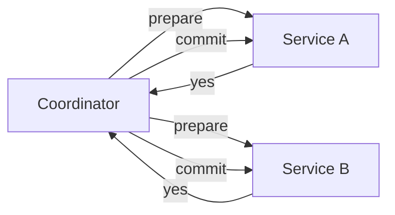

# Transactions

> **Learning Path:** Data Architecture
> **Section:** 3.1.7 — Databases

### 1. The problem

A single business operation rarely touches one row. Transfer money, place an order, book a seat — each requires multiple writes that must all succeed or all disappear.

Without a guarantee, you get partial updates: debit succeeds, credit fails. Money vanishes. Inventory decrements but payment never recorded. The system is left in an inconsistent state that business logic cannot reason about.

The problem is not single writes, it's **coordinated change under failure**.

### 2. Mental model

A transaction is an atomic unit of work with a contract: **all or nothing, once committed, visible to everyone the same way**.

Think of it as a sealed envelope. You can add pages inside, but outside the world sees either nothing happened or the whole envelope arrived. The envelope also promises isolation: other readers don't see half-written pages.

### 3. How it works

Inside a single database the mechanism is simple:

1. **Begin** a private workspace
2. **Read/Write** to that workspace
3. **Validate** against isolation rules
4. **Commit** by making changes durable via WAL, or **Rollback** and discard

ACID is the contract:
* **Atomicity** - all changes commit or none do
* **Consistency** - commit moves DB from one valid state to another
* **Isolation** - concurrent transactions don't see intermediate states
* **Durability** - committed data survives crashes

Isolation is a dial, not a switch. READ UNCOMMITTED → READ COMMITTED → REPEATABLE READ → SERIALIZABLE. Higher isolation = more correctness, less concurrency.

In a distributed system the envelope must span services. Two options emerge:



**2PC - Two Phase Commit.** Coordinator asks all participants to prepare, then commits. Strong atomicity, but coordinator is a single point of failure and participants stay locked until commit.

**Saga.** Break the operation into local transactions with compensating actions.


No global lock, eventually consistent, but you must design compensations and accept temporary inconsistency.

### 4. Architectural reasoning

Use local ACID transactions when:
* All data lives in one datastore
* Operation latency budget allows locking
* Strong consistency is a business requirement

Choose distributed coordination when you must span services/datastores.

2PC helps when:
* You need immediate atomicity across few, reliable participants
* You can tolerate blocking and a central coordinator

Saga helps when:
* Services are autonomous, you own failure modes
* Availability > immediate consistency
* Long-running processes need to survive crashes

Alternatives: single writer per aggregate, event sourcing with append-only logs, or redesign to avoid cross-service write.

### 5. Trade-offs and failure modes

* **Consistency vs Availability.** Strong transactions sacrifice availability during partitions. Sagas keep services up but expose intermediate states.
* **Latency vs Isolation.** Higher isolation means more locks, waits, deadlocks. Deadlocks are normal; you need timeouts and retry with jitter.
* **Coupling vs Correctness.** 2PC couples participants to a coordinator. Sagas couple business logic to compensation logic.
* **Failure modes to design for:** coordinator crash in 2PC leaves participants in-doubt; network partitions cause saga steps to be lost; retries cause duplicate charges without idempotency.

Most real failures are not crashes, they are **timeouts and partial visibility**. Design for idempotent operations and explicit state machines, not happy path.

### 6. Example

Bank transfer between accounts in same DB:

```
BEGIN;
SELECT balance FROM accounts WHERE id = A FOR UPDATE;
SELECT balance FROM accounts WHERE id = B FOR UPDATE;
UPDATE accounts SET balance = balance - 100 WHERE id = A;
UPDATE accounts SET balance = balance + 100 WHERE id = B;
COMMIT;
```

If credit fails, debit rolls back. One envelope.

E-commerce order across Inventory, Payment, Shipping services:

Saga: Reserve inventory -> local commit. Charge payment -> local commit. Create shipment -> local commit. If shipment fails, run compensations: refund payment, release inventory. Customer sees order in "pending" until saga completes.

### 7. Reasoning challenge

You are architecting a ticket sale for a concert. 10,000 seats, 50k concurrent users, inventory in Postgres, payments via external provider, notifications via Kafka. You need to prevent oversell, but payment can take 5 seconds.

Do you use a distributed 2PC across inventory and payment, a saga with reservation expiry, or a single local transaction with async reconciliation? What isolation level and failure handling do you choose?

### 8. Key takeaway

* Transactions exist to make multi-step updates safe under failure; they are a correctness primitive, not performance.
* Inside one DB, ACID gives you atomicity and isolation via locking and WAL. Choose isolation deliberately.
* Across services, you trade strong atomicity for availability and autonomy. 2PC gives atomicity with blocking; Saga gives eventual consistency with compensations.
* Design for idempotency, timeouts, deadlocks, and partial failure first. The happy path is free.
