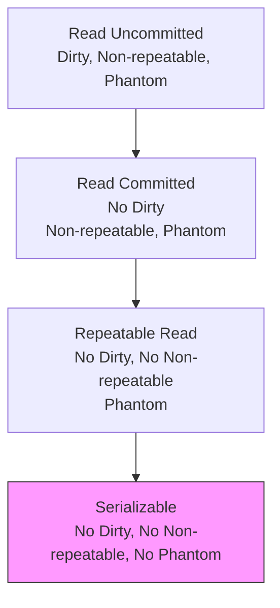

# Isolation levels

> **Learning Path:** Data Architecture
> **Section:** 3.1.8 — Databases

### 1. The problem

Concurrent transactions need data that is changing. Without control, one transaction can see intermediate, inconsistent, or disappearing data from another.

What you get is:
* A reader sees a row that was written but later rolled back
* A reader reads the same row twice and gets two different values
* A reader runs the same query twice and gets a different set of rows

These are not bugs in your code. They are the inevitable result of sharing state without defining *how much* isolation you require.

Isolation levels exist to let you choose which anomalies you are willing to tolerate in exchange for performance and availability.

### 2. Mental model

Think of isolation as a dial between **visibility** and **contention**.

Low isolation = transactions see each other's in-flight changes, less locking, more speed.
High isolation = transactions are walled off, more locking/snapshot overhead, more safety.

The SQL standard gives you four named stops on that dial, defined by three read phenomena:

* **Dirty read:** see uncommitted data
* **Non-repeatable read:** same row changes between two reads in one transaction
* **Phantom read:** same query returns a different set of rows

### 3. How it works

Databases enforce isolation with locking or versioning. Most modern OLTP engines use MVCC: each transaction works on a snapshot of data as of its start time.

* Read Committed: new snapshot per statement. You never see dirty data, but you can see a row change mid-transaction.
* Repeatable Read: snapshot fixed for the transaction. Same row always returns same value.
* Serializable: snapshot + predicate locking / serial order checking. Even phantoms are prevented. Often emulated with SSI.

The mechanism is invisible to you, but the cost is real: more snapshots to keep, more locks to wait on, higher chance of serialization failures.

### 4. Architectural reasoning

Choose isolation level by workload, not by habit.

* **High-throughput OLTP with low contention:** Read Committed is usually enough. You want minimal locking. Dirty reads are unacceptable, non-repeatable reads are tolerable.
* **Financial transfers, inventory decrement, balance checks:** Repeatable Read or Serializable. You need the same balance to stay consistent within a transaction.
* **Reporting / analytics on a live DB:** Snapshot isolation or Read Committed with explicit versioning. You want a stable view without blocking writers.

Alternatives to raising isolation:
* Application-level locking / optimistic concurrency with version columns
* Separate read replica with relaxed consistency
* Queueing writes and serializing them per entity

You raise isolation only when the business invariant cannot be enforced in the app layer.

### 5. Trade-offs and failure modes

* **Consistency vs latency:** Higher isolation = more waits, more aborts. Serializable can cause serialization errors under contention.
* **Phantoms are the expensive one.** Preventing them requires predicate locks or serializable snapshot isolation. That's why many systems stop at Repeatable Read.
* **Deadlocks:** Stronger locking increases deadlock probability. You need retry logic and keep transactions short.
* **False sense of safety:** Repeatable Read does not prevent lost updates unless you use `SELECT ... FOR UPDATE` or a version check. Isolation is not the same as correctness.

The classic failure: two services both read inventory = 5, both decrement to 4, both commit. Isolation level alone doesn't fix it; you need atomic write or optimistic check.

### 6. Example

E-commerce checkout:

Transaction A reserves item 123 and charges card.
Transaction B does the same for the last unit.

With Read Committed, both can read stock = 1, both succeed, you oversell.
With Repeatable Read + `SELECT ... FOR UPDATE`, second transaction waits or fails.

For nightly revenue reporting, you want a stable snapshot, not row-level locks on the transactional DB. Use a read replica at Repeatable Read or export to warehouse.

### 7. Reasoning challenge

You have a payment service and a dashboard.

Payments must never double-spend an account. Dashboard needs near real-time totals but can be a few seconds stale.

What isolation level do you set for payments, and how do you avoid paying the serializable cost for the dashboard? What would break if you set everything to Serializable?

### 8. Key takeaway

* Isolation levels are a deliberate trade-off between correctness guarantees and concurrency cost.
* Dirty read is almost never acceptable; non-repeatable read and phantom read are the real design choices.
* MVCC gives you Repeatable Read cheaply; Serializable is expensive and may need retries.
* Choose per workload, keep transactions short, and enforce business invariants with locks or version checks, not isolation alone.

You should be able to reason: *What anomaly can this business tolerate, and what is the cost of preventing it?*
