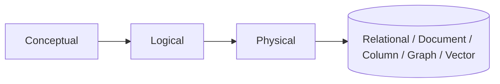

# Data modeling

> **Learning Path:** Data Architecture
> **Section:** 3.2.1 — Data architecture

**Data modeling**

### 1. The problem

You have one domain reality — orders, users, sessions, embeddings — and many systems that need to use it differently.

OLTP needs fast, consistent writes and point lookups. Analytics needs scans and aggregations. AI training needs immutable, versioned historical features. RAG needs vectors with metadata filtering.

If you model for only one use case, the others break. If you model for all at once, you get a tangled schema that is expensive to change and hard to reason about.

Data modeling is the decision of what to store, how to structure it, and what contracts to expose, given those competing constraints.

### 2. Mental model

A data model is an interface between the domain and storage.

It is not the database. It is the set of entities, attributes, relationships and constraints you commit to.

Think in three layers:

Conceptual: business concepts and relationships, technology agnostic.
Logical: entities, keys, cardinalities, constraints, no physical types.
Physical: tables, partitions, indexes, denormalization for access patterns.

Change is cheap at conceptual, expensive at physical. Good modeling keeps the conceptual stable while allowing physical to evolve.

### 3. How it works

Modeling is choosing access patterns first, then shaping data to match.

For each consumer ask:
* What query shape? point lookup vs scan vs join vs similarity search
* What freshness? real-time vs batch vs eventual
* What consistency? strict ACID vs eventual
* What lifecycle? append-only vs mutable vs time-series

Then decide normalization vs denormalization, granularity, and ownership.

Normalization reduces redundancy and write anomalies for transactional data. Denormalization reduces reads and joins for analytical and AI serving.

You also model for evolution. Add nullable columns, use surrogate keys, version schemas, and keep history explicit when features or analytics need reproducibility.

### 4. Architectural reasoning

When it helps:
* When multiple services read the same data with different latency SLOs
* When schema changes are frequent and need controlled rollout
* When you need to separate write model from read model

Alternatives:
* One normalized relational model for everything → simple writes, painful reads at scale
* One denormalized document model for everything → fast reads, hard correctness and analytics
* Separate models per bounded context → higher operational cost, better fit per use case

Choose by purpose, not by technology.

Transactional core → normalized relational with strict constraints.
Analytical → star/snowflake or columnar with denormalized fact tables.
Feature store for ML → immutable, time-versioned entities and features, with point-in-time correctness.
Vector / RAG → embedding vectors with metadata for filtering, not for joins.

### 5. Trade-offs and failure modes

Normalization vs denormalization: consistency and storage vs read latency and simplicity.
Granularity: fine-grained events are flexible but expensive to aggregate; coarse aggregates are fast but lose history.
Schema rigidity: strict schemas protect correctness but slow evolution; schemaless is flexible but pushes validation to app code.
Coupling: shared tables create implicit coupling across services. A change in one consumer forces changes in producers.

Common failure modes:
* Modeling for current queries only → schema migrations become risky later
* Mixing OLTP and OLAP in one model → write amplification and slow analytics
* Implicit temporal semantics → features trained on data that wasn't point-in-time correct
* Over-normalization for AI workloads → joins at training time become bottlenecks

### 6. Example

E-commerce order system.

Conceptual: User, Order, OrderLine, Product, Payment.
Logical: User 1:* Order 1:* OrderLine *:* Product, Order 1:1 Payment.
Physical transactional: normalized PostgreSQL with FKs, for ACID writes.

For analytics: nightly ETL to Snowflake star schema. Fact table `f_order_line` with denormalized user_id, product_id, sku, price, timestamp. Dimension tables for User, Product, Date. Queries scan and aggregate fast.

For recommendations: feature store stores immutable `user_id, timestamp, avg_order_value_30d, category_affinity`. Features are versioned and point-in-time joinable to training data.

For support search: product documents in Elasticsearch with denormalized fields for full-text search.

One domain, three physical models, each optimized for its access pattern, derived from the same logical model.

### 7. Reasoning challenge

You are building a real-time chat app. Requirements:
* Low-latency message delivery and edit/delete
* Full-text search across messages per channel
* Weekly analytics on active users and message volume
* Personalized recommendations based on conversation topics

Would you model messages in one store? If not, what are the minimal models and how do they relate?

### 8. Key takeaway

* Data modeling is an architectural interface decision, not a database schema exercise.
* Model for access patterns, consistency, and evolution, not for purity.
* Keep conceptual stable, allow logical and physical to diverge per use case.
* Separate transactional, analytical, and AI models early; sync them explicitly.

You should be able to reason: given read/write patterns and lifecycle, what structure minimizes coupling, cost, and risk of change.
