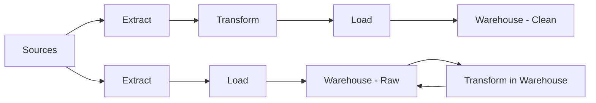

# ETL / ELT

> **Learning Path:** Data Architecture
> **Section:** 3.2.10 — Data architecture

### The problem

You have data in 5-10 operational systems — OLTP DB, SaaS apps, logs, event streams — and you need a single place to query it for reporting, analytics, and AI features. 

The constraints that create the need:
* Sources are heterogeneous and keep changing schemas
* Target systems have different compute and storage economics
* Data must be usable, not just present: cleaned, joined, conformed
* You need to balance freshness, cost, and reliability

This is the data integration problem. ETL and ELT are two answers to *where* and *when* you apply transformation.

### Mental model

Think of it as a factory line for data.

**ETL = Extract, Transform, Load.** You clean and shape the data *before* it enters the warehouse. The warehouse receives finished goods.

**ELT = Extract, Load, Transform.** You move raw data *into* the warehouse first, then clean and shape it *inside* the warehouse using its own compute.

The difference is not tools. It's who pays for transformation and when schema is enforced.

### How it works

**ETL core loop:**
Extract data from sources in batches or micro-batches. Transform in a dedicated engine — deduplicate, type-cast, join, conform dimensions. Load the curated tables into the target.

**ELT core loop:**
Extract and land raw data as-is into cheap storage in the warehouse. Transform later with SQL, dbt, Spark running on warehouse compute. The raw layer is kept, the curated layer is derived.

Both share the same stages, just the order changes.

### Architectural reasoning

Choose ETL when:
* Target has limited or expensive compute, e.g., classic data warehouse, on-prem appliance, or a destination that must enforce a strict schema on ingest.
* Data volume is small relative to transformation complexity, and you want to fail fast before polluting the warehouse.
* Regulatory or governance requires cleaning before data is ever stored centrally.

Choose ELT when:
* Target is a cloud data warehouse / lakehouse with elastic compute and cheap storage. Transform in place is cheaper and faster.
* You want to preserve raw data for reprocessing as business logic changes. Schema evolution is handled by re-running transformations, not re-extracting.
* Ingestion latency matters. Landing raw is fast; transformations can be incremental and decoupled.

The architectural decision is: *where is transformation cheapest and safest?*

### Trade-offs and failure modes

* **Cost vs latency.** ETL moves less data but requires a separate transform tier. ELT moves all raw data but leverages cheap storage + elastic compute. For cloud warehouses, ELT is usually cheaper at scale.
* **Data quality timing.** ETL catches bad data early, protecting downstream. ELT delays validation, so you need strong data contracts and monitoring on the raw layer or bad data can silently accumulate.
* **Schema rigidity.** ETL forces a schema on ingest. Good for stability, bad for experimentation. ELT allows schema-on-read and iterative modeling, but requires governance to avoid sprawl.
* **Failure blast radius.** ETL failures block the load. ELT failures in transformation don't lose the raw copy; you can replay. But long-running warehouse transforms can starve other workloads.
* **Operational complexity.** ETL needs orchestration, state management, and a transform engine. ELT pushes complexity into warehouse jobs, which is simpler if your team is SQL-first.

Common failure modes: schema drift from source breaking transforms, late-arriving data causing backfills, transform jobs running out of memory on the warehouse, and losing the raw layer in ELT which makes reprocessing impossible.

### Example

E-commerce analytics.

Sources: PostgreSQL orders, Kafka clickstream, Stripe payments.
Target: Snowflake / BigQuery.

ELT approach: Stream/ batch landing into `raw.orders`, `raw.events`, `raw.payments`. dbt models build `stg_*` then `int_*` then `mart_*` inside Snowflake. Product team can add a new metric by adding a model, without touching ingestion.

ETL approach: An orchestration tool extracts, runs Python transformations to unify currencies and sessionize clicks, then loads curated tables into Redshift. Changes require updating the ETL job and re-validating the load.

The ELT choice makes sense because storage is cheap, transformations are SQL-heavy, and the raw layer is valuable for audit and ML feature replays.

### Reasoning challenge

You are building a real-time fraud detection feature that needs features from both a transactional OLTP DB and a clickstream Kafka topic. The model retrains weekly and needs point-in-time correct features. Latency budget is <5 minutes from event to feature availability. Cost is constrained.

Would you design an ETL pipeline with a separate transform cluster, or an ELT pipeline landing raw into a warehouse/lakehouse and transforming there? What breaks if you pick the wrong one?

### Key takeaway

* ETL and ELT are the same stages in different order; the decision is where transformation happens.
* ETL protects the target with clean data up front; ELT preserves raw data and leverages cheap cloud compute for transformation.
* Choose based on target compute economics, schema stability needs, and how important raw reprocessing is.
* Architect for failure: monitor schema drift, keep a raw layer, and isolate transform workloads from critical ingestion paths.
