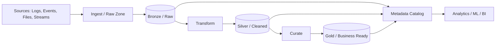

# Data lakes

> **Learning Path:** Data Architecture
> **Section:** 3.2.11 — Data architecture

**Data lakes**

### 1. The problem

You need to keep everything. Not just the cleaned, business-approved fields for reporting, but raw logs, clickstreams, IoT telemetry, images, video, semi-structured JSON, change streams, and experimental features.

A traditional data warehouse solves this with schema-on-write: data is cleaned, normalized and loaded before it is stored. That works for known questions with stable schemas. It fails when:

* Sources are heterogeneous and change format frequently
* You need the raw data for compliance, replay, or model training
* You want teams to explore without waiting for central ETL
* Storage cost must stay low for long retention

The constraint is: **cheap, durable storage for raw variety, with schema applied later by the consumer.**

### 2. Mental model

A data lake is object storage with a catalog, not a database.

Think of it as a warehouse for raw materials. You dump the raw material in cheap bulk storage, you label it later. The value comes from being able to reprocess the same raw input with new schemas, new algorithms, or new regulations.

Core idea: **store first, structure later.** Schema-on-read instead of schema-on-write.

### 3. How it works

Ingestion lands raw files in an object store like S3, ADLS, or GCS. Compute is separate.

A medallion architecture is the common mental model:

* **Bronze:** raw, immutable, as-received
* **Silver:** cleaned, deduplicated, conformed
* **Gold:** business-ready aggregates for BI

A catalog tracks what exists, where, and its lineage. Compute engines like Spark, Presto/Trino, Athena, or Databricks query the lake without moving data.

### 4. Architectural reasoning

Choose a data lake when the problem is variety + scale + retention + exploratory reuse.

It solves:
* Low-cost long-term retention of raw data
* Decoupling ingest from consumption
* Enabling ML training on full history and raw features
* Allowing different teams to apply different schemas to the same source

Alternatives:
* **Data warehouse:** schema-on-write, strong governance, fast OLAP on structured data. Choose when queries are well-known and latency matters.
* **Lakehouse:** tries to get both. Adds ACID tables, metastore, and unified compute on top of lake storage. Choose when you need warehouse semantics but lake scale.

For an AI solution architect, the lake is the place to store training data, raw features, model artifacts, and evaluation sets with full lineage.

### 5. Trade-offs and failure modes

* **Data swamp.** Without governance, you get unlabelled files, duplicate data, and no trust. Catalog, ownership, and data contracts are required.
* **Query cost and latency.** Full scans on object storage are cheap to store but expensive to query. Partitioning, file sizes, and columnar formats matter.
* **Security.** Raw PII sits in the lake. You need encryption, fine-grained access control, and classification at rest.
* **Operability.** Schema-on-read pushes complexity to consumers. Teams must be disciplined about metadata and versioning.

Common failure: treating a lake like a dump and expecting BI performance. It needs curation layers.

### 6. Example

E-commerce platform wants to improve recommendation quality.

Events from web, app, and warehouse are streamed to Bronze in parquet partitioned by date. Data engineers run daily Silver jobs to dedupe user sessions and join with product catalog. ML engineers read Silver to train embeddings, and read Bronze to reconstruct historical sessions for a new model.

Business analysts query Gold tables in a warehouse for KPIs. All three teams reuse the same raw source without interfering.

### 7. Reasoning challenge

You have 50TB of raw video and sensor data from autonomous vehicles. Legal requires 7-year retention of raw bytes. Data science wants to experiment with new feature extraction monthly. Finance wants predictable query cost.

Do you put everything in a data lake, a data warehouse, or a lakehouse? What do you store in Bronze vs Silver, and where do you enforce schema and access control?

### 8. Key takeaway

* A data lake exists to store raw, heterogeneous data cheaply and durably for later structuring.
* Schema-on-read enables reuse but requires governance to avoid a swamp.
* Separate storage from compute; use medallion layers to balance raw fidelity and usability.
* Choose lake for variety and experimentation, warehouse for known fast queries, lakehouse when you need both.
