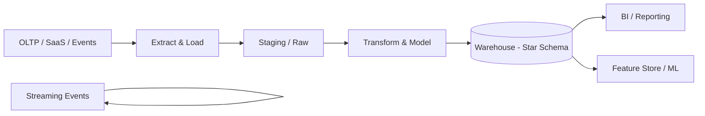

# Data warehouses

> **Learning Path:** Data Architecture
> **Section:** 3.2.12 — Data architecture

**Data warehouses**

### The problem

OLTP systems are built for one thing: fast, consistent updates to current state. Queries for analytics break them.

What happens when you need:
* Answers over months/years of history, not just today
* Aggregations across millions of rows: `SUM`, `COUNT DISTINCT`, joins across many tables
* Many concurrent readers with different questions, none of which can block writes
* A single source of truth for reporting, with defined business semantics

Running this on an operational database causes slow queries, lock contention, schema churn from feature development, and inconsistent definitions of “revenue” across teams.

You need a system optimized for analytical reads, with stable schema, historical immutability, and separated workload.

### Mental model

A data warehouse is a curated, read-optimized store for analytical queries over integrated historical data.

Think: OLTP = live ledger. Warehouse = audited, consolidated archive built from many ledgers.

Data is cleaned, conformed, and denormalized into schemas designed for questions, not transactions. Once written, data is typically immutable and append-only.

### How it works

Sources → Ingestion/ELT → Curated warehouse → Consumption

Essential mechanism is separation of write and read paths:
* **ELT not ETL:** Load raw data first, transform inside the warehouse using its compute. This scales with warehouse compute and avoids brittle external pipelines.
* **Star schema:** Fact tables with measures + dimension tables with context. Optimized for filtering and aggregation.
* **Batch + incremental:** Data lands on a schedule, then is versioned. Late arrivals are handled by reprocessing windows.

### Architectural reasoning

When it helps:
* Organization-wide reporting needs a single definition of metrics
* Historical analysis and trend detection over long time windows
* Complex joins and aggregations that are expensive in OLTP
* Downstream ML features that require consistent, governed training data

Alternatives:
* **Data Lake:** Cheap raw storage, schema-on-read. Good for exploratory, unstructured data, but leaves governance and query performance to the consumer.
* **Lakehouse:** Tries to get warehouse governance on lake storage. Useful when you need both open formats and SQL performance.
* **OLTP + read replicas:** Works for simple dashboards on recent data, fails on deep history and cross-system joins.

Choose a warehouse when correctness, consistency, and query performance for governed analytics outweigh the need for real-time freshness and schema flexibility.

### Trade-offs and failure modes

* **Freshness vs cost.** Warehouses are batch-oriented. Sub-minute latency requires streaming ingestion and adds complexity and cost. Most reporting tolerates hourly/daily latency.
* **Schema rigidity.** Changing a conformed dimension is a migration with downstream impact. This is a feature for governance, a liability for rapid experimentation.
* **Cost model.** Compute scales with query load. Ad-hoc exploration by many users can explode cost if not governed. Snowflake/BigQuery charge per scan/compute.
* **Pipeline brittleness.** Warehouse is only as good as its pipelines. Silent failures, schema drift from source, and late data cause stale or wrong reports. Observability on data quality and SLA is mandatory.
* **Query degradation.** Without partitioning, clustering, and proper modeling, large fact tables become slow. Star schema design and materialized views matter.

Common failure: treating the warehouse as a dumping ground. Raw + curated layers must be separated, and business logic centralized, otherwise you replicate inconsistency.

### Example

E-commerce company with orders in Postgres, payments in Stripe, product catalog in Mongo, and clickstream in Kafka.

A warehouse ingests daily snapshots via ELT, plus hourly clickstream. A star schema is built:
* `fact_orders` with order_id, user_id, product_id, timestamp, amount
* `dim_user`, `dim_product`, `dim_date`

Finance queries `SUM(amount)` by month from the warehouse, not from Postgres. Product team joins clickstream to orders for conversion analysis. ML team builds churn features from the same curated tables.

Operational writes never touch the warehouse. Reporting is consistent and isolated.

### Reasoning challenge

You need real-time fraud scoring on transactions and monthly regulatory reporting on those same transactions.

Do you put both in the same data warehouse? Where does each workload live and why? What is the interface between them?

### Key takeaway

* A data warehouse exists to provide a governed, historical, query-optimized view for analytics, decoupled from operational systems.
* Choose it when consistency and analytical performance matter more than real-time freshness and schema flexibility.
* Success depends on reliable ELT pipelines, clear modeling, and treating the warehouse as a product with SLAs, not a dump.
* Watch for cost, latency, schema change friction, and data quality failures as the primary architectural risks.
