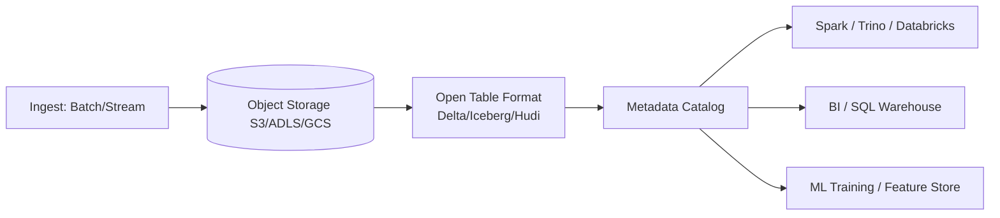

# Lakehouses

> **Learning Path:** Data Architecture
> **Section:** 3.2.13 — Data architecture

**Lakehouses**

### 1. The problem

You have two data platforms and neither works alone.

A data lake gives you cheap object storage and schema-on-read. You can land raw logs, IoT streams, and unstructured data at scale. But there is no enforcement, no ACID, and BI tools struggle with it. Governance is manual.

A data warehouse gives you ACID, SQL, governance, and fast BI. But it is schema-on-write, expensive at scale, and a bad fit for raw data, streaming, and ML workloads that need the original files.

The constraint: you need cheap, durable storage at scale **and** warehouse semantics for analytics, ML, and governance, on one platform.

### 2. Mental model

A lakehouse is a data lake with warehouse guarantees on top.

Storage stays on open object storage. Semantics are provided by an open table format that adds a transactional metadata layer. Same data, same files, can be read by a BI engine, a Spark job, or a training run.

Think: files on disk + a lightweight catalog that makes those files behave like a table.

### 3. How it works

The essential mechanism is not a new storage system. It is an open table format — Delta Lake, Apache Iceberg, Apache Hudi — sitting on object storage.

The format provides:
* **ACID transactions** on top of eventually-consistent object storage via a log of metadata changes
* **Schema evolution** and data versioning
* **Time travel** and upserts/merges for incremental processing
* A centralized catalog for discovery and governance

Compute is separate and interchangeable. Storage is decoupled from compute.

### 4. Architectural reasoning

When it helps:
* You need one source of truth for analytics *and* ML from raw to curated data
* You want lake economics for long-term retention and warehouse performance for hot data
* You need open formats to avoid vendor lock-in and enable multi-engine access

Alternatives:
* Lake + Warehouse with ETL replication. Works, but you pay for duplication, latency, and operational complexity.
* Warehouse-only. Works for structured BI, fails on cost and flexibility for raw/unstructured and large-scale ML.

Choose lakehouse when the decision is to unify platforms, not add another.

### 5. Trade-offs and failure modes

* **Complexity moves up.** You now operate a metadata catalog, compaction, and vacuum. Small files and write amplification are real operational problems. If the metadata log is corrupted, the table is unreadable.
* **Consistency vs availability.** ACID on object storage is built with optimistic concurrency. Hot write paths can conflict; you need retries and idempotent writers.
* **Performance is not magic.** Warehouse-style scans are fast on curated tables, slow on raw landing zones. You still need medallion architecture: Bronze raw, Silver cleaned, Gold aggregated.
* **Vendor gravity.** Features like auto-compaction, change data feed, and serverless compute are vendor-specific even if the format is open.

Failure modes architects care about: metadata store as a single point of failure, runaway vacuum jobs, schema evolution breaking downstream consumers, and cost surprises from excessive time travel retention.

### 6. Example

Retail company with clickstream, POS transactions, and product catalog.

Raw events land in S3 as Bronze in Iceberg format. Silver layer runs incremental merge to dedupe sessions and enforce schemas. Gold layer materializes daily sales aggregates.

Same tables serve:
* Trino for ad-hoc BI
* Spark for feature engineering
* A model training job reading historical partitions with time travel for reproducibility

No separate warehouse copy. Governance and lineage are applied once at the table level.

### 7. Reasoning challenge

You have real-time Kafka streams, 10TB/day batch loads, and a data science team that needs raw Parquet for model training. Finance needs audited, ACID-compliant reporting with point-in-time queries.

Do you build a lakehouse on open formats, or keep a streaming lake + a separate cloud warehouse with CDC replication? What is the deciding constraint?

### 8. Key takeaway

* Lakehouse = object storage + open table format with ACID and governance, not a new storage engine.
* It exists to unify cheap scale of lakes with reliability of warehouses.
* Choose it for platform consolidation and ML + analytics convergence, not as a default.
* Watch metadata durability, small file management, and operational complexity as the real cost.
