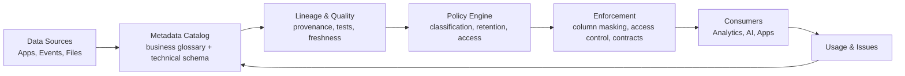

# Data governance

> **Learning Path:** Data Architecture
> **Section:** 3.2.14 — Data architecture

**Data governance is not a catalog. It is who decides what data means, who can use it, and how you prove it.**

### 1. The problem

At scale data stops being a technical problem and becomes an organizational one.

* Teams create their own copies of customer, product, and transaction data. Definitions diverge: `customer_id` means three different things.
* AI models and analytics are built on those copies. Bad joins, stale snapshots, or PII leakage become model risk.
* Compliance is no longer optional. GDPR, CCPA, HIPAA, SOC2 require you to prove *where data came from, who touched it, and why access was allowed*.
* Engineers optimize for speed. Legal optimizes for risk. Data owners are unclear.

Without a shared decision layer you get data sprawl, rework, audit failures, and models you cannot trust.

### 2. Mental model

Think of governance as a control plane for data, not a data pipeline.

It defines the rules of the data economy: definitions, quality bars, access, lineage, and retention. Then it enforces those rules at the points where data is created, moved, and consumed.

`Policy + Metadata + Enforcement = Governance`

If you only have documentation, you have governance theater.

### 3. How it works

The minimal architecture is three loops:

* **Business glossary & technical metadata** give a single source of truth for meaning.
* **Lineage** maps source → transformation → consumer so impact of a change is knowable.
* **Classification & policy** tag PII, PHI, financial data and encode rules: who can read, where it can leave, how long it lives.
* **Enforcement** is pushed to the perimeter: access control at warehouse, masking in BI, data contracts at ingestion, quality gates in CI.

Governance succeeds when the policy is observable and automated, not emailed as a PDF.

### 4. Architectural reasoning

Use governance when data is reused across teams and has risk.

It helps when:
* You have multiple producers and consumers with different SLAs and compliance needs.
* AI workloads depend on training data quality and auditability.
* You need to prove compliance, not just claim it.

Alternatives:
* **Data management only** = pipelines, quality checks, no decision rights. Fast, but inconsistent.
* **Central data team as gatekeeper** = works early, fails at scale due to bottleneck.
* **Fully decentralized** = fast innovation, high duplication and risk.

Choose governance when the cost of a bad decision > cost of coordination. That is almost always true for customer data, regulated data, and model training data.

### 5. Trade-offs and failure modes

* **Centralization vs autonomy.** Strong central policies ensure consistency but slow teams. The fix is federated ownership: domain owners define meaning, central platform provides tooling and guardrails.
* **Prevention vs detection.** Blocking bad data at ingestion is safer but reduces velocity. Most architectures use both: contracts + quality gates prevent, lineage + monitoring detect drift.
* **Completeness vs usability.** A perfect catalog no one uses is worthless. Govern the 20% of datasets that drive 80% of risk and value first.
* **Cost and operability.** Metadata collection, lineage tracking, policy enforcement add latency and cost. Operate it like a product with SLOs, not a side project.

Common failures: governance as documentation, policy without enforcement, and catalog-first without business ownership. Governance dies when the glossary is owned by engineers alone.

### 6. Example

An e-commerce platform builds a churn prediction model.

Without governance: marketing exports `customer` table from Redshift, engineering uses `user` from Snowflake, both contain PII. Model trains on mismatched keys, leaks email addresses into logs, and cannot be audited for GDPR deletion requests.

With governance: 
* Business glossary defines `customer_lifetime_value` once, owned by Finance.
* Lineage shows model features derive from `orders` and `subscriptions`.
* Classification tags PII columns; policy enforces masking in BI and automatic redaction in training datasets.
* Data contract tests freshness and null rate; CI blocks deploy if quality drops.

Result: faster reuse, auditable model, and a single deletion workflow that propagates.

### 7. Reasoning challenge

You are launching an internal LLM assistant that can query customer support tickets.

Do you first build a unified access policy and PII classification for tickets, or build the assistant and add guardrails later? What breaks if you choose wrong?

### 8. Key takeaway

* Governance is decision rights and enforcement, not a tool.
* Start with business meaning and risk, then automate policy at the edges.
* Federate ownership; centralize platform, not people.
* Measure governance by trust and reuse, not catalog coverage.
