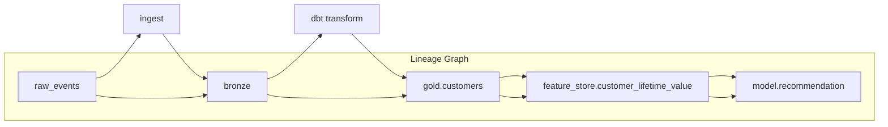

# Data lineage

> **Learning Path:** Data Architecture
> **Section:** 3.2.15 — Data architecture

**Data lineage**

### 1. The problem

You have a data product in production. A model scores it down, a compliance auditor asks for the source of PII, or a downstream dashboard shows impossible numbers.

Who produced this value? What transformed it? Which upstream change broke it?

Without lineage you are left with grep, tribal knowledge, and manual reconstruction. With 100+ tables, streaming pipelines, and feature stores, that reconstruction is impossible at speed.

The problem is not knowing *what* data you have. It is knowing *how it came to be* and *what depends on it*.

### 2. Mental model

Lineage is a directed acyclic graph of data artifacts and the transformations between them.

Nodes = datasets, tables, files, columns, features, models.
Edges = transformations, copies, joins, aggregations.

Think of it as a family tree for data. You can walk upstream to find origin and downstream to find impact.

Column-level lineage is the useful granularity. Table-level tells you `orders` came from `raw_orders`. Column-level tells you `orders.customer_lifetime_value` = `SUM(orders.amount) GROUP BY customer_id` from `raw_events`.

### 3. How it works

Lineage is captured as metadata, not by moving data.

**Static lineage:** Parsed from code. SQL parser extracts FROM/JOIN/SELECT, dbt models, Spark jobs. Cheap, fast, but incomplete for dynamic logic.

**Dynamic lineage:** Captured at runtime via instrumentation. Query logs, change data capture, or explicit emission from pipeline steps. Accurate, but higher overhead.

The system stores:
* **Provenance:** where an artifact was created, when, by whom, with what config
* **Transformation:** the logic that maps input to output
* **Dependency graph:** edges between artifacts

In practice you combine both. Static for coverage, dynamic for validation.

### 4. Architectural reasoning

Use lineage when the cost of not knowing exceeds the cost of capturing metadata.

It helps when:
* **Governance and compliance** - GDPR/CCPA right to erasure, SOX audit. You must prove where PII flows and delete it everywhere.
* **Impact analysis** - A schema change in `raw_events` will break which downstream models? Lineage gives you a blast radius.
* **ML/AI trust** - Model drift or bias? Trace a feature back to its raw sources and training data versions. This is data provenance for model governance.
* **Incident response** - Data quality issue? Walk upstream to the root cause instead of guessing.

Alternatives are manual documentation and tribal knowledge. They decay instantly in CI/CD pipelines.

Lineage is not a debugging tool. It is an architectural decision support system. It enables safe evolution of data platforms.

### 5. Trade-offs and failure modes

* **Completeness vs overhead.** Dynamic lineage is accurate but adds instrumentation latency and storage cost. Static parsing is cheap but misses runtime branches, UDFs, and hand-coded transforms.
* **Granularity vs usability.** Column-level is ideal for compliance and ML features, but graph size explodes. Most teams start table-level, then add column-level for critical domains.
* **Freshness.** Lineage can be stale if pipelines change without updating metadata. Treat lineage as a product with its own SLAs, not a one-off scan.
* **Scope creep.** Capturing lineage across SaaS, lakes, warehouses, and feature stores requires a unified metadata layer. Without governance, you get siloed graphs that don't connect.

Failure mode: trusting lineage without verification. A parser can misinterpret a dynamic SQL string. Always sample and validate lineage against actual data samples.

### 6. Example

E-commerce recommendation model.

`raw_clickstream` -> Kafka -> `bronze.events` -> dbt -> `gold.user_sessions` -> feature engineering -> `feature_store.session_quality_score` -> training pipeline -> `model.recommender_v3`.

An auditor asks: "Does the model use any data from EU users after consent was withdrawn?"

With lineage you start at `model.recommender_v3`, walk upstream to `session_quality_score`, to `gold.user_sessions`, to `raw_clickstream`, and see the exact join to `consent_table`. You can prove the filter exists, and identify all other downstream consumers that might still be non-compliant.

Without lineage you would audit every dbt model and feature job manually.

### 7. Reasoning challenge

You are designing a new real-time feature store for an AI agent that blends streaming user events with batch CRM data.

Option A: instrument every feature computation for dynamic lineage. Option B: rely on static parsing of feature definitions in code.

Your SLO is 50ms p95 feature serving latency, and compliance requires provable data origin for all features used in production models.

Which do you choose, and what do you do about the parts you cannot capture perfectly?

### 8. Key takeaway

* Lineage exists to answer *where did this come from* and *what breaks if I change that*.
* Think in a graph of artifacts and transformations, prefer column-level for ML and compliance.
* Combine static parsing for coverage with dynamic capture for critical paths; treat lineage metadata as a product.
* The architectural value is safe change, auditability, and model trust, not pretty diagrams.
