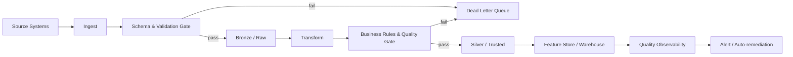

# Data quality

> **Learning Path:** Data Architecture
> **Section:** 3.2.16 — Data architecture

### The problem

You build a model, a dashboard, or an automated decision. It works in dev. In production it degrades, makes bad recommendations, or silently drifts. The root cause is rarely the algorithm. It is the data it consumes.

Data quality is not a cleaning task. It is an architectural constraint: downstream systems assume properties about upstream data — schema, completeness, freshness, correctness, and consistency — and when those assumptions break, the system fails in non-obvious ways.

For an AI Solution Architect, this is critical because models amplify data problems. A 2% label error can become a 20% business error.

### Mental model

Think of data quality as **fitness for purpose, not perfection**.

Data is fit for purpose when a consumer can rely on it to make a correct decision with known risk. That fitness is defined by the consumer, not the producer.

The mental model is a contract: Producer promises measurable properties, Consumer defines acceptable thresholds, and an observability layer verifies the contract continuously.

### How it works

Quality is measured along dimensions, enforced at boundaries, and observed over time.

Core dimensions architects care about:
* **Completeness:** Are required fields present?
* **Validity:** Does data conform to schema and business rules?
* **Accuracy:** Does it reflect ground truth?
* **Consistency:** Same entity, same value across systems?
* **Freshness / Timeliness:** Is it late enough to be useless?
* **Uniqueness:** No duplicate keys causing double counting.

Architecture puts checks at the handoff points, not everywhere:

Prevention at ingestion stops poison. Detection in the pipeline provides metrics. Observability closes the loop.

### Architectural reasoning

When to enforce quality, and where?

* **Clean at source** when you control the producer and the cost of bad data is high. Best, often impractical.
* **Clean in pipeline** when you own the ingestion layer. This is the default for data platforms. Validate schema, enforce constraints, quarantine bad rows.
* **Clean at read** when you need flexibility and can tolerate latency. Good for exploratory analytics, bad for real-time decisions.

Choice depends on constraints: latency budget, ownership boundaries, cost of reprocessing, and tolerance for partial data.

Data contracts between teams make this explicit: producer defines schema + SLAs, consumer defines acceptance thresholds. Quality gates enforce the contract automatically.

For AI systems, add a feedback loop. Model performance degradation is often a proxy for data drift. Monitor input feature distributions and label quality, not just pipeline uptime.

### Trade-offs and failure modes

* **Strictness vs availability.** Reject bad records and you lose data. Accept them and you poison downstream. Architect the quarantine path and decide per domain: financial transactions = reject, clickstream = sample and continue.
* **Central governance vs distributed ownership.** Central team can enforce standards but creates bottleneck. Distributed teams move fast but drift. Hybrid works: central platform provides validation primitives, domain teams own rules.
* **Freshness vs completeness.** Waiting for late-arriving data improves completeness but hurts freshness. Define SLAs per use case.
* **Cost of observability.** Quality metrics, lineage, and profiling cost storage and compute. Measure only what drives decisions.

Common failure modes:
* Silent schema drift: new field added, old consumer breaks.
* Late-arriving corrections overwrite historical facts without versioning.
* Duplicates from retries cause double counting.
* Measuring quality once at load time, then never again.

### Example

Enterprise customer 360 for churn prediction.

Sources: CRM, billing, support tickets, product events. Each has different latency and ownership.

Architecture decision: bronze layer accepts everything with schema validation only. Silver layer applies business rules: email must be valid, subscription_id not null, event timestamp within 7 days. Bad rows go to DLQ with reason code. Quality metrics are emitted: completeness of `lifetime_value`, freshness of CRM sync, duplicate rate of user_id.

Feature store consumes silver and monitors distribution drift of features like `days_since_last_purchase`. If drift exceeds threshold, model is auto-gated and data owners are alerted.

Result: model retraining is not triggered by calendar, but by measurable fitness loss.

### Reasoning challenge

You have a real-time fraud scoring service requiring <100ms latency. One upstream payment processor occasionally sends transactions with missing merchant category code, about 0.5% of volume. Filling it later takes 2 hours.

Do you: reject those transactions at ingestion, accept and score with a default value, or score with a degraded model path?

What do you measure to decide, and where do you enforce the rule?

### Key takeaway

* Data quality is fitness for purpose defined by the consumer, not an abstract ideal.
* Enforce quality at architectural boundaries with contracts, gates, and observability, not ad-hoc cleaning.
* Prefer prevention at ingest, detection in pipeline, and continuous monitoring over one-time cleansing.
* Trade strictness for availability explicitly per domain, and make the cost of bad data visible.
