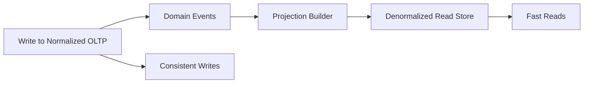

# Denormalization

> **Learning Path:** Data Architecture
> **Section:** 3.2.3 — Data architecture

**Denormalization**

### 1. The problem

Normalization solves a different problem than read performance.

In OLTP, you normalize to eliminate redundancy, enforce integrity, and make writes cheap and consistent. One `customers` table, one `orders` table, one `order_items` table. Writes touch few rows, updates are safe.

That breaks down when read patterns demand many joins, repeated aggregation, or low-latency access at scale.

Problem appears when:
* Reads are 10-100x more frequent than writes
* A single user-facing query requires 5+ joins across large tables
* Latency budget is tight and join cost is unpredictable
* Consumers need a pre-shaped view, not a generic relational model

You can throw hardware at joins for a while. Eventually join cost, network shuffle, and cache misses dominate.

### 2. Mental model

Normalization is about storing data once, in its most atomic form.
Denormalization is about storing data *for the way it is read*.

Think of it as pre-computing and pre-joining the answers you need most often, and accepting the cost of keeping them fresh.

You are trading write complexity and storage for read simplicity and speed.

### 3. How it works

Denormalization flattens relationships.

Normalized:
```
orders(id, customer_id, ...)
customers(id, name, email, ...)
order_items(order_id, product_id, qty, ...)
products(id, name, price, ...)
```

One read requires 3 joins.

Denormalized read model:
```
order_read(id, customer_name, customer_email, items_json, total_amount, ...)
```

The read model contains duplicated data: customer name is repeated per order, product name is embedded in items.

Mechanically it can be:
* **Schema denormalization:** redundant columns/tables in the same DB
* **Physical duplication:** separate read store, materialized view, or cache
* **Event-driven projection:** write to normalized OLTP, emit events, build denormalized read model asynchronously



### 4. Architectural reasoning

When it helps:
* Read-heavy workloads with stable query shapes. Dashboards, product listings, search, recommendations.
* Cross-service reads where joins are impossible. Service A cannot join Service B's DB.
* Low-latency serving. Flattening removes join latency and allows single-row lookups.
* Analytical queries. Star schemas in warehouses are intentionally denormalized for scan efficiency.

Alternatives and why you might not choose them:
* Add indexes / materialized views: helps but still joins
* Cache results: helps hit rate but invalidation is hard for complex queries
* Keep normalized + CQRS: clean separation, but adds operational complexity

Decision rule: Denormalize when the read pattern is predictable, the write volume is manageable, and the cost of stale data is acceptable.

### 5. Trade-offs and failure modes

* **Write amplification.** One logical update touches many physical rows. Update customer email? Now you must update every denormalized order read model that contains it.
* **Consistency risk.** Denormalized copies drift. Without a reliable propagation mechanism you serve stale or partial data. Eventual consistency becomes a design choice, not an accident.
* **Storage cost.** Duplication is literal. At scale this is real money.
* **Schema rigidity.** Flattened models couple to specific read shapes. Changing a read requires backfilling data.
* **Operational complexity.** You now own two models and the synchronization between them. Failure modes include missed events, out-of-order processing, and backfills.

The most dangerous failure: silent staleness. Reads look fast and correct until they aren't. You need observability on lag, versioning, and reconciliation.

### 6. Example

E-commerce product detail page.

Normalized OLTP is correct for checkout. Read path for the page needs product, price, inventory, seller, reviews, recommendations, and promotions.

Joining 7 tables per request at 5k RPS is expensive.

Architecture:
* OLTP remains normalized: `products`, `inventory`, `sellers`, `reviews`
* On product change, publish `ProductUpdated` event
* Projection service builds `product_page_view` document:
  ```json
  {
    "product_id": 123,
    "name": "Wireless Headphones",
    "price": 199,
    "inventory": 42,
    "seller_name": "Acme",
    "avg_rating": 4.6,
    "top_reviews": [...]
  }
  ```
* API serves page from single row/document lookup, <10ms p95

Writes are slower and more complex, reads are trivial. Acceptable because product updates are infrequent vs page views.

### 7. Reasoning challenge

You have a SaaS billing system. Normalized schema: `accounts`, `subscriptions`, `invoices`, `payments`.

Product wants an instant “account health” dashboard showing: account name, current plan, MRR, last payment date, failed payment count last 90 days, and next renewal date.

Reads: ~100/sec per region. Writes: invoices created continuously, payments stream in real time.

Do you denormalize the dashboard into a single read model, or keep it joined at query time? What consistency level can you tolerate, and what is your failure mode if the projection lags 30 seconds?

### 8. Key takeaway

* Denormalization exists to make reads fast and simple by paying the cost on writes.
* It is a response to read/write ratio, join cost, and service boundaries, not a schema mistake.
* Choose it when query shapes are stable and stale data is tolerable; avoid it when writes dominate or strong consistency is required.
* The real cost is operational: you must own propagation, invalidation, and reconciliation of duplicated data.
