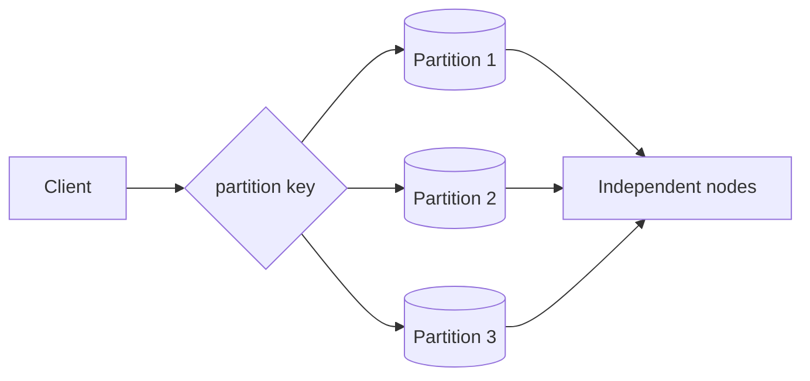

# Partitioning

> **Learning Path:** Data Architecture
> **Section:** 3.2.4 — Data architecture

**Partitioning**

### The problem

A single database node hits a wall. Write throughput plateaus, storage fills, and read latency grows as the working set no longer fits in memory. Vertical scaling helps for a while, then costs spike and you still have a single point of failure.

You need more capacity, but you also need predictable latency and availability. You cannot just add RAM.

That forces a decision: keep data together and scale up, or split data and scale out.

### Mental model

Partitioning is splitting a logical dataset into physically independent pieces so different machines can own different pieces.

Think of a library. One librarian can handle all requests until the collection is too big. Partition by author last name A-M and N-Z, give each to a librarian. A request goes to the right librarian by key.

The data is still one table conceptually, but physically it lives on multiple nodes.

### How it works

A partition key decides where a row lives. The router uses that key to direct reads/writes to the correct partition.

Common strategies:
* **Hash:** `hash(user_id) % N`. Even distribution, good for point lookups.
* **Range:** `created_at` or `region`. Good for scans and pruning, bad if ranges skew.
* **Consistent hashing:** lets you add/remove nodes with minimal data movement.

The router can be a proxy, client library, or a service mesh. The partition key must be chosen before data lands; changing it later is expensive.

### Architectural reasoning

Partitioning helps when:
* Write volume and data size exceed one node.
* Access patterns are key-local: most queries can be answered from one partition.
* You need independent failure domains and horizontal availability.

It does not help when every query needs the whole dataset, or when you need strong cross-row transactions across partitions.

Alternatives:
* Scale up. Simpler, works until cost/limits hit.
* Read replicas. Solves read scale, not write scale or storage.
* Caching. Reduces load but does not remove the data growth problem.

Choose partitioning when the workload is partitionable and the operational complexity is worth the scale.

### Trade-offs and failure modes

* **Hot partitions.** Skewed keys create a hotspot. A few users, a few regions, or recent dates can overload one node while others idle. You need monitoring and sometimes key salting.
* **Cross-partition queries.** Joins and aggregations that span partitions become expensive network operations. Design schemas to keep related data co-located.
* **Rebalancing cost.** Adding partitions requires moving data. With hash partitioning you move ~1/N of data. With range, you may move large chunks.
* **Operational complexity.** Backup, schema migration, and consistent reads now involve multiple nodes. The router is a critical path.
* **Transaction boundaries.** Distributed transactions across partitions are hard. Most designs accept eventual consistency or enforce partition-local transactions.

### Example

E-commerce orders. 2 TB/month, 90% of queries are `WHERE user_id = ?` and `WHERE user_id = ? AND created_at BETWEEN ? AND ?`.

Partition by `user_id` hash. Each order lives with its user. Point lookups are local. A daily report by region still scans all partitions, so the team creates a separate read-optimized aggregate table.

If they had partitioned by `created_at` range, user lookups would fan out to many partitions and hot spots would form at the current month.

### Reasoning challenge

You have a global chat service. Messages are written 500k/sec and queried by `conversation_id`. Occasionally you need to scan all messages from the last 24h for moderation.

Do you partition by `conversation_id` hash, by `created_at` range, or both? What breaks?

### Key takeaway

* Partitioning trades simplicity for scale. It solves size and throughput limits, not bad queries.
* The partition key is the most important architectural decision. It determines data distribution, query locality, and future migration cost.
* Design for access patterns, not just for even distribution. Local reads win, cross-partition scans lose.
* Expect hot spots and rebalancing pain. Monitor skew and keep partition-local transactions.
