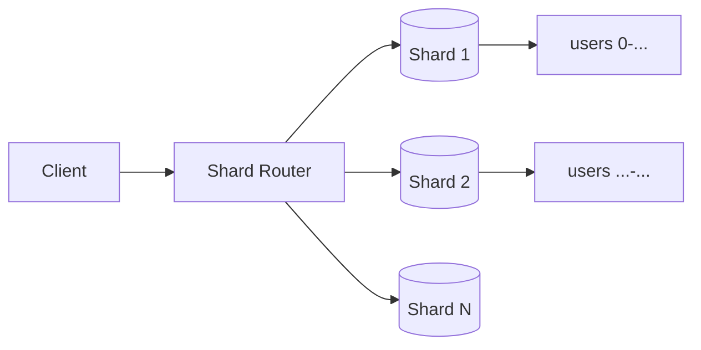

# Sharding

> **Learning Path:** Data Architecture
> **Section:** 3.2.5 — Data architecture

### The problem

A single database node hits a hard ceiling. Write throughput tops out on CPU/IO, storage size exceeds what one machine can hold cost-effectively, and read latency rises with data volume. Vertical scaling helps for a while but gets expensive, slow, and risky — you still have one failure domain.

You can add read replicas for read scale, and cache for hot reads. Neither solves the fundamental write and storage limit. You need more write capacity and more storage that grows linearly with data.

### Mental model

Sharding is horizontal partitioning. Instead of one big database, you have N independent databases. Each holds a slice of the data, and all slices together form the whole dataset.

Think of a library that runs out of shelves. You don’t buy a bigger building, you open branch libraries. A router knows which branch holds a given book by its call number. The branches are independent; the system as a whole is larger.

### How it works

Data is split by a **shard key**. The router hashes or ranges on that key to deterministically map a request to the correct shard.

Writes go to one shard. Reads go to one shard if you have the key. No shard needs to know about the others.

Common strategies:
* **Hash sharding**: `shard_id = hash(key) % N`. Even distribution, hard to move data.
* **Range sharding**: key ranges per shard, e.g., user_id 1-1M, 1M-2M. Easier for range scans, risk of skew.

The router is the critical piece. It can be a proxy, client library, or service mesh. It must know the mapping and handle shard failures.

### Architectural reasoning

Sharding helps when:
* Write throughput must grow beyond one node
* Dataset size exceeds single node storage
* You need geographic distribution for latency/compliance

It does not help for:
* Strongly correlated cross-entity queries that need a global view
* Transactions spanning many entities

Alternatives first:
* Vertical scale up, read replicas, caching. Cheaper and simpler.
* Partition by time and archive old data.
* Use a more scalable datastore.

Choose sharding when those are insufficient and you can accept the operational cost.

### Trade-offs and failure modes

**Data locality loss.** Related data may live on different shards. A join across shards becomes a distributed query, slow and expensive.

**Hot shards.** A bad shard key creates imbalance. `user_id` is usually good; `country` is usually bad. Hot keys still concentrate load.

**Operational complexity.** You now run N databases. Backups, schema migrations, and rebalancing must be coordinated. Adding a shard is not trivial with hash sharding; you must rehash and move data.

**Cross-shard transactions.** ACID across shards is hard. Most architectures avoid it by design: co-locate related data on one shard, use sagas/eventual consistency, or accept partial failure.

**Failure modes to remember:**
* Rebalancing downtime or data loss if mapping changes incorrectly
* Router becomes a bottleneck and single point of failure if not replicated
* Uneven growth causes premature capacity issues

### Example

Multi-tenant SaaS with 10M users. Orders table grows 2TB/year, writes 20k/s at peak.

Shard by `tenant_id` with hash sharding into 64 shards. Each shard holds ~30GB and handles ~300 writes/s. New tenants automatically balance. Queries always include tenant_id, so router resolves to one shard.

A global report “top products across all tenants” becomes expensive: it must fan out to 64 shards and aggregate. That report is moved to a nightly batch that writes to an analytics store, accepting staleness.

### Reasoning challenge

You are designing a social feed service. Writes are per-user posts, reads are per-user timelines with fan-out to followers. You can shard by `user_id`.

Where does a hot celebrity with 50M followers create a problem, and what would you change about the shard key or architecture to mitigate it? Think about write amplification, read hotspots, and cross-shard fan-out.

### Key takeaway

* Sharding trades operational simplicity for horizontal scale of writes and storage.
* Success depends entirely on shard key choice: it must distribute load evenly and keep related data together.
* Design around the router and avoid cross-shard transactions; push global queries to offline systems.
* Shard late. Prove you need it with metrics, then pay the complexity cost deliberately.
