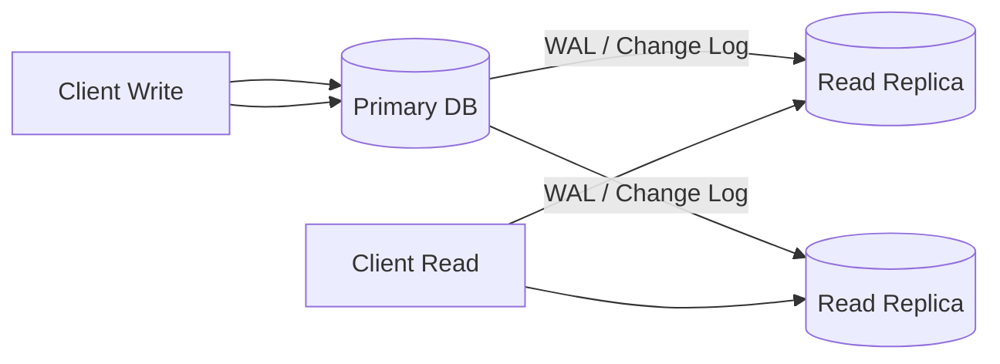

# Replication

> **Learning Path:** Data Architecture
> **Section:** 3.2.6 — Data architecture

### The problem

A single data store is a bottleneck and a single point of failure. Write load is bounded by one node, read load is bounded by one node, and any outage kills the whole service.

You hit this first as read scale: a product catalog serving millions of requests per second can't be answered from one primary. You hit it as availability: a node crash, AZ failure, or network partition means downtime. You hit it as latency: users in Sydney can't tolerate 300ms round trips to a primary in Virginia.

Replication is the answer to *read scale, fault tolerance, and locality*, not to write scale.

### Mental model

Replication = keep multiple copies of the same data and make them stay eventually in sync.

Think of it as publishing a changelog from a source of truth and having copies apply it. The primary accepts writes, produces a log of changes, and replicas consume that log.

One writer, many readers. Writes go to one place, reads can be served from many.

### How it works

Essentially three mechanisms:

* **Log shipping.** Primary writes to a write-ahead log. Replicas stream and replay the log. This is async by default.
* **Synchrony.** Synchronous replication waits for at least one replica to acknowledge the write before committing. Async replication commits locally and ships later.
* **Routing.** Writes are routed to the primary. Reads are routed to replicas, optionally with a freshness check.

The core invariant is *ordering*. As long as replicas apply changes in the same order as the primary, they converge. The problem is *when* they apply them.

### Architectural reasoning

When it helps:
* **Read heavy workloads.** Analytics, catalog browsing, search indexing, feature stores. Replicas give near-linear read scale.
* **High availability.** If a primary fails, a replica can be promoted. With multi-AZ replication you survive AZ loss.
* **Latency and data locality.** Replicas in different regions let you serve reads close to users without cross-region writes.
* **Isolation.** Offline backups, batch jobs, and AI training reads can run on replicas without impacting the primary.

Alternatives:
* **Vertical scale.** Bigger machine. Hits a ceiling, expensive, still a SPOF.
* **Sharding.** Split data across nodes. Solves write scale, adds complexity for cross-shard queries.
* **Caching.** Reduces read load but adds invalidation and isn't durable.

Choose replication when reads dominate writes, you can tolerate some staleness, and you need durability / regional presence more than write throughput.

### Trade-offs and failure modes

* **Consistency lag.** Async replication means replicas are behind. A user writes their address then immediately reads profile and sees old data. This is the classic read-your-writes violation. You must design for eventual consistency or use read-your-writes routing for a session.
* **Write amplification and cost.** Every write is now N writes. Network, storage, and ops cost scale with replica count.
* **Failover is hard.** Automatic promotion can cause split-brain if fencing is weak. Manual promotion is safer but slower. You need a consensus mechanism for leader election.
* **Conflict resolution.** In multi-primary or bi-directional replication, concurrent writes to the same row can conflict. You need last-write-wins, vector clocks, or application-level merge.
* **Replication lag amplification.** Long transactions, large bulk loads, or network partitions cause lag to grow, which can cascade into timeouts and retries.

Replication does not make a system linearizable. It makes it available and scalable for reads.

### Example

E-commerce platform. Primary writes to Postgres in us-east-1 for orders, payments, inventory mutations. Three async read replicas: one in us-east-1 for internal dashboards, one in eu-west-1 for European storefront reads, one in ap-southeast-1 for APAC.

Checkout writes always go to primary. Product listing, search, recommendations, and user profile reads go to the nearest replica. A session affinity flag forces reads for the first 2 seconds after a write to go back to primary to avoid stale reads.

If us-east-1 AZ fails, promote the us-east-1 replica in another AZ. RPO is a few seconds of async lag, RTO is minutes.

### Reasoning challenge

You are designing a real-time fraud scoring service. Scores must be computed within 500ms of a transaction and must reflect the latest user risk flags, which are updated by multiple services.

Would you serve risk flags from async read replicas? What would you change if the SLA requires read-your-writes for the same user session?

### Key takeaway

* Replication copies data to increase read capacity, availability, and locality; it does not increase sustainable write capacity.
* Async replication trades freshness for availability and lower write latency. Synchronous replication trades latency for stronger consistency.
* Design your reads around staleness: route recent writes to primary, use monotonic reads, or accept eventual consistency.
* Failover and conflict resolution are architectural problems, not just operational ones.
