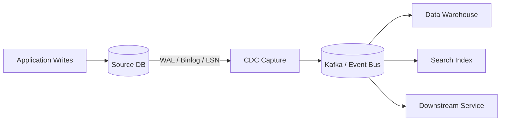

# CDC

> **Learning Path:** Data Architecture
> **Section:** 3.2.8 — Data architecture

**CDC — Change Data Capture**

### The problem
You have an OLTP database of record. Downstream systems need a fresh copy: data warehouse, search index, recommendation features, audit log, another service.

Options that feel natural are bad:
* **Poll the DB**: `SELECT * WHERE updated_at > ?`. Misses deletes, creates load spikes, and freshness is tied to poll interval.
* **Application dual writes**: Write to DB then publish an event. Couples every writer to every consumer, and a failure between the two creates inconsistency.

The constraint is: read changes without adding load to the write path, without changing application code, and with exactly-once-ish delivery semantics.

That is the problem CDC solves.

### Mental model
CDC treats the database transaction log as the source of truth. The DB already records every committed change for durability and replication. CDC taps that log and replays it as a stream of row-level changes.

Think of it as a read-only tap on the database's own write-ahead log. Producers don't know it exists. Consumers subscribe to a changelog.

No queries hit the OLTP tables. No code changes in the app.

### How it works
Two essential mechanisms:

* **Log-based**: The capture agent reads the DB's native change log — WAL for Postgres, binlog for MySQL, LSN for Oracle, CTE for SQL Server. It tracks a high-water mark and emits `before/after` row images.
* **Stream-based**: Changes are published as events with table name, primary key, operation type `INSERT/UPDATE/DELETE`, and payload. Consumers process the stream at their own pace and can replay from an offset.

Debezium is the canonical example: a connector connects to the DB, monitors the log, and produces normalized change events to Kafka. The DB remains the system of record; CDC is just a reader.

### Architectural reasoning
**When it helps**
* You need near real-time downstream sync without modifying legacy apps.
* Multiple consumers need the same changes at different speeds.
* You want replayability for rebuilding views or backfilling.

**Alternatives**
* Application events: great when you own the code and can guarantee outbox pattern. Poor for legacy or polyglot writes.
* ETL batch: cheap and simple, but hours/days lag.
* Database triggers + queue: works, but adds write latency and failure modes inside the DB.

Choose CDC when the source of truth is a database you cannot or should not change, and freshness matters more than simplicity.

### Trade-offs and failure modes
* **Ordering and exactly-once**: Log order is per partition, not global. Consumer must handle out-of-order events and idempotency.
* **Schema drift**: A column rename or type change breaks downstream consumers. You need schema registry and evolution discipline.
* **Operational coupling**: Log retention becomes a SLA. If the CDC consumer falls behind beyond retention, you lose data. You must monitor lag, offset commits, and log size.
* **Read amplification**: Large transactions generate many events. A bulk load can flood consumers.
* **Security**: Log access is privileged. A compromised CDC agent sees all data, including PII.

CDC moves complexity from write path to read path and ops.

### Example
E-commerce order DB on Postgres. Orders must be:
* loaded into Snowflake for BI
* indexed in OpenSearch for search
* sent to fraud scoring service

With CDC: Debezium reads Postgres WAL, emits `orders` change events to Kafka. Three independent consumers subscribe. The checkout service writes once. No dual writes. If the search index goes down, it catches up by replaying from its last offset without touching the OLTP DB.

### Reasoning challenge
You have a 10-year-old monolith with direct writes from 30 services, no outbox, and a requirement for sub-minute sync to a new data lake. The DB team says enabling logical replication is risky and log retention is 7 days.

Would you use CDC now? What would you need to validate first, and what would make you choose batch ETL instead?

### Key takeaway
* CDC derives events from the database log, not from application code.
* It decouples writes from downstream reads and enables replay without OLTP load.
* Choose it for legacy sources and real-time sync; avoid it when you own the write path and can implement outbox reliably.
* The main risks are log retention/lag, schema evolution, and consumer idempotency.
