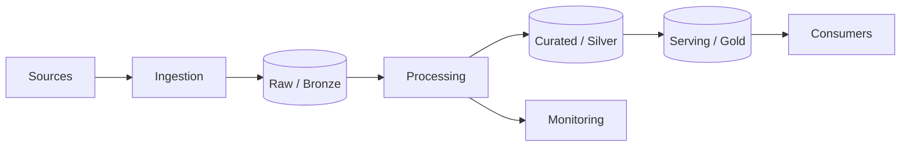

# Data pipelines

> **Learning Path:** Data Architecture
> **Section:** 3.2.9 — Data architecture

### 1. The problem

You have many producers generating data at different rates and formats: web clicks, transactions, IoT sensors, CRM updates. You have many consumers needing that data in different shapes and latencies: dashboards, data warehouse, ML features, operational services.

If producers call consumers directly you get tight coupling, failure propagation, and lost data when consumers are slow or down. If you copy data ad-hoc you get duplication, schema drift, and no replay.

A data pipeline exists to decouple production from consumption with a reliable, observable path for moving and transforming data.

### 2. Mental model

Think of a factory conveyor belt with inspection stations.

Raw material arrives → checked for quality → transformed → placed in the right warehouse → shipped to downstream lines.

The belt keeps moving even if one station is slow. You can pause, rewind, and replay a section. The stations are independent.

### 3. How it works

The essential mechanism is: Ingest → Land → Process → Serve, with contracts at each boundary.

**Ingestion** captures data with at-least-once guarantees. Batch loads files; streaming ingests events.

**Raw Landing** is immutable, append-only storage. This is your replay log.

**Processing** validates schema, cleans, deduplicates, joins. It can be batch for correctness or streaming for latency.

**Serving** stores data in the shape consumers need: OLAP for analytics, feature store for ML, low-latency store for apps.

Contracts are schemas and SLAs: what fields exist, freshness, quality thresholds.

### 4. Architectural reasoning

Use a pipeline when:

* Producers and consumers have different speeds and failure domains. The pipeline buffers and decouples them.
* You need replay. Raw landing lets you reprocess historical data when logic changes.
* Multiple consumers need the same source. Fan-out from one pipeline is cheaper than N point-to-point integrations.
* Data must be governed. Central validation, lineage, and audit happen once.

Alternatives:
* Direct service calls for low-volume, tightly coupled, strongly consistent operational data.
* ETL scripts for one-off migrations. Not for ongoing, evolving systems.
* Lakehouse / warehouse native ingestion when you only need analytics and can tolerate batch.

Choose streaming when latency matters for decisions: fraud, recommendations, alerting. Choose batch when cost and correctness dominate: reporting, model training.

### 5. Trade-offs and failure modes

* **Latency vs cost.** Streaming gives seconds latency but higher operational cost and complexity. Batch is cheap and simple but hours/days delayed.
* **Exactly-once vs at-least-once.** Exactly-once is expensive. Most pipelines accept at-least-once + idempotent writes.
* **Schema rigidity vs flexibility.** Strict schemas prevent silent corruption. Flexible schemas ingest faster but push complexity downstream.
* **Coupling to storage.** Tightly coupling processing to a specific warehouse limits replay and migration.

Common failures:
* **Backpressure.** Fast producer overwhelms slow consumer → queue grows → OOM. Mitigate with rate limiting, autoscaling, dead-letter queues.
* **Schema drift.** Producer adds/removes field without notice → pipeline breaks. Mitigate with schema registry and backward compatibility checks.
* **Silent data loss.** Missing monitoring on ingestion lag and record counts. Mitigate with end-to-end lineage and data quality checks.
* **Dual writes.** Updating source and warehouse separately leads to inconsistency. Pipeline should be the source of truth for derived data.

### 6. Example

E-commerce clickstream to recommendations.

Clicks, cart adds, purchases stream into Kafka. Raw events land in S3 as immutable Parquet. A streaming job validates schema, deduplicates user sessions, and writes to a feature store for real-time scoring. A nightly batch job aggregates the raw data, joins with product catalog, and writes curated tables to Snowflake for analysts.

Producers never know about consumers. When the recommendation model changes, you reprocess raw data from last 30 days without touching producers.

### 7. Reasoning challenge

Your company runs a daily batch pipeline for sales reporting. Product wants real-time fraud alerts on payments.

Do you add a streaming branch to the existing pipeline, replace batch with streaming, or build a separate pipeline? What do you keep in raw landing, and what is the minimal change to avoid dual writes?

### 8. Key takeaway

* Pipelines decouple producers from consumers and provide replayability through immutable raw storage.
* Design around contracts: schema, freshness, quality. Enforce them at ingestion.
* Batch optimizes for cost and correctness; streaming optimizes for latency. Hybrid is normal.
* Operate pipelines like a product: monitor lag, data quality, and lineage, not just uptime.
