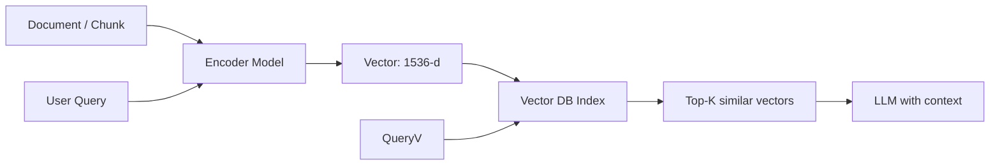

# Embeddings

> **Learning Path:** Data Architecture
> **Section:** 3.3.1 — AI-specific data

### The problem

Text search fails when you need meaning, not keywords.

You have a corpus of documents, tickets, code, product descriptions. A user asks: "how do I reset MFA when locked out?" Keyword search finds "MFA" and "reset" but misses "I can't log in after losing my phone" which means the same thing. Keyword search also can't rank by relevance across domains.

For LLMs, you need to retrieve context that is *semantically* related, not just lexically overlapping. You need a representation that puts "king - man + woman ≈ queen" in the same space as "reset MFA ≈ recover account".

You also need to compare millions of items fast. That forces a numeric representation you can index.

### Mental model

An embedding is a dense vector that encodes meaning as position.

Think of it as coordinates in a high-dimensional space where distance = semantic dissimilarity.

Similar concepts cluster together. The encoder is trained to push related texts close and unrelated texts apart. You don't interpret individual dimensions; you interpret relative positions.

This turns a natural language problem into a geometry problem you can index.

### How it works

A fixed encoder model maps text to a vector of length N, typically 384-4096.

Process is:
Chunk -> Normalize -> Encode -> Store vector + metadata -> Query encodes to vector -> Approximate Nearest Neighbor search -> Return top-k.

Cosine similarity is the usual distance metric. The vector DB handles ANN with HNSW or IVF to make search sub-linear.

### Architectural reasoning

Embeddings enable semantic retrieval and similarity at scale.

When it helps:
* RAG / retrieval-augmented generation where you need relevant context for an LLM
* Semantic search, recommendation, clustering, deduplication
* Matching user intent to content when phrasing varies

Alternatives and why embeddings win:
* Keyword / BM25: cheap and precise for exact terms, fails on paraphrase
* Tagging / classification: needs predefined labels, doesn't scale to open vocab
* Full LLM re-ranking of all docs: accurate but prohibitively expensive

Choose embeddings when you need fuzzy, meaning-based matching over a large, changing corpus and latency/cost matter.

Architecture decision is not just "use a vector DB". It's: what granularity to chunk, which encoder to use, when to re-embed, how to store metadata, and how to route results to the LLM.

### Trade-offs and failure modes

**Model choice vs cost.** Larger models give better semantics but higher latency and cost per encode. You often need separate models for ingestion and query if they drift.

**Dimensionality and index.** Higher dims = better expressiveness, worse memory and search speed. Quantization reduces size but loses nuance.

**Semantic drift.** Language evolves, products change. Embeddings are static until re-encoded. Without a refresh policy you get stale retrieval.

**Chunking is architecture.** Too small = loss of context. Too large = dilution of meaning. The optimal chunk size depends on the encoder's context window and the task.

**Security and poisoning.** Embeddings leak information about source text via inversion attacks. Malicious documents can be embedded to pollute retrieval results. You need access control at retrieval time, not just at storage.

**Evaluation is hard.** There is no single accuracy metric. You need task-specific relevance tests, not just cosine scores.

### Example

Enterprise support RAG.

Tickets, KB articles, and release notes are chunked to ~512 tokens with 128 token overlap. Each chunk is encoded with `text-embedding-3-large` and stored in a vector DB with metadata: source_id, version, PII flag, tenant_id.

At query time, the user question is encoded, top-10 chunks are retrieved per tenant with a hybrid score: 0.7 cosine + 0.3 BM25. Results are filtered by PII policy and version.

The retrieved chunks are passed to the LLM with citations. Re-embedding runs nightly for updated docs and on-demand for high-churn collections.

This gives semantic recall without scanning the whole corpus and keeps retrieval under 100ms.

### Reasoning challenge

You have a product catalog with 20M SKUs, descriptions change daily, and you need both semantic search for "lightweight hiking boots waterproof" and exact filter for brand, size, price.

Do you embed the full description, a short normalized summary, or both? Do you re-embed every description on change, or batch nightly? What do you do when the embedding model vendor deprecates the model you used?

Explain the trade-offs in cost, freshness, and recall before choosing.

### Key takeaway

* Embeddings convert meaning into geometry so you can search by similarity, not keywords.
* They are an architectural primitive for retrieval, not a feature. Design choices are chunking, encoder, index, refresh, and filtering.
* The main risks are stale vectors, model drift, and retrieval poisoning; mitigate with versioned embeddings and metadata-based access control.
* Use them when you need semantic recall at scale and can tolerate approximate relevance. Keep keyword search as a complementary signal.
