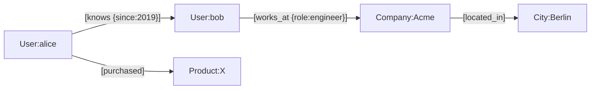

# Graph databases

> **Learning Path:** Data Architecture
> **Section:** 3.3.10 — AI-specific data

### The problem

Relational and document stores are excellent at answering: *What is this record?* and *Find records matching these properties.*

They struggle with: *Who is connected to whom, how many hops away, and what paths exist?*

In AI systems this shows up as:
* Entity resolution and linking across sources
* Multi-hop reasoning for RAG: "Which suppliers of my customers are at risk?"
* Recommendation and fraud detection where the signal is the pattern of connections, not a single row
* Knowledge graphs where the meaning is in the edges

With a relational model you pay for each hop with a join. As depth grows, query cost grows exponentially, plans become unpredictable, and you end up denormalizing for read paths you can't anticipate.

### Mental model

A graph database treats **nodes and edges as first-class citizens** with properties, not foreign keys in tables.

Think of it as an index-free adjacency structure: each node knows its neighbors directly. Traversal is pointer chasing, not index lookups + joins.



The question "friends of friends who work at Acme" is a 3-hop walk, not 3 joins.

### How it works

Native graph stores store adjacency physically close. Traversal engines follow edges from node to node.

Core mechanisms:
* **Property graph model**: nodes with labels, edges with type + properties, both can be indexed
* **Index-free adjacency**: moving to a neighbor is O(1) pointer follow, no global index scan
* **Traversal-centric query languages**: Cypher, Gremlin, SPARQL let you express paths, patterns, and variable-length hops declaratively

For AI workloads this pairs well with vector search. The graph gives you structure and provenance; vectors give you semantic similarity. Hybrid architectures store embeddings as node properties and use the graph for constrained retrieval.

### Architectural reasoning

**When it helps**
* Relationship is the primary query axis: pathfinding, connectivity, centrality
* Schema is evolving and heterogeneous: new entity types and relation types appear without migrations
* You need explainability: "Why was this recommended?" can be answered with the path

**What it solves**
* Variable-depth queries become cheap and predictable
* Schema flexibility for knowledge graphs built from unstructured data
* Efficient graph algorithms: PageRank, community detection, shortest path

**Alternatives**
* **Relational**: Good for fixed-depth joins and strong transactional consistency. Bad for exploratory multi-hop queries.
* **Document / key-value**: Good for entity storage. Bad for cross-entity traversals.
* **Vector DB**: Good for semantic similarity. Bad for structured constraints like "only suppliers in EU".

Decision rule: If your dominant access pattern is *traverse*, choose graph. If it's *filter + aggregate*, relational is usually cheaper.

### Trade-offs and failure modes

* **Supernodes**: A node with millions of edges e.g., a popular product or a user with huge connections. Traversal fans out and can OOM or time out. Mitigation: partitioning, degree limits, materialized views.
* **Write amplification**: Adding a relationship often touches multiple indexes. Write throughput is lower than a simple document store.
* **Operational complexity**: Fewer DBAs know graph tuning. Backup, scaling, and consistency models differ from Postgres.
* **Query complexity**: Developers overuse deep traversals. Without limits you get accidental cartesian explosions.
* **Cost model**: Graph is cheap for reads with few hops, expensive for bulk scans. Don't use it as a general purpose OLTP store.

### Example

Fraud detection in payments.

Nodes: Account, Device, IP, Merchant, Transaction.
Edges: owns, used_by, paid_to, shared_with.

A relational query for "find accounts that share a device with a known fraudster within 2 hops" requires recursive CTEs and grows slow.

In a graph:

```
MATCH (f:Account {risk:'high'})-[:USES|OWNS*1..2]-(a:Account)
WHERE NOT a:Account {risk:'high'}
RETURN a, count(*) as risk_score
```

The traversal finds the pattern in milliseconds and the path provides an audit trail for the model. Embeddings of transaction notes can be stored on Transaction nodes, letting you combine semantic similarity with graph constraints for RAG retrieval.

### Reasoning challenge

You are designing an e-commerce platform.

* Requirement A: Real-time order placement, inventory deduction, payment capture. Strong ACID, 10k TPS.
* Requirement B: Personalized recommendations and "customers who bought X also bought Y" with explainable paths, updated hourly.

Do you put both in a graph database? What do you put where and why?

### Key takeaway

* Graph databases exist because traversing relationships is a different cost model than filtering tables.
* Use them when the query is about connectivity, paths, and patterns, not just attributes.
* Pair them with vector and relational stores in a polyglot architecture; graph is rarely the only store.
* Watch for supernodes, write costs, and query depth; they dictate operability more than features do.
