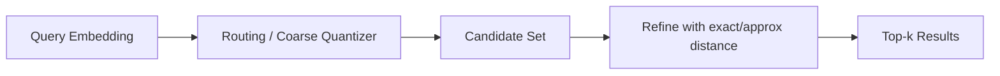

# Vector indexes

> **Learning Path:** Data Architecture
> **Section:** 3.3.3 — AI-specific data

### The problem

You have millions of text chunks turned into 768-1536 dimensional embeddings. A RAG query needs the top-k most semantically similar chunks, not keyword matches.

Brute force cosine similarity is O(N * d) per query. At 10M vectors x 1024 dims that's ~10B operations per query. Too slow for real-time.

You also cannot shard by primary key. Similarity is a spatial problem, not a key lookup.

**Problem → Constraints:** low latency <100ms, high recall >90%, scale to 10M-1B vectors, high dimensionality.

### Mental model

A vector index is a spatial index for meaning space.

Think of it like a library. Brute force is checking every book. A vector index builds a map of where things live in embedding space so you can walk to the neighborhood of the query instead of scanning the whole building.

It does not store the meaning, it stores a navigable approximation of the geometry of the vectors.

### How it works

All methods trade exactness for speed. The core idea is reduce candidates before doing precise distance.

**Partitioning:** Divide space into cells. IVF - Inverted File Index trains coarse centroids, routes query to nearest cells, then does exact search inside.

**Graph navigation:** HNSW builds a multi-layer graph where each node links to its nearest neighbors. Query walks greedily down layers then up, like navigating a small-world network.

**Compression:** Product Quantization splits vectors into sub-spaces and stores codes instead of floats. Search uses asymmetric distance on compressed codes, 10-50x smaller memory.

Typical query flow:

Build is offline and expensive. Search is fast because you only score a tiny fraction of the corpus.

### Architectural reasoning

Use a vector index when you need approximate nearest neighbor at scale with latency constraints.

**When it helps**
* RAG retrieval, semantic search, recommendation, clustering, deduplication
* Corpus > ~1M vectors or query QPS > few hundred
* Recall can be slightly imperfect

**Alternatives**
* Brute force exact search: correct, simple, fails beyond ~100k vectors
* Keyword BM25: fast and interpretable, fails on paraphrase and semantics
* Hybrid: vector index + keyword re-ranking gives best real-world recall

Decision hinges on three axes: latency target, recall requirement, update frequency.

### Trade-offs and failure modes

**Recall vs latency vs memory.** HNSW gives high recall and low latency but high memory and slow build. IVF-PQ is memory efficient and fast at scale but needs careful tuning for recall.

**Static vs dynamic.** Most indexes are optimized for read-heavy. HNSW supports incremental inserts but degrades. IVF needs rebuilds for large updates. If you update hourly, plan for rebuild pipelines or delta indexes.

**Dimensionality curse.** Above ~200 dims, distance differences shrink. Quantization error grows. You need more centroids/layers to compensate.

**Failure modes architects miss**
* Embedding drift: model version changes, old vectors become meaningless. Index must be versioned with model.
* Poor recall from bad parameters: too few probes in IVF, too low M in HNSW.
* Cold start / warm-up: graph indexes need query warming to reach steady-state latency.
* Cost of re-embedding: vector index is only as good as the embedding pipeline feeding it.

### Example

Enterprise RAG for support knowledge base.

10M chunks, 1024-dim embeddings from bge-large. Requirement: p95 < 80ms, recall@10 > 0.92.

Choice: IVF-PQ with 8192 centroids, 64-byte codes, 32 probes. Served on GPU with FAISS. Daily rebuild from source of truth. Query path: text → embedding → index → top 100 → reranker → top 10.

Why not HNSW? Memory for 10M vectors at 1024 dims ~40GB raw. HNSW would be >60GB plus overhead. IVF-PQ fits in ~1GB. Latency target met, recall acceptable for reranker.

If updates were per minute, they'd switch to HNSW with incremental inserts and accept higher memory.

### Reasoning challenge

You have 200M product vectors, 768 dims. Queries 5k QPS, p95 latency <50ms, corpus updates daily via batch. You need recall@10 >0.95.

Would you pick HNSW or IVF-PQ? What parameters and operational considerations matter most?

*Hint: think about memory footprint at 200M, build time, and recall tuning.*

### Key takeaway

* Vector indexes solve approximate nearest neighbor, not exact search. They exist because brute force similarity does not scale.
* Choose structure by workload: graph for low-latency dynamic, partitioned + quantized for large static scale.
* Recall is a tunable SLA, not a guarantee. Always measure recall@k vs latency with real queries.
* The index is downstream of embeddings. Model changes, chunking strategy, and update cadence are architectural decisions that dominate index performance.
