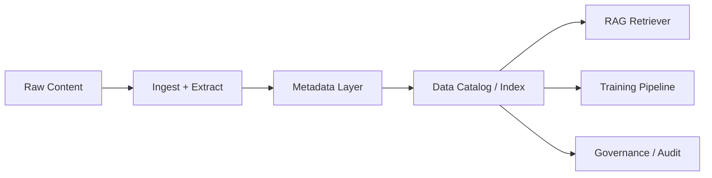

# Metadata

> **Learning Path:** Data Architecture
> **Section:** 3.3.4 — AI-specific data

### The problem

An AI system doesn't just need data, it needs *usable* data. A PDF, a log line, or a table is inert without knowing: where it came from, when it was created, how trustworthy it is, who can use it, and how to retrieve it for a specific query.

Without that, you get silent failures: a RAG system retrieves an outdated price, a training run ingests PII it shouldn't, a model is evaluated on the wrong slice, and you can't explain why an answer was given. The problem isn't storage, it's control.

### Mental model

Metadata is the control plane for data. Data is the payload, metadata is the description that makes the payload routable, filterable, and governable.

Think of it as the label on a chemical bottle. The liquid is the data. The label tells you what it is, concentration, expiry, hazards, and handling instructions. Without the label the liquid is dangerous.

For AI, metadata is both *about the source* and *about the AI usage* of that source.

### How it works

Metadata is created at ingest and propagated with the data.

`Raw Content -> Extract / Enrich -> Metadata Layer -> Catalog / Index -> AI Workloads`

Essential mechanisms:
* **Capture at source.** Provenance, timestamp, source system, owner, license.
* **Enrich during processing.** Chunk id, embedding vector id, quality score, PII tags, language, domain.
* **Store separately but linkable.** Metadata lives in a catalog or index keyed to the data artifact. For vectors, metadata is the filterable sidecar to the embedding.
* **Propagate.** Metadata travels with derived artifacts: a chunk inherits document metadata, a training example inherits chunk metadata.

### Architectural reasoning

Metadata enables decisions you cannot make on raw data alone.

* **Retrieval relevance.** RAG needs to filter by recency, source trust, region, and access rights before similarity search. Metadata provides those filters.
* **Training data curation.** You need to select slices by quality, label confidence, time window, and bias attributes. That selection is metadata-driven.
* **Governance and safety.** You must know which data is PII, copyrighted, or customer-restricted to enforce policies and audit.

Alternatives: hard-code filters in application logic or rely on file names/folders. That works for 10 files, fails at scale, and cannot be audited.

Choose a formal metadata layer when data is heterogeneous, long-lived, reused across models, or subject to compliance.

### Trade-offs and failure modes

* **Overhead vs utility.** Capturing rich metadata costs ingest latency and storage. Capture too little and the system is ungovernable; capture too much and you drown in noise.
* **Schema rigidity vs flexibility.** Strict schemas enforce consistency but break on new sources. Schemas should be core fields + extensible tags.
* **Freshness.** Metadata can drift from data. If an update happens without metadata re-indexing, you serve stale filters. Need change data capture or re-ingest signals.
* **Ownership.** Metadata is a product. If no team owns it, fields become inconsistent, duplicated, or abandoned.

Failure mode to remember: embedding without metadata. You can find semantically similar chunks but cannot exclude outdated or unauthorized ones. Retrieval accuracy drops silently.

### Example

Enterprise support RAG.

Documents: support tickets, KB articles, contracts.
Ingest pipeline extracts:
* Descriptive: doc_id, title, source system, created_at, updated_at
* Structural: chunk_id, page number, section
* Administrative: owner team, classification, retention policy
* AI-specific: language, PII flag, quality score from LLM grader, embedding model version

At query time: `similarity search` + metadata filters `updated_at > 90 days ago AND classification != confidential AND owner_team in allowed_set`. The retriever returns only usable, authorized content.

Training data curation uses the same metadata to build a clean slice: `quality_score > 0.8 AND PII flag = false AND label_confidence > 0.9`.

### Reasoning challenge

You are building a multi-tenant RAG for 5 customers sharing one vector DB. Each customer must never see another customer's data, and you need to guarantee retrieval latency <200ms.

Do you store one index with tenant_id as metadata filter, or five separate indexes? What breaks if you choose wrong?

### Key takeaway

* Metadata turns raw data into an addressable, governable asset for AI.
* Capture provenance, quality, and access attributes at ingest and keep them linked to every derived artifact.
* Use metadata for filtering before retrieval and for slicing before training.
* Design for freshness, ownership, and schema evolution, not just initial completeness.
