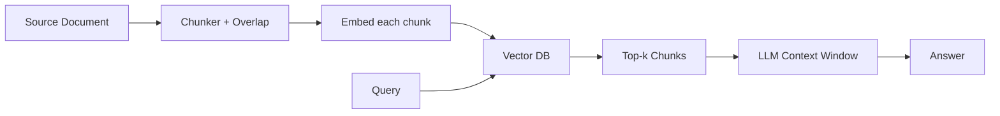

# Chunking

> **Learning Path:** Data Architecture
> **Section:** 3.3.5 — AI-specific data

### 1. The problem

LLMs have a hard context limit and a soft attention limit. You cannot feed a 200-page policy doc, a code repo, or a year's worth of tickets into a prompt and expect a correct answer.

You also cannot embed an entire document as one vector. Embedding models have a max input length, and one vector per document loses all internal structure. Retrieval needs granularity: the question about "refund SLA for enterprise customers" lives inside a larger doc about billing.

So you need a way to break AI-specific data into pieces that are:
* small enough to fit in context and embed cheaply
* large enough to retain meaning
* retrievable independently

That need is chunking.

### 2. Mental model

Think of chunking as cutting a book into readable pages for a librarian with a short memory.

Too small a page = the librarian finds the right page but the answer is cut in half.
Too large a page = the librarian brings back the whole chapter and the model drowns in noise.

The cut must respect meaning boundaries, not just byte offsets.

### 3. How it works

A chunker takes a source document and produces overlapping, semantically coherent fragments.

Essential mechanisms:
* **Boundary detection:** split on natural units — sentences, paragraphs, headings, code functions — not mid-sentence.
* **Size control:** target by tokens, not characters. Typical targets are 200-800 tokens for retrieval, governed by embedding model limits and LLM context.
* **Overlap:** 10-20% overlap between consecutive chunks preserves cross-boundary context and prevents information loss at seams.
* **Hierarchy for long docs:** first split by section, then by paragraph. Allows coarse then fine retrieval.

Chunk → embed → store → retrieve → assemble into prompt. The chunk is the unit of retrieval and the unit of context.

### 4. Architectural reasoning

When it helps:
* RAG pipelines where retrieval precision matters more than verbatim recall
* Knowledge bases with long documents, conversations, or logs
* Any system where you need to map a query to a sub-document, not the whole corpus

Alternatives:
* **No chunking, whole-document embedding:** cheap, but recall collapses on long docs.
* **Aggressive summarization first:** loses detail, good for high-level browse, bad for precise citations.
* **Hierarchical retrieval:** keep both coarse and fine chunks. More complex but improves recall on multi-hop questions.

Decision rule: choose chunking when you need both semantic search and faithful grounding, and you can tolerate higher storage and indexing cost.

### 5. Trade-offs and failure modes

* **Size vs fidelity.** Smaller chunks increase precision and reduce context waste, but increase vector count, cost, and risk of fragmented answers. Larger chunks preserve context but dilute the embedding signal and waste tokens.
* **Overlap cost.** Overlap improves continuity but increases storage and can cause near-duplicate retrievals.
* **Boundary errors.** Splitting mid-thought creates orphan facts. Splitting only on fixed tokens creates incoherent chunks. Both hurt retrieval quality.
* **Domain sensitivity.** Code needs function-level chunks. Legal text needs clause-level. Conversations need speaker turns. One-size chunking fails across domains.
* **Latency and cost.** More chunks = larger index, higher embedding cost, larger candidate set to rerank.

Failure mode to watch: the model confidently answers from a chunk that is locally coherent but globally wrong because the chunking removed disambiguating context from the previous section.

### 6. Example

Enterprise support RAG over 10k KB articles.

Decision: recursive chunking by heading then paragraph, target ~500 tokens with 100 token overlap. Store chunk text + metadata {article_id, heading_path, version}.

Why: support queries are narrow — "how to reset MFA for SSO users". A 500-token chunk usually contains the step list. Overlap prevents the step list from being split across boundaries. Metadata enables citation and version control.

Result: retrieval precision up, context window usage predictable, and updates can re-chunk only changed sections.

### 7. Reasoning challenge

You have a financial compliance corpus: 50-page PDFs with definitions, then case examples, then tables of thresholds.

Query: "What is the reporting threshold for transaction type X in 2024?"

Would you use fixed 512-token chunks with overlap, or semantic chunks aligned to document structure? What happens if you choose the wrong strategy?

### 8. Key takeaway

* Chunking exists to make long documents retrievable and usable inside limited context windows.
* Chunk size is a trade-off between retrieval precision and contextual completeness.
* Respect semantic boundaries and use overlap to avoid seam loss.
* Chunking strategy must match document type and query type; there is no universal size.

You should leave able to reason: what chunk size and boundaries maximize relevance for a given corpus and query distribution, and what breaks when you get it wrong.
