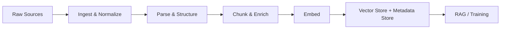

# Document processing

> **Learning Path:** Data Architecture
> **Section:** 3.3.6 — AI-specific data

**Document processing**

### 1. The problem

LLMs can reason over text, but they cannot natively ingest a 200-page PDF contract, a scanned invoice, or a messy Confluence export. The raw artifact is unstructured, heterogeneous, and often noisy. The problem is not storage, it's making the content *retrievable and usable* for retrieval-augmented generation and training.

You need to turn a document collection into something an AI system can query with high fidelity, while preserving provenance, freshness, and cost control.

### 2. Mental model

Think of document processing as a factory line for AI-specific data.

Raw documents in → normalized, parsed, chunked, enriched artifacts → indexed for retrieval or training.

The output is not the document, it's a set of retrievable units with metadata and vectors that link back to source.

### 3. How it works

The essential pipeline is:

**Ingest & Normalize:** Pull from S3, SharePoint, DB, email. Deduplicate by content hash. Track source URI, version, owner.

**Parse & Structure:** Extract text, tables, images. Use format-specific parsers for PDF/DOCX/HTML, OCR for scans, and layout models to keep tables and headings together. Preserve structure, don't flatten to plain text.

**Chunk & Enrich:** Split into semantically coherent units. Chunk size is a trade-off between context and precision. Add metadata: doc_id, page, section, author, timestamps, PII flags, access control. Enrich with summaries, entities, and classification.

**Embed & Index:** Embed chunks for semantic search. Store vectors + metadata together. Keep raw chunks and source link for citation.

### 4. Architectural reasoning

You would choose a processing pipeline when you need:
* **Retrieval over private/unstructured corpora** - RAG requires clean, indexed chunks
* **Consistency and governance** - Need audit trail, versioning, and access control per document
* **Scale and heterogeneity** - Thousands of formats, continuous updates

Alternatives:
* **Raw prompt inlining** works for one-off small docs, fails at scale and cost
* **Fine-tuning on raw dumps** wastes tokens and loses traceability
* **Search-only** without chunking/enrichment gives poor grounding

Decision hinges on freshness requirements. Batch nightly processing is cheaper and simpler. Real-time processing is needed for operational documents like support tickets.

### 5. Trade-offs and failure modes

* **Chunking strategy.** Small chunks improve recall but lose context and increase noise. Large chunks preserve context but dilute relevance and hit token limits. Overlap helps continuity but increases cost.
* **Structure vs flatten.** Preserving tables/headings improves accuracy for legal/financial docs. Flattening is cheaper and works for narrative text. Wrong choice causes hallucinated relationships.
* **Sync vs async.** Streaming ingestion gives low latency but complex failure handling. Batch is reliable and cheaper.
* **Failure modes to watch:** Drift between source and index when updates aren't re-processed. Poor OCR on scans. Missing metadata leads to unauthorized retrieval. Chunk boundaries that split entities.

### 6. Example

Enterprise knowledge base for internal support.

Documents live in Confluence, PDFs in S3, tickets in Postgres. An ingestion service watches S3 and a CDC stream for tickets. Each new/changed file triggers parse, chunk with 800-token windows with 150-token overlap, and metadata enrichment with tenant_id and classification.

Vectors go to a vector store with metadata filtering. Retrieval first filters by tenant and PII clearance, then semantic search. Answers are cited with source URI and page.

When a doc is deleted or updated, the pipeline re-processes and tombstones old chunks. This gives grounded answers and auditable provenance.

### 7. Reasoning challenge

You are architecting a system for real-time contract negotiation. Contracts arrive as PDFs with signatures, tables of pricing, and amendment letters that reference prior versions.

Do you process each amendment as an independent document, or merge it into a canonical contract version before chunking? What metadata do you need to prevent the model from citing superseded clauses?

### 8. Key takeaway

* Document processing exists to convert unstructured artifacts into retrievable, grounded AI units with provenance.
* Design around chunking, metadata, and versioning, not just embedding.
* Choose batch vs streaming and structure preservation based on document type and freshness needs.
* The biggest risks are stale indexes, bad chunk boundaries, and missing access control metadata.
