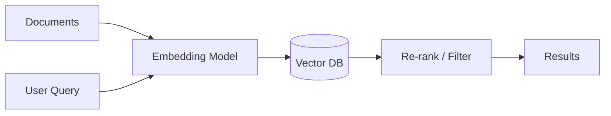

# Semantic search

> **Learning Path:** Data Architecture
> **Section:** 3.3.7 — AI-specific data

**Semantic search**

### 1. The problem

Keyword search works when users know the exact term you used. It fails when meaning matters.

* "cheap flights" vs "low-cost airlines"
* "cancel subscription" vs "stop recurring charge"
* A support ticket about "login loop after password reset"

With keyword search you get exact matches, not intent. You can add synonyms, but the list explodes and never covers paraphrase. For AI systems that need to find relevant context to answer, you need relevance by meaning, not by term overlap.

### 2. Mental model

Semantic search maps text to a vector space where distance = meaning similarity.

Documents and queries become points in the same space. A query is close to documents that say the same thing in different words.

Keyword search = match tokens.
Semantic search = match neighborhoods in embedding space.

### 3. How it works

1. **Embed**: Convert text to a dense vector with a model trained to put semantically similar texts near each other.
2. **Index**: Store vectors in a vector database with approximate nearest neighbor search.
3. **Query**: Embed the user query, find the k nearest document vectors via cosine similarity.
4. **Return**: Re-rank top hits, optionally with metadata filters.

The critical architectural piece is the embedding model and the retrieval layer, not the LLM. The LLM only comes after retrieval.

### 4. Architectural reasoning

**When it helps**
* Unstructured text corpora where phrasing varies: support KB, docs, tickets, contracts
* You need intent matching, not literal matching
* You want to feed relevant context into RAG or agents

**Alternatives**
* BM25 keyword search: fast, precise for exact terms, terrible for paraphrase
* Hybrid: BM25 + vector, often best in production. Vector finds meaning, BM25 rescues rare proper nouns and exact matches
* Graph / taxonomy search: good when you have a curated ontology

**Decision rule**
Choose semantic when recall of meaning > recall of exact term. Choose hybrid when you need both.

### 5. Trade-offs and failure modes

* **Recall vs precision**: Embeddings can over-generalize. "Python" the snake vs "Python" the language. Needs disambiguation via metadata filters.
* **Drift and staleness**: Embedding model and document corpus drift over time. Re-embed on updates. Version your embedding model.
* **Cost and latency**: Embedding is compute heavy at index time and query time. ANN is approximate. You trade accuracy for speed and cost.
* **The vector is lossy**: You lose exact structure, positions, and rare terms. That's why hybrid wins.
* **Security / leakage**: Vectors can leak information about source text. Treat vector store as data store with access controls.

Most failures come from treating semantic search as a drop-in replacement for keyword search.

### 6. Example

Enterprise support RAG.

Documents: 200k support articles, tickets, release notes.

Architecture:
* Ingest pipeline chunks articles into 512-token windows with overlap, stores chunk text + metadata {product, version, tier}
* Embed with a domain-tuned model, write to vector DB with product/version filters enabled
* Query path: user query → embed → vector search with filters product=X → top 10 chunks → re-rank with cross-encoder → return to LLM with citations

This gives "how to restore deleted mailbox" even if user asks "I accidentally removed my email folder".

### 7. Reasoning challenge

You are building product search for an e-commerce catalog with 5M SKUs, attributes like price, brand, color, and long descriptions.

Do you use pure semantic search, pure keyword, or hybrid? What filters do you apply before vector search and why? What breaks if you only use semantic?

### 8. Key takeaway

* Semantic search solves the problem of matching intent, not tokens.
* Embeddings turn meaning into geometry; retrieval becomes nearest neighbor search.
* Hybrid vector + keyword is the production default, not pure semantic.
* Architect for re-embedding, filtering, and re-ranking. The vector DB is an index, not the whole system.
* Measure recall of relevant meaning, not just top-k hit rate.
