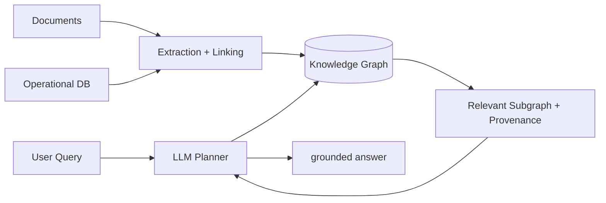

# Knowledge graphs

> **Learning Path:** Data Architecture
> **Section:** 3.3.9 — AI-specific data

**The problem**

LLMs are fluent but relationally blind. Give them text and they will infer connections, often incorrectly. Give them a relational database and you can enforce transactions, but multi-hop questions like *“Which suppliers of components used in product X have had compliance violations in the last 18 months?”* become expensive join chains that change shape with every query.

The constraint for AI-specific data is: you need explicit, queryable semantics about entities and how they relate, with evolving schema and the ability to reason across hops, while also grounding generation to reduce hallucination.

**Mental model**

A knowledge graph is a network of meaning.

Nodes are entities: people, products, transactions, concepts. Edges are typed relationships with properties: `supplied_by`, `part_of`, `contradicts`. The graph is the primary artifact, not a table optimized for writes.

Analogy: a relational DB is a filing cabinet with perfect folders. A knowledge graph is a map with roads between places. You want the map when the question is *how far and via what path*, not just *find the file*.

**How it works**

Essentially triples: `subject - predicate - object`. Property graph models add attributes to nodes and edges.

```
(Product:123) -[part_of]-> (Product:456)
(Product:123) -[supplied_by {since:2021}]-> (Supplier:A)
```

Storage is graph-native or in triplestore/RDF. Query languages like Cypher or SPARQL traverse patterns rather than join tables. For AI use, the graph is typically built from:

* schema + curated entities
* entity extraction and relation extraction from documents
* reconciliation / entity linking to collapse duplicates

The graph is then used for retrieval, grounding, and constrained generation in RAG or agents.

**Architectural reasoning**

When it helps:

* Knowledge-intensive domains with many entity types and relationships: enterprise catalogs, healthcare, finance, manufacturing.
* Need for multi-hop reasoning and explainability: *why* was this recommendation made?
* Entity disambiguation and consolidation across sources.
* Grounding LLM outputs to verifiable facts.

What it solves: explicit semantics, flexible schema evolution, efficient graph traversals.

Alternatives:

* **Relational + joins:** good for transactional consistency and structured reporting. Poor for ad-hoc 3+ hop traversals and schema changes.
* **Vector DB only:** great for semantic similarity, zero for explicit relations and provenance.
* **Document store:** cheap ingestion, no structure.

Choose a knowledge graph when the value is in the *relationships* and you need to answer questions that are path-dependent, not just similarity-dependent.

**Trade-offs and failure modes**

* **Write complexity vs read value.** Building and maintaining the graph is expensive: extraction, linking, curation, keeping it fresh. If you cannot sustain updates, the graph rots.
* **Schema drift.** Unconstrained property graphs become messy. You need governance for entity types, relation vocabularies, and quality metrics.
* **Query performance.** Traversals are fast in small neighborhoods, but global analytics and large fan-outs need indexing and partitioning.
* **Reasoning vs retrieval.** A KG does not do inference for you. You still need rules, embeddings, or a reasoner for implicit knowledge.
* **Operational cost.** Graph databases, ETL pipelines, entity resolution services, and human curation add cost and latency.

Failure mode: using a KG as a fancy document store. If you only ever retrieve 1-hop neighbors and never use paths, a vector DB is simpler and cheaper.

**Example**

Fraud detection in payments.

Entities: `Account`, `Device`, `IP`, `Merchant`, `Transaction`. Relations: `owns`, `used_by`, `paid_to`, `co-located_with`.

A relational model can find transactions by account. A graph finds patterns: Account A → Device D → IP I used by Account B → Merchant M also paid by Account C. A 4-hop suspicious ring emerges in one traversal and can be surfaced to an LLM agent with provenance: *“Flag because device shared with 3 high-risk accounts in last 30 days”*.

The graph is updated nightly from transactions and enriched with risk signals. The agent queries the subgraph for an alert and grounds its explanation in concrete edges.

**Reasoning challenge**

You are designing search for an e-commerce catalog with 10M SKUs, attributes, reviews, and supplier data. Queries are mostly keyword + filter: “red shoes size 9 under $100”. Would you build a knowledge graph for this?

Think about what problem you are actually solving: is it multi-hop relational reasoning or fast faceted filtering with semantic similarity? Where does the graph add value vs a search index + vector DB?

**Key takeaway**

* Knowledge graphs exist to make relationships explicit and traversable, not to store documents.
* Use them when answers depend on paths, entity identity, and explainable links.
* They trade write and curation cost for flexible, semantic reads.
* Combine with vectors for semantic retrieval and LLMs for generation; the graph provides grounding and structure.
* If you cannot maintain entity resolution and schema governance, do not build one.



The graph is the map. The LLM is the navigator.
