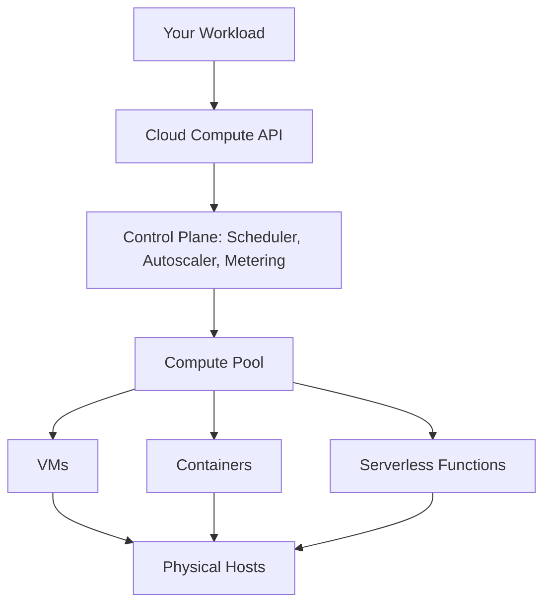

# Compute

> **Learning Path:** Cloud & Infrastructure Architecture
> **Section:** 4.1.1 — Cloud fundamentals

### The problem

You need compute to run software, but owning compute creates permanent cost for variable demand.

On-prem: you buy servers for peak load. They sit idle 60-80% of the time. You pay CapEx up front, maintain hardware, patch hosts, replace failing disks, and you still can't scale instantly when traffic spikes.

The problem cloud compute solves is **decoupling capacity from demand** and **shifting ownership of hardware to operation of workloads**.

### Mental model

Cloud compute is a pool of CPU + memory you rent by the second, with an API to create and destroy it.

Think of it as electricity: you don't build a power plant, you draw from the grid and pay for what you use. The grid operator handles capacity, maintenance, and failure. You only design the appliances.

The abstraction stack is:
`Physical hosts -> Hypervisor -> VMs -> Containers -> Serverless functions`

Each layer trades control for operational burden.

### How it works

A cloud provider maintains a fleet of physical hosts. A scheduler virtualizes them:

* **VMs / IaaS:** Hypervisor partitions hosts into virtual machines. You get an OS, you manage it. Scale is manual or via autoscaling groups.
* **Containers / CaaS:** Orchestrator like Kubernetes schedules containers across hosts. You package app + deps, provider manages nodes.
* **Serverless / FaaS:** Provider manages runtime pool. You upload code, it runs on demand, billed per invocation and duration.

All three share the same control plane: API to request capacity, scheduler to place it, metering to bill, and APIs for lifecycle.

You don't provision hosts, you declare desired state.

### Architectural reasoning

Choose compute model by what you want to own.

**Use VMs when you need control and portability.** Legacy apps, specific OS/kernel, licensing, GPUs with custom drivers. You accept ops overhead for maximum control.

**Use containers when you need density and portability with faster startup.** Microservices, CI/CD pipelines, batch jobs. You own app packaging and orchestration config, provider owns nodes.

**Use serverless when demand is spiky, event-driven, and you can tolerate cold starts.** APIs with bursty traffic, webhooks, ETL triggers, low-utilization AI inference endpoints. You own code and statelessness, provider owns everything else.

The decision is not technical fashion. It is **who absorbs the failure domain**.

### Trade-offs and failure modes

* **Control vs operability.** More control = more things to break. VMs let you tune the kernel; you also have to patch it. Serverless removes patching; you can't debug the runtime.
* **Latency vs cost.** Serverless cold starts hurt tail latency. Containers/VMs give warm, predictable latency at higher baseline cost.
* **Statefulness.** Compute is ephemeral by design. Treating a VM as durable storage causes data loss. The failure mode is assuming instances are stable.
* **Noisy neighbor.** Multi-tenant hosts share resources. Latency-sensitive workloads need dedicated hosts or performance isolation, at higher cost.
* **Cost visibility.** Per-second billing encourages right-sizing, but over-provisioned autoscaling and orphaned resources leak money fast. Compute cost is a function of rightsizing and lifecycle hygiene, not just price per vCPU.

### Example

An AI inference service for a product search.

Peak: 5k RPS during sales, baseline 200 RPS overnight.

VM approach: provision for peak, run at ~10% utilization overnight. High cost.

Container + autoscaler: scale replicas on CPU queue length, warm pool ready in ~30s. Good balance of latency and cost.

Serverless: first request latency 800ms cold, fine for occasional users, unacceptable for core search path. Hybrid: serverless for canary and batch re-ranking, containers for serving path.

The architect picks the compute model per workload slice, not one model for all.

### Reasoning challenge

You have a nightly batch training job that runs 2 hours, needs 8x A100 GPUs, starts at 02:00 UTC, and a real-time chatbot that sees 50 RPS steady with spikes to 500 RPS on news events.

Do you put both on the same compute model? What would you change if the batch job must finish by 04:00 UTC and costs are constrained?

### Key takeaway

* Compute in cloud is a capacity abstraction, not just VMs. The value is elasticity and shifting hardware ops to the provider.
* The architectural choice is VMs vs containers vs serverless, driven by control needs, latency tolerance, and demand shape.
* Ephemeral compute forces stateless design. Durability belongs in managed storage, not instances.
* Cost is driven by utilization and lifecycle management, not just unit price. Right-size, autoscale, and clean up.
