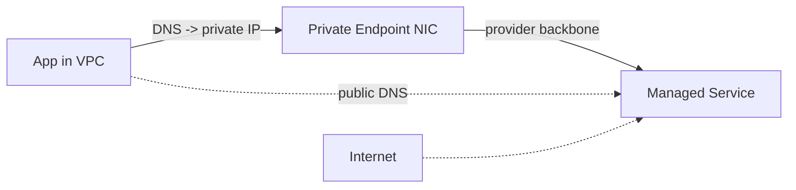

# Private endpoints

> **Learning Path:** Cloud & Infrastructure Architecture
> **Section:** 4.1.10 — Cloud fundamentals

**Private endpoints**

### The problem

You moved workloads to cloud managed services. Those services are great, but by default they are reachable via public endpoints on the internet.

That creates three architectural constraints:
* **Exposure surface.** Any public IP is discoverable and must be defended with network security groups, WAF, TLS, and identity controls.
* **Data path.** Traffic from your VPC to a SaaS/PaaS service leaves your private network, goes over the public internet, and re-enters. You lose control, add latency, and pay egress.
* **Compliance.** Many regulations require data to never traverse public networks, even if encrypted.

You want the benefits of managed services without making the service public to the world.

### Mental model

A private endpoint is a private network interface for a managed service that lives inside *your* VPC.

Think of it as building a private driveway to a building in a gated community instead of driving on public roads. The building is the same, the address is the same hostname, but from inside your network the DNS resolves to a private IP in your subnet. Traffic never touches the internet.

### How it works

The cloud provider allocates an ENI/NIC from one of your subnets and assigns a private IP. That NIC is fronted by a private endpoint service.

DNS is the switch. When a client in the VPC resolves `service.region.provider.com`, the provider’s private DNS zone returns the private IP instead of the public one. When the query comes from outside the VPC, it returns the public IP.

Traffic stays on the provider backbone. No NAT gateway, no public internet, no public IP on your side.

### Architectural reasoning

**When it helps**
* Sensitive data access to SaaS/PaaS: storage, databases, OpenAI, Cosmos DB, etc., where data must stay on-provider.
* Zero-trust network design: remove public ingress requirements.
* Cost and latency: avoid NAT egress charges and internet hops for high-volume internal traffic.

**Alternatives**
* Public endpoint + strict firewall/VPN: cheaper to set up, but traffic still leaves network and you own perimeter defense.
* ExpressRoute / Direct Connect: for on-prem to cloud, not for cloud-managed service private access.
* Service mesh / privateLink equivalent: for service-to-service within your own estate.

Choose private endpoints when the service is managed by the cloud and you need private-only reachability from specific VPCs/subnets, not global access.

### Trade-offs and failure modes

* **Cost and IP consumption.** You pay per endpoint and consume a private IP from your subnet. Many services need one endpoint per subnet per region.
* **Split-horizon DNS.** Misconfigured DNS means clients resolve to public IP and silently bypass the private path. Debugging is harder because `nslookup` differs by network.
* **Regional and service limits.** Private endpoints are regional. Cross-region access still traverses provider backbone but needs peering. Not all services support them.
* **Operational complexity.** Endpoint lifecycle is coupled to service lifecycle. Deleting a subnet without migrating endpoints breaks connectivity. Scaling out means provisioning endpoints in new subnets.

Failure mode to watch: a private endpoint created in the wrong subnet with no route to the client, or DNS not propagated. The service appears reachable but times out, and teams blame the managed service.

### Example

A payments platform runs in Azure VNet. It reads customer data from Azure Storage and calls Azure OpenAI for fraud scoring.

Public endpoint would mean data leaves the VNet to internet and back, violating PCI controls. Instead:
* Private endpoint for Storage in the app subnet, DNS zone linked to VNet.
* Private endpoint for OpenAI in the same VNet.
* App talks to both services via private IPs. Traffic never hits internet, audit logs show private IP source, and firewall rules can be minimal.

### Reasoning challenge

You have a SaaS product with customers in multiple VPCs across three clouds. Each customer wants private connectivity to your central control plane hosted as a managed Kubernetes service in AWS.

Do you provision a private endpoint per customer VPC, or expose a single public endpoint with mTLS and private network access controls? What changes if the control plane must be accessed from on-prem data centers too?

### Key takeaway

* Private endpoints solve the problem of needing managed services without public exposure, by bringing a private IP into your VPC.
* They are a networking control, not a security control by itself; identity and auth still required.
* Use them when data residency, compliance, latency, and egress cost outweigh the operational overhead of DNS and IP management.
* The biggest risks are DNS misresolution and subnet/IP sprawl, not the endpoint itself.
